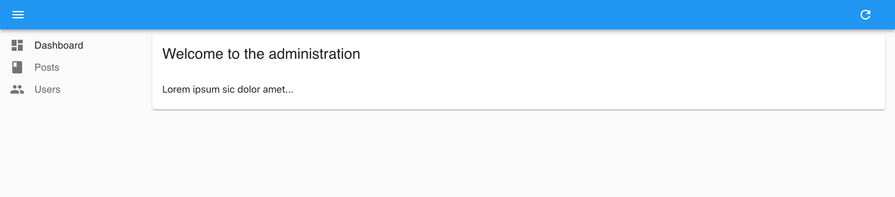
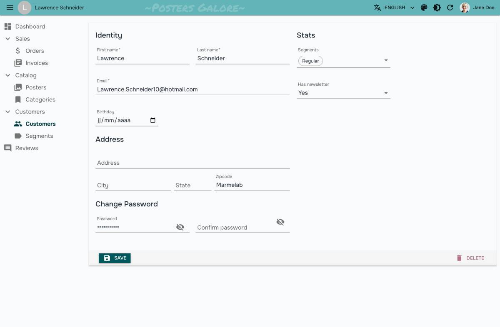

# `<Admin>`

`<Admin>` コンポーネントは、React-Admin アプリのルートコンポーネントです。アプリケーションのアダプター、ルート、および UI を設定するために使用されます。

`<Admin>` は一連のコンテキストプロバイダーを作成し、その子コンポーネントがアプリの設定にアクセスできるようにします。主なルートとレイアウトをレンダリングし、コンテンツ領域のレンダリングをその `<Resource>` 子コンポーネントに委譲します。


## 使用方法

`<Admin>` には `dataProvider` プロップと、少なくとも1つの `<Resource>` 子コンポーネントが必要です。以下は最も基本的な例です:

```tsx
    // src/App.js
    import { Admin, Resource } from 'react-admin';
    import simpleRestProvider from 'ra-data-simple-rest';

    import { PostList } from './posts';

    const App = () => (
        <Admin dataProvider={simpleRestProvider('http://path.to.my.api')}>
            <Resource name="posts" list={PostList} />
        </Admin>
    );

    export default App;
```

`<Admin>` の子コンポーネントは [`<Resource>`](./Resource.md) および [`<CustomRoutes>`](./CustomRoutes.md) です。

ほとんどのアプリでは、`<Admin>` により多くのプロップを渡す必要があります。以下は [e-commerce demo](https://marmelab.com/react-admin-demo/) から取られたより完全な例です:



```tsx
// src/App.js
import { Admin, Resource, CustomRoutes } from 'react-admin';
import { Route } from "react-router-dom";

import { dataProvider, authProvider, i18nProvider } from './providers';
import { Layout } from './layout';
import { Dashboard } from './dashboard';
import { Login } from './login';
import { lightTheme, darkTheme } from './themes';
import { CustomerList, CustomerEdit } from './customers';
import { OrderList, OrderEdit } from './orders';
import { InvoiceList, InvoiceEdit } from './invoices';
import { ProductList, ProductEdit, ProductCreate } from './products';
import { CategoryList, CategoryEdit, CategoryCreate } from './categories';
import { ReviewList } from './reviews';
import { Segments } from './segments';

const App = () => (
    <Admin
        dataProvider={dataProvider}
        authProvider={authProvider}
        i18nProvider={i18nProvider}
        layout={Layout}
        dashboard={Dashboard}
        loginPage={Login}
        theme={lightTheme}
        darkTheme={darkTheme}
        defaultTheme="light"
    >
        <Resource name="customers" list={CustomerList} edit={CustomerEdit} />
        <Resource name="orders" list={OrderList} edit={OrderEdit} options={{ label: 'Orders' }} />
        <Resource name="invoices" list={InvoiceList} edit={InvoiceEdit} />
        <Resource name="products" list={ProductList} edit={ProductEdit} create={ProductCreate} />
        <Resource name="categories" list={CategoryList} edit={CategoryEdit} create={CategoryCreate} />
        <Resource name="reviews" list={ReviewList} />
        <CustomRoutes>
            <Route path="/segments" element={<Segments />} />
        </CustomRoutes>
    </Admin>
);
```



メインのアプリコンポーネントを簡潔にするために、リソースのプロップを別のファイルに移動することをお勧めします。例えば、先ほどの例を以下のように書き換えることができます:

```tsx
// src/App.js
import { Admin, Resource, CustomRoutes } from 'react-admin';
import { Route } from "react-router-dom";

import { dataProvider, authProvider, i18nProvider } from './providers';
import { Layout } from './layout';
import { Dashboard } from './dashboard';
import { Login } from './login';
import { lightTheme, darkTheme } from './themes';
import customers from './customers';
import orders from './orders';
import invoices from './invoices';
import products from './products';
import categories from './categories';
import reviews from './reviews';
import { Segments } from './segments';

const App = () => (
    <Admin 
        dataProvider={dataProvider}
        authProvider={authProvider}
        i18nProvider={i18nProvider}
        dashboard={Dashboard}
        loginPage={Login}
        layout={Layout}
        theme={lightTheme}
        darkTheme={darkTheme}
        defaultTheme="light"
    >
        <Resource {...customers} />
        <Resource {...orders} />
        <Resource {...invoices} />
        <Resource {...products} />
        <Resource {...categories} />
        <Resource {...reviews} />
        <CustomRoutes>
            <Route path="/segments" element={<Segments />} />
        </CustomRoutes>
    </Admin>
);
```

## プロップ

`<Admin>` コンポーネントのコア機能を設定するための主要な3つのプロップ:

* [`dataProvider`](#dataprovider): データ取得用
* [`authProvider`](#authprovider): セキュリティと権限用
* [`i18nProvider`](#i18nprovider): 翻訳と国際化用

以下は、コンポーネントが受け入れるすべてのプロップです:

|プロップ|必須|タイプ|デフォルト|説明|
|---|---|---|---|---|
|`dataProvider`|必須|`DataProvider`|\-|リソースの取得に使用するデータプロバイダー|
|`children`|必須|`ReactNode`|\-|レンダリングするルート|
|`authCallbackPage`|任意|`Component`|`AuthCallback`|認証コールバックページの内容|
|`authProvider`|任意|`AuthProvider`|\-|セキュリティと権限のための認証プロバイダー|
|`basename`|任意|`string`|\-|すべてのURLのベースパス|
|`catchAll`|任意|`Component`|`NotFound`|未知のルートに対するフォールバックコンポーネント|
|`dashboard`|任意|`Component`|\-|ダッシュボードページの内容|
|`darkTheme`|任意|`object`|\-|ダークテーマの設定|
|`defaultTheme`|任意|`boolean`|`false`|デフォルトでライトテーマを使用するフラグ|
|`disableTelemetry`|任意|`boolean`|`false`|テレメトリー収集を無効にする|
|`i18nProvider`|任意|`I18NProvider`|\-|翻訳のための国際化プロバイダー|
|`layout`|任意|`Component`|`Layout`|レイアウトの内容|
|`loginPage`|任意|`Component`|`LoginPage`|ログインページの内容|
|`notification`|任意|`Component`|`Notification`|通知コンポーネント|
|`queryClient`|任意|`QueryClient`|\-|react-query クライアント|
|`ready`|任意|`Component`|`Ready`|準備ページの内容|
|`requireAuth`|任意|`boolean`|`false`|すべてのルートに対する認証を要求するフラグ|
|`store`|任意|`Store`|\-|ユーザーの設定を管理するストア|
|`theme`|任意|`object`|\-|メイン（ライト）テーマの設定|
|`title`|任意|`string`|\-|エラーページのタイトル|

## `dataProvider`

`dataProvider` は唯一の必須プロップで、API と通信するためのオブジェクトでなければなりません。React-admin はデータの取得や保存が必要なすべての場所でこのデータプロバイダーを使用します。

多くの場合、データプロバイダーを自分で書く必要はなく、[既存の50以上のデータプロバイダー](./DataProviderList.md) のいずれかがニーズに合うでしょう。例えば、API が REST ベースであれば、[Simple REST Data Provider](https://github.com/marmelab/react-admin/tree/master/packages/ra-data-simple-rest) を次のように使用できます:

```tsx
// src/App.js
import simpleRestProvider from 'ra-data-simple-rest';
import { Admin, Resource } from 'react-admin';

import { PostList } from './posts';

const dataProvider = simpleRestProvider('http://path.to.my.api/');

const App = () => (
    <Admin dataProvider={dataProvider}>
        <Resource name="posts" list={PostList} />
    </Admin>
);
```

独自に書く必要がある場合、データプロバイダーは以下のメソッドを持つ必要があります。すべてが Promise を返します:

```tsx
const dataProvider = {
    getList:    (resource, params) => Promise.resolve(),
    getOne:     (resource, params) => Promise.resolve(),
    getMany:    (resource, params) => Promise.resolve(),
    getManyReference: (resource, params) => Promise.resolve(),
    create:     (resource, params) => Promise.resolve(),
    update:     (resource, params) => Promise.resolve(),
    updateMany: (resource, params) => Promise.resolve(),
    delete:     (resource, params) => Promise.resolve(),
    deleteMany: (resource, params) => Promise.resolve(),
}
```

API のデータプロバイダーを書く方法についての詳細は [Writing a Data Provider](./DataProviderWriting.md) 章を参照してください。

`dataProvider` は、カスタム HTTP ヘッダーの追加、ファイルのアップロード処理、リソース名の API エンドポイントへのマッピング、API への認証情報の渡し、ビジネスロジックの追加、API エラーの再フォーマットなどにも理想的です。詳細は [Data Provider documentation](./DataProviders.md) を参照してください。

## `children`

`<Admin>` コンポーネントは、[`<Resource>`](./Resource.md) および [`<CustomRoutes>`](./CustomRoutes.md) 要素を子コンポーネントとして受け取ることを期待しています。これらはアプリケーションのルートを定義します。

例えば:



```tsx
const App = () => (
    <Admin dataProvider={dataProvider} dashboard={Dashboard}>
        <Resource name="customers" list={CustomerList} edit={CustomerEdit} />
        <Resource name="orders" list={OrderList} edit={OrderEdit} options={{ label: 'Orders' }} />
        <Resource name="invoices" list={InvoiceList} />
        <Resource name="products" list={ProductList} edit={ProductEdit} create={ProductCreate} />
        <Resource name="categories" list={CategoryList} edit={CategoryEdit} create={CategoryCreate} />
        <Resource name="reviews" list={ReviewList} />
        <CustomRoutes>
            <Route path="/segments" element={<Segments />} />
        </CustomRoutes>
    </Admin>
);
```



これらの子コンポーネントにより、`<Admin>` コンポーネントは以下のルートを生成します:

* `/`: ダッシュボード
* `/customers`: カスタマーリスト
* `/customers/:id`: カスタマー編集ページ
* `/orders`: 注文リスト
* `/orders/:id`: 注文編集ページ
* `/invoices`: 請求書リスト
* `/products`: 製品リスト
* `/products/create`: 製品作成ページ
* `/products/:id`: 製品編集ページ
* `/categories`: カテゴリーリスト
* `/categories/create`: カテゴリー作成ページ
* `/categories/:id`: カテゴリー編集ページ
* `/reviews`: レビューリスト
* `/segments`: セグメントページ

## `authCallbackPage`

React-admin アプリには `/auth-callback` と呼ばれる特別なルートがあり、外部認証プロバイダー (Auth0、Cognito、OIDC サーバーなど) がログイン後にユーザーをリダイレクトできるようになっています。このルートはデフォルトで `AuthCallback` コンポーネントをレンダリングし、`authProvider.handleCallback()` を呼び出します。

このルートに対して異なる動作が必要な場合、`authCallbackPage` プロップとしてカスタムコンポーネントを渡すことでカスタマイズできます。

```tsx
import { Admin } from 'react-admin';
import { dataProvider } from './dataProvider';
import { authProvider } from './authProvider';
import MyAuthCallbackPage from './MyAuthCallbackPage';

const App = () => (
    <Admin
        authCallbackPage={MyAuthCallbackPage}
        authProvider={authProvider}
        dataProvider={dataProvider}
    >
        ...
    </Admin>
);
```

**注意**: 外部認証プロバイダーを使用する場合でも、このオプションを使用することはまれです。すでに `authProvider.handleCallback()` を介して `/auth-callback` ルートコントローラを定義できるため、ユーザーがログインした後にフィードバックが必要な場合のみ `authCallbackPage` プロップが有用です。

`authCallbackPage={false}` を渡すことで、`/auth-callback` ルートを完全に無効にすることもできます。

詳細については [Authentication documentation](./Authentication.md#using-external-authentication-providers) を参照してください。

## `authProvider`

`authProvider` は認証および権限管理を担当し、通常は認証バックエンドに基づいています。React-admin はこれを使用して認証状態を確認し、ユーザーが認証されていない場合にログインページにリダイレクトし、権限を確認し、ユーザーの身元を表示します。

標準的な認証戦略を使用する場合、既存の [auth providers](./AuthProviderList.md) の1つを使用できます。例えば、[Auth0](https://auth0.com/) を使用する場合は [`ra-auth-auth0`](https://github.com/marmelab/ra-auth-auth0) を使用できます:

```tsx
// src/App.tsx
import React, { useEffect, useRef, useState } from 'react';
import { Admin, Resource } from 'react-admin';
import { Auth0AuthProvider } from 'ra-auth-auth0';
import { Auth0Client } from '@auth0/auth0-spa-js';
import dataProvider from './dataProvider';
import posts from './posts';

const auth0 = new Auth0Client({
    domain: import.meta.env.VITE_AUTH0_DOMAIN,
    clientId: import.meta.env.VITE_AUTH0_CLIENT_ID,
    cacheLocation: 'localstorage',
    authorizationParams: {
        audience: import.meta.env.VITE_AUTH0_AUDIENCE,
    },
});

const authProvider = Auth0AuthProvider(auth0, {
    loginRedirectUri: import.meta.env.VITE_LOGIN_REDIRECT_URL,
    logoutRedirectUri: import.meta.env.VITE_LOGOUT_REDIRECT_URL,
});

const App = () => {
    return (
        <Admin
            authProvider={authProvider}
            dataProvider={dataProvider}
        >
            <Resource name="posts" {...posts} />
        </Admin>
    );
};
export default App;
```

認証バックエンドがサポートされていない場合、独自の `authProvider` を[作成](./AuthProviderWriting.md)する必要があります。それは6つのメソッドを持つオブジェクトで、それぞれが Promise を返します:

```tsx
const authProvider = {
    login: params => Promise.resolve(),
    logout: params => Promise.resolve(),
    checkAuth: params => Promise.resolve(),
    checkError: error => Promise.resolve(),
    getIdentity: params => Promise.resolve(),
    getPermissions: params => Promise.resolve(),
};

const App = () => (
    <Admin authProvider={authProvider} dataProvider={simpleRestProvider('http://path.to.my.api')}>
        ...
    </Admin>
);
```

Auth Provider では、ログイン/ログアウト後のリダイレクト、匿名アクセス、リフレッシュトークン、ロールおよびユーザーグループも設定できます。詳細な実装方法については [Auth Provider documentation](./Authentication.md) を参照してください。

## `basename`

このプロップを使用して、すべてのルートおよびリンクを共通の「ベース」URL パスに相対的にします。これは、`BrowserRouter` を使用してサブパスでアプリケーションを提供する場合や、シングルページアプリケーション内に react-admin を埋め込む場合に必要です。

```tsx
import { Admin } from 'react-admin';
import { BrowserRouter } from 'react-router-dom';

const App = () => (
    <BrowserRouter>
        <Admin basename="/admin">
            ...
        </Admin>
    </BrowserRouter>
);
```

詳細な使用例については [Using React-Admin In A Sub Path](#using-react-admin-in-a-sub-path) を参照してください。

## `catchAll`

ユーザーが任意の URL を入力し、それが子の `<Resource>` コンポーネントと一致しない場合、デフォルトの「Not Found」ページが表示されます。


このページをカスタマイズして、任意のコンポーネントを使用することができます。Material UI の `<Card>` コンポーネントと [react-admin の `<Title>` コンポーネント](./Title.md) を使用すると一般的なデザインにフィットします:

```tsx
// src/NotFound.js
import * as React from "react";
import Card from '@mui/material/Card';
import CardContent from '@mui/material/CardContent';
import { Title } from 'react-admin';

export default () => (
    <Card>
        <Title title="Not Found" />
        <CardContent>
            <h1>404: Page not found</h1>
        </CardContent>
    </Card>
);
```

```tsx
// src/App.js
import * as React from "react";
import { Admin } from 'react-admin';
import simpleRestProvider from 'ra-data-simple-rest';

import NotFound from './NotFound';

const App = () => (
    <Admin catchAll={NotFound} dataProvider={simpleRestProvider('http://path.to.my.api')}>
        // ...
    </Admin>
);
```

**ヒント**: カスタム `catchAll` コンポーネントに react-router の `<Route>` コンポーネントが含まれている場合、これを使用して react-admin レイアウト内に新しいルートを簡単に登録できます。これらのルートはすべての react-admin リソースルートがテストされた後に一致します。デフォルトのリソースルートを上書きするために react-admin よりも前にカスタムルートを追加するには、[`custom pages`](./CustomRoutes.md) セクションを参照してください。

## `dashboard`

デフォルトでは、管理アプリのホームページは最初の子 `<Resource>` の `list` です。しかし、カスタムコンポーネントを指定することもできます。Material UI の `<Card>` コンポーネントと [react-admin の `<Title>` コンポーネント](./Title.md) を使用してタイトルを AppBar に設定すると、一般的なデザインにフィットします:

```tsx
// src/Dashboard.js
import * as React from "react";
import Card from '@mui/material/Card';
import CardContent from '@mui/material/CardContent';
import { Title } from 'react-admin';
export default () => (
    <Card>
        <Title title="Welcome to the administration" />
        <CardContent>Lorem ipsum sic dolor amet...</CardContent>
    </Card>
);
```

```tsx
// src/App.js
import * as React from "react";
import { Admin } from 'react-admin';
import simpleRestProvider from 'ra-data-simple-rest';

import Dashboard from './Dashboard';

const App = () => (
    <Admin dashboard={Dashboard} dataProvider={simpleRestProvider('http://path.to.my.api')}>
        // ...
    </Admin>
);
```



## `darkTheme`

ライトモードとダークモードの両方をサポートしたい場合は、`theme` プロップに加えて `darkTheme` を提供できます。OS レベルでダークモードを好むユーザーにはデフォルトで `darkTheme` が使用され、ユーザーは [<ToggleThemeButton> コンポーネント](./ToggleThemeButton.md) を利用してライトモードとダークモードを切り替えることができます。

<video controls autoplay muted loop> <source src="./img/ToggleThemeButton.webm" type="video/webm"/> Your browser does not support the video tag. </video>
```tsx
import { Admin } from 'react-admin';
import { dataProvider } from './dataProvider';
import { darkTheme, lightTheme } from './themes';

const App = () => (
    <Admin
        dataProvider={dataProvider}
        theme={lightTheme}
        darkTheme={darkTheme}
    >
        ...
    </Admin>
);
```

**ヒント**: OS の設定検出を無効にして、常に1つのテーマをデフォルトで使用する場合は、[`defaultTheme`](#defaulttheme) プロップを参照してください。

## `defaultTheme`

`lightTheme` と `darkTheme` の両方を提供する場合、react-admin はユーザーの OS 設定に基づいてデフォルトテーマを選択します。これは、ダークモードを使用するユーザーにはデフォルトでダークテーマが表示されることを意味します。ユーザーはその後、[<ToggleThemeButton> コンポーネント](./ToggleThemeButton.md) を使用して他のテーマに切り替えることができます。

ユーザーの OS 設定に関係なく常にライトテーマまたはダークテーマをデフォルトにする場合、`defaultTheme` プロップを `light` または `dark` に設定できます:

```tsx
import { Admin } from 'react-admin';

const App = () => (
    <Admin
        dataProvider={dataProvider}
        theme={lightTheme}
        darkTheme={darkTheme}
        defaultTheme="light"
    >
        ...
    </Admin>
);
```

## `disableTelemetry`

本番環境では、react-admin アプリケーションはマウント時に marmelab によって運営されるテレメトリーサーバーに匿名リクエストを送信します。このリクエストはブラウザの DevTools のネットワークタブで確認できます:

`https://react-admin-telemetry.marmelab.com/react-admin-telemetry`

テレメトリーサーバーに送信されるデータは管理ドメイン（例: "example.com"）のみであり、個人データは一切送信されず、レスポンスにクッキーも含まれません。react-admin チームはこれらのドメインを使用してフレームワークの使用状況を追跡します。

`<Admin>` コンポーネントに `disableTelemetry` を追加するだけでテレメトリーをオプトアウトできます:

```tsx
// src/App.js
import { Admin } from 'react-admin';
import { dataProvider } from './dataProvider';

const App = () => (
    <Admin disableTelemetry dataProvider={dataProvider}>
        // ...
    </Admin>
);
```

## `i18nProvider`

`i18nProvider` プロップを使用して GUI を翻訳できます。例えば、デフォルトの英語ではなくフランス語に切り替えるには次のようにします:

```tsx
// src/i18nProvider.js
import polyglotI18nProvider from 'ra-i18n-polyglot';
import fr from 'ra-language-french';

export const i18nProvider = polyglotI18nProvider(() => fr, 'fr');

// src/App.js
import { i18nProvider } from './i18nProvider';

const App = () => (
    <Admin 
        dataProvider={dataProvider}
        i18nProvider={i18nProvider}
    >
        {/* ... */}
    </Admin>
);
```

翻訳の詳細については [Translation Documentation](./Translation.md) を参照してください。

## `layout`

アプリのヘッダー、メニュー、通知を深くカスタマイズしたい場合、最良の方法はカスタムレイアウトコンポーネントを提供することです。

React-admin は使用できる既成のレイアウトを提供しています:

<figure> <svg xmlns="http://www.w3.org/2000/svg" viewBox="0 0 1177 290" preserveAspectRatio="xMinYMin meet"> <image width="1177" height="290" xlink:href="./img/layouts.png" /> <g opacity="0"> <a href="./Layout.html" aria-label="Layout"> <rect x="0" y="0" width="348" height="290"/> </a> </g> <g opacity="0"> <a href="./ContainerLayout.html" aria-label="ContainerLayout"> <rect x="373" y="0" width="408" height="290"/> </a> </g> <g opacity="0"> <a href="./SolarLayout.html" aria-label="SolarLayout"> <rect x="801" y="0" width="376" height="290"/> </a> </g> </svg> </figure>
* [`<Layout>`](./Layout.md): デフォルトのレイアウト。トップのアプリバーとサイドバーにナビゲーションメニューをレンダリングします。
* [`<ContainerLayout>`](./ContainerLayout.md): 水平方向のナビゲーションを持つ中央レイアウト。
* [`<SolarLayout>`](./SolarLayout.md): 小さなアイコンのサイドバー、トップバーなし、全幅のコンテンツエリアを持つレイアウト。

例えば、デフォルトの `Layout` を `ContainerLayout` に置き換える方法は次のとおりです:

```tsx
import { Admin } from 'react-admin';
import { ContainerLayout } from '@react-admin/ra-navigation';

export const App = () => (
    <Admin dataProvider={dataProvider} layout={ContainerLayout}>
        // ...
    </Admin>
);
```

レイアウトコンポーネントはプロップを介してカスタマイズできます。例えば、`menu` プロップをカスタム `menu` にオーバーライドする `Layout` を渡すことができます:

```tsx
// src/MyLayout.js
import { Layout } from 'react-admin';
import MyMenu from './MyMenu';

export const MyLayout = (props) => <Layout {...props} menu={MyMenu} />;
```

次に、それを `layout` プロップとして `<Admin>` コンポーネントに渡します:

```tsx
// src/App.js
import { Admin } from 'react-admin';
import { MyLayout } from './MyLayout';

const App = () => (
    <Admin dataProvider={dataProvider} layout={MyLayout}>
        // ...
    </Admin>
);
```

各レイアウトコンポーネントのドキュメントを参照して、受け入れるプロップを確認してください。

最後に、カスタムコンポーネントを `layout` プロップとして渡すこともできます。それは、react-admin がページコンテンツをレンダリングする `{children}` プレースホルダーを含む必要があります。例については [カスタムレイアウトドキュメント](./Layout.md#writing-a-layout-from-scratch) を確認し、[デフォルトの `<Layout>`](https://github.com/marmelab/react-admin/blob/master/packages/ra-ui-materialui/src/layout/Layout.tsx) を出発点として使用してください。

## `loginPage`

ログインページをカスタマイズするか、ユーザー名/パスワードフォーム以外の認証戦略に切り替えたい場合は、独自のコンポーネントを `loginPage` プロップとして渡します。React-admin は `/login` ルートが呼び出されるたびにこのコンポーネントを表示します。

```tsx
import { Admin } from 'react-admin';
import { dataProvider } from './dataProvider';
import { authProvider } from './authProvider';
import MyLoginPage from './MyLoginPage';

const App = () => (
    <Admin
        loginPage={MyLoginPage}
        authProvider={authProvider}
        dataProvider={dataProvider}
    >
        ...
    </Admin>
);
```

詳細については [Authentication documentation](./Authentication.md#customizing-the-login-component) を参照してください。

このプロップに `false` を渡すことで `/login` ルートを完全に無効にすることもできます。この場合、カスタムログインページにユーザーをリダイレクトする責任は `authProvider` にあります。これを行うには `checkAuth` に対する応答で `redirectTo` フィールドを返します（詳細については [`authProvider.checkAuth()`](./AuthProviderWriting.md#checkauth) を参照してください）。リダイレクトのカスタマイズに失敗した場合、アプリは無限ループに陥る可能性があります。

```tsx
const authProvider = {
    // ...
    async checkAuth() {
        // ...
        if (!authenticated) {
            throw { redirectTo: '/no-access' };
        }
    },
};

const App = () => (
    <Admin authProvider={authProvider} loginPage={false}>
        ...
    </Admin>
);
```

## `notification`

通知コンポーネントをオーバーライドすることができます。例えば、通知の表示時間を変更するなどです。一般的な使用例は、`autoHideDuration` を変更し、通知をデフォルトの4秒よりも長く表示することです。例えば、デフォルトを5秒に設定したカスタム通知コンポーネントを作成するには:

```tsx
// src/MyNotification.js
import { Notification } from 'react-admin';

const MyNotification = () => <Notification autoHideDuration={5000} />;

export default MyNotification;
```

このカスタム通知コンポーネントを使用するには、`notification` プロップとして `<Admin>` コンポーネントに渡します:

```tsx
// src/App.js
import MyNotification from './MyNotification';
import dataProvider from './dataProvider';

const App = () => (
    <Admin notification={MyNotification} dataProvider={dataProvider}>
        // ...
    </Admin>
);
```

## `queryClient`

React-admin はデータの取得、キャッシュ、および更新に [react-query](https://react-query-v3.tanstack.com/) を使用します。内部的に `<Admin>` コンポーネントはマウント時に react-query の [`QueryClient`](https://tanstack.com/query/v3/docs/react/reference/QueryClient) を作成し、[react-query の「攻撃的だが健全な」デフォルト設定](https://react-query-v3.tanstack.com/guides/important-defaults) を使用します:

* クエリはキャッシュされたデータを古いと見なします
* 古いクエリは次の場合にバックグラウンドで自動的に再フェッチされます:
  * クエリの新しいインスタンスがマウントされたとき
  * ウィンドウが再フォーカスされたとき
  * ネットワークが再接続されたとき
  * クエリが再フェッチ間隔で構成されている場合
* 現在のページで使用されていないクエリ結果は「非アクティブ」と見なされ、後で再使用される場合に備えてキャッシュに残ります。
* デフォルトでは、「非アクティブ」クエリは5分後にガベージコレクションされます。
* 失敗したクエリは3回静かに再試行され、指数関数的なバックオフ遅延の後にエラーが UI にキャプチャおよび表示されます。
* デフォルトでクエリ結果は構造的に共有され、データが実際に変更されたかどうかを検出し、そうでない場合はデータ参照が変更されず、`useMemo` および `useCallback` に関して値の安定化に役立ちます。

react-query のデフォルトクエリおよびミューテーションデフォルトオプションを上書きするか、特定のクライアントまたはミューテーションキャッシュを使用する場合、独自の `QueryClient` インスタンスを作成し、`<Admin queryClient>` プロップに渡すことができます:

```tsx
import { Admin } from 'react-admin';
import { QueryClient } from 'react-query';
import { dataProvider } from './dataProvider';

const queryClient = new QueryClient({
    defaultOptions: {
        queries: {
            retry: false,
            structuralSharing: false,
        },
        mutations: {
            retryDelay: 10000,
        },
    },
});

const App = () => (
    <Admin queryClient={queryClient} dataProvider={dataProvider}>
        ...
    </Admin>
);
```

`QueryClient` コンストラクタに渡すことができるオプションについては [react-query documentation](https://tanstack.com/query/v3/docs/react/reference/QueryClient) および [query options](https://tanstack.com/query/v3/docs/react/reference/useQuery) と [mutation options](https://tanstack.com/query/v3/docs/react/reference/useMutation) セクションを確認してください。

react-admin 開発者が頻繁に上書きする一般的な設定は次のとおりです:

```tsx
import { QueryClient } from 'react-query';

const queryClient = new QueryClient({
    defaultOptions: {
        queries: {
            /**
             * データが古いと見なされるまでのミリ秒単位の時間。
             * `Infinity` に設定すると、データは決して古いと見なされません。
             */
            staleTime: 10000,
            /**
             * `false` に設定すると、デフォルトで失敗したクエリは再試行されません。
             * `true` に設定すると、失敗したクエリは無限に再試行されます。失敗回数は `failureCount: num`。
             * 整数値 (例: 3) に設定すると、失敗回数がその数値に達するまで再試行されます。
             * 関数 `(failureCount, error) => boolean` に設定すると、関数が `false` を返すまで失敗したクエリが再試行されます。
             */
            retry: false,
            /**
             * `true` に設定すると、データが古い場合にウィンドウフォーカス時にクエリが再フェッチされます。
             * `false` に設定すると、ウィンドウフォーカス時にクエリは再フェッチされません。
             * `always` に設定すると、ウィンドウフォーカス時にクエリが常に再フェッチされます。
             * 関数に設定すると、最新のデータとクエリを使用して値を計算するために関数が実行されます。
             * デフォルトは `true`。
             */
            refetchOnWindowFocus: false,
        },
    },
});
```

## `ready`

`<Resource>` や `<CustomRoutes>` の子がない `<Admin>` を実行すると、react-admin は「ready」画面を表示します:


この「ready」画面をカスタムコンポーネントに置き換えるには、`ready` プロップとしてカスタムコンポーネントを渡します:

```tsx
import * as React from 'react';
import { Admin } from 'react-admin';

const Ready = () => (
    <div>
        <h1>Admin ready</h1>
        <p>You can now add resources</p>
    </div>
)

const App = () => (
    <Admin ready={Ready}>
        ...
    </Admin>
);
```

## `requireAuth`

react-admin アプリの一部のページは匿名アクセスを許可する場合があります。そのため、react-admin はユーザーがログインしているかどうかを確認する前にページレイアウトのレンダリングを開始します。すべてのページが認証を必要とする場合、このデフォルトの動作により、ログインしていないユーザーに対して不要な「UI フラッシュ」が発生します。

アプリが匿名アクセスを許可しないことがわかっている場合、`<Admin requireAuth>` プロップを設定してページレイアウトをレンダリングする前に `authProvider.checkAuth()` の解決を待機させることができます。

```tsx
import { Admin } from 'react-admin';
import { dataProvider } from './dataProvider';
import { authProvider } from './authProvider';

const App = () => (
    <Admin
        requireAuth
        authProvider={authProvider}
        dataProvider={dataProvider}
    >
        ...
    </Admin>
);
```

## `store`

`<Admin>` コンポーネントは `localStorage` をストレージエンジンとして使用してユーザーの設定を管理する [Store](./Store.md) を初期化します。これを上書きするには、カスタム `store` プロップを渡します。

組み込みのストアは次のとおりです:

* `memoryStore`: データをメモリに保存します
* `localStorageStore`: データを `localStorage` に保存します

例えば、メモリ内にユーザー設定を保存し、セッション間でユーザーデータを保持しないようにするか、テスト用に使用することができます:

```tsx
import { Admin, Resource, memoryStore } from 'react-admin';

const App = () => (
    <Admin dataProvider={dataProvider} store={memoryStore()}>
        <Resource name="posts" />
    </Admin>
);
```

詳細は [Preferences documentation](./Store.md) を参照してください。

## `theme`

Material UI は [テーマ](https://mui.com/material-ui/customization/theming/) をサポートしています。これにより、フォント、色、間隔をオーバーライドして管理アプリの外観と操作性をカスタマイズできます。`theme` プロップを使用してカスタム Material UI テーマを提供できます。

React-admin には4つのビルトインテーマがあります: [Default](./AppTheme.md#default)、[Nano](./AppTheme.md#nano)、[Radiant](./AppTheme.md#radiant)、および [House](./AppTheme.md#house)。[e-commerce demo](https://marmelab.com/react-admin-demo/) にはテーマ切り替え機能があり、実際のアプリケーションでこれらをテストできます。

<video controls autoplay playsinline muted loop> <source src="./img/demo-themes.mp4" type="video/mp4"/> Your browser does not support the video tag. </video>

例えば、デフォルトのテーマの代わりに Nano テーマを使用するには:

```tsx
import { Admin, nanoLightTheme } from 'react-admin';
import { dataProvider } from './dataProvider';

const App = () => (
    <Admin theme={nanoLightTheme} dataProvider={dataProvider}>
        // ...
    </Admin>
);
```



会社のブランディングに合わせて独自のテーマを[作成](./AppTheme.md#writing-a-custom-theme)することもできます。既定およびカスタムテーマの詳細については [Application Theme 章](./AppTheme.md) を参照してください。

ライトテーマとダークテーマの両方をサポートする場合は、[`<Admin darkTheme>` プロップ](#darktheme) を参照してください。

## `title`

エラーページでは、管理アプリのヘッダーに「React Admin」がメインのアプリタイトルとして使用されます。`title` を使用してカスタマイズします。

```tsx
const App = () => (
    <Admin title="My Custom Admin" dataProvider={simpleRestProvider('http://path.to.my.api')}>
        // ...
    </Admin>
);
```

## カスタムページの追加

`<Admin>` コンポーネントの [`children`](#children) プロップはアプリケーションのルートを定義します。

[CRUD ページのための `<Resource>` 要素](./Resource.md) に加えて、[<CustomRoutes> コンポーネント](./CustomRoutes.md) を使用してカスタムルートを追加することができます。

```tsx
// src/App.js
import * as React from "react";
import { Route } from 'react-router-dom';
import { Admin, Resource, CustomRoutes } from 'react-admin';
import posts from './posts';
import comments from './comments';
import Settings from './Settings';
import Profile from './Profile';

const App = () => (
    <Admin dataProvider={simpleRestProvider('http://path.to.my.api')}>
        <Resource name="posts" {...posts} />
        <Resource name="comments" {...comments} />
        <CustomRoutes>
            <Route path="/settings" element={<Settings />} />
            <Route path="/profile" element={<Profile />} />
        </CustomRoutes>
    </Admin>
);

export default App;
```

## カスタムルーターの使用

React-admin はルーティングを処理するために [react-router ライブラリ](https://reactrouter.com/) を使用し、[HashRouter](https://reactrouter.com/en/6/router-components/hash-router#hashrouter) を使用します。これは、URL のハッシュ部分 (例: `#/posts/123`) がメインのアプリケーションルートを含むことを意味します。この戦略はサーバーを使用せず、レガシーな Web ブラウザでも動作するという利点があります。

しかし、サーバーサイドレンダリングなどの別のルーティング戦略を使用したい場合があります。React-router はそのようなルーティング戦略を実装するためのさまざまなルーターコンポーネントを提供しています。異なるルーターを使用したい場合、アプリ全体をラップします。React-admin はすでにルーター内にあることを検出し、独自のルーターをスキップします。

```tsx
import { BrowserRouter } from 'react-router-dom';
import { Admin, Resource } from 'react-admin';
import { dataProvider } from './dataProvider';

const App = () => (
    <BrowserRouter>
        <Admin dataProvider={dataProvider}>
            <Resource name="posts" />
        </Admin>
    </BrowserRouter>
);
```

## サブパスでの React-Admin の使用

React-admin のリンクは絶対パスです (例: `/posts/123/show`)。サブパス (例: `/admin`) から管理アプリを提供する場合、react-admin はシームレスに動作し、ハッシュのみを追加します (URL は `/admin#/posts/123/show` のようになります)。

しかし、サブパスから管理アプリを提供し、かつ別のルーター (例えば [`<BrowserRouter>`](https://reactrouter.com/en/main/router-components/browser-router) など) を使用する場合、`<Admin basename>` プロップを設定して、すべてのリンクにベースネームを含める必要があります (例: `/admin/posts/123/show`)。

```tsx
import { Admin, Resource } from 'react-admin';
import { BrowserRouter } from 'react-router-dom';
import { dataProvider } from './dataProvider';

const App = () => (
    <BrowserRouter>
        <Admin basename="/admin" dataProvider={dataProvider}>
            <Resource name="posts" />
        </Admin>
    </BrowserRouter>
);
```

これにより、すべてのリンクが `/admin` で始まるようになります。

サブパスから管理アプリを提供する責任はあなたにあります。例えば、[Vite.js](https://vitejs.dev/config/shared-options.html#base) を使用している場合は `vite.config.ts` の `base` フィールドを設定するか、[Create React App](https://create-react-app.dev/docs/deployment/#building-for-relative-paths) を使用している場合は `package.json` の `homepage` フィールドを設定します。

react-admin をより大きな React アプリケーションのサブパスとして使用したい場合は、次のセクションの手順を確認してください。

## ルート内での React-Admin の使用

react-admin アプリを他のアプリ内に含めることができ、react-router の `<Route>` を使用します:

```tsx
import { BrowserRouter, Routes, Route } from 'react-router-dom';
import { StoreFront } from './StoreFront';
import { StoreAdmin } from './StoreAdmin';

export const App = () => (
    <BrowserRouter>
        <Routes>
            <Route path="/" element={<StoreFront />} />
            <Route path="/admin/*" element={<StoreAdmin />} />
        </Routes>
    </BrowserRouter>
);
```

react-admin はすべての内部リンクに `/admin` をプレフィックスとして追加する必要があります。`<Admin basename>` プロップを使用します:

```tsx
// src/StoreAdmin.js
import { Admin, Resource } from 'react-admin';
import { dataProvider } from './dataProvider';
import posts from './posts';

export const StoreAdmin = () => (
    <Admin basename="/admin" dataProvider={dataProvider}>
        <Resource name="posts" {...posts} />
    </Admin>
);
```

これにより、react-admin はサブパスを含む絶対URLを生成します。

## ランタイムにリソースを宣言する

アプリの起動時にリソースを動的に定義する必要がある場合があります。そのためには、`<Admin>` 子として関数を使用するか、`AdminContext` と `<AdminUI>` の組み合わせを使用して `<Admin>` をプラグから外す方法の2つがあります。

### `<Admin>` 子として関数を使用する

`<Admin>` コンポーネントは子の1つとして関数を受け入れ、この関数は Promise を返すことができます。`authProvider` も定義している場合、子関数は `authProvider.getPermissions()` の呼び出し結果を受け取ります (詳細は [Auth Provider](./Authentication.md#enabling-auth-features) 章を参照してください)。

例えば、API からリソースを取得する例は次のようになります:

```tsx
import * as React from "react";
import { Admin, Resource } from 'react-admin';
import simpleRestProvider from 'ra-data-simple-rest';

import { PostList } from './posts';
import { CommentList } from './comments';

const knownResources = [
    <Resource name="posts" list={PostList} />,
    <Resource name="comments" list={CommentList} />,
];

const fetchResources = (permissions: any) =>
    fetch('https://myapi/resources', {
        method: 'POST',
        headers: {
            'Content-Type': 'application/json'
        },
        body: JSON.stringify(permissions),
    })
    .then(response => response.json())
    .then(json => knownResources.filter(resource => json.resources.includes(resource.props.name)));

const App = () => (
    <Admin dataProvider={simpleRestProvider('http://path.to.my.api')}>
        {fetchResources}
    </Admin>
);
```

### `<Admin>` をプラグから外して `<AdminContext>` と `<AdminUI>` を使用する

関数を子として使用してリソースを動的に設定することは、すべての場合に十分ではない場合があります。なぜなら、この関数はフックを実行できないためです。

例えば、クエリを使用して動的にリソースを取得する場合、クエリを実行してから `<Admin>` コンポーネントをレンダリングする必要があります。

この制限を克服するために、2つの低レベルコンポーネントを使用して独自の `<Admin>` コンポーネントを構築できます: `<AdminContext>` (プロバイダーをコンテキストに配置する役割) と `<AdminUI>` (UI を表示する役割)。このアプローチを通じて、独自の i18n プロバイダーとストアを提供する必要があります。幸いなことに、react-admin は使用するための簡単なデフォルトを提供しています。以下はその例です:

```tsx
import * as React from "react";
import { useEffect, useState } from "react";
import {
    AdminContext,
    AdminUI,
    DataProvider,
    defaultI18nProvider,
    localStorageStore,
    Resource,
    ListGuesser,
    Loading,
    useDataProvider,
} from "react-admin";
import myDataProvider from "./myDataProvider";

const store = localStorageStore();

function App() {
    return (
        <AdminContext
            dataProvider={myDataProvider}
            i18nProvider={defaultI18nProvider}
            store={store}
        >
            <AsyncResources />
        </AdminContext>
    );
}

interface MyDataProvider extends DataProvider {
    getResources: () => Promise<{ name: string }[]>;
}

function AsyncResources() {
    const [resources, setResources] = useState<Array<{ name: string }>>(
        [] as Array<{ name: string }>
    );
    const dataProvider = useDataProvider<MyDataProvider>();

    useEffect(() => {
        // Note that the `getResources` is not provided by react-admin. You have to implement your own custom verb.
        dataProvider.getResources().then((r) => setResources(r));
    }, []);

    return (
        <AdminUI ready={Loading}>
            {resources.map((resource) => (
                <Resource name={resource.name} key={resource.name} list={ListGuesser} />
            ))}
        </AdminUI>
    );
}
```

この例では、リソースのリストが空の状態で開発中に管理画面が表示されないように、`<AdminUI ready>` コンポーネントを上書きしています。


