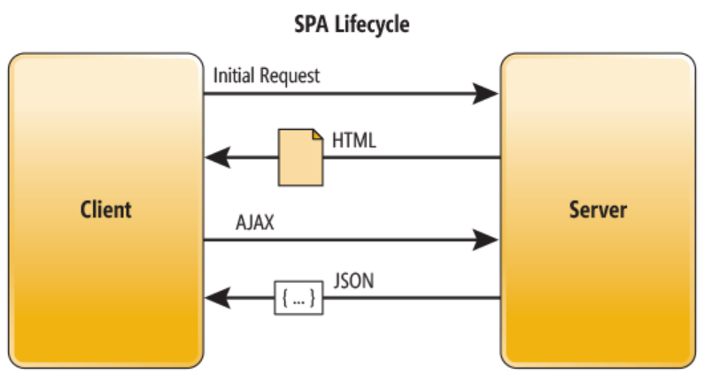
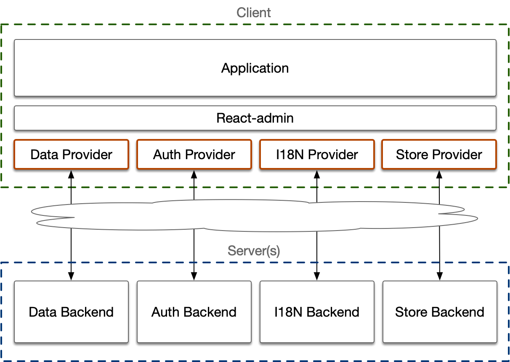

# 主要概念

React-adminは、そのコードベースを構築するいくつかの設計決定に依存しています。

## シングルページアプリケーション

React-adminは[シングルページアプリケーション (SPA)](https://en.wikipedia.org/wiki/Single-page_application)を構築するために特別に設計されています。React-adminアプリでは、ブラウザは必要なHTML、CSS、およびJavaScriptを一度だけ取得し、その後はAJAXコールを通じてAPIからデータを取得します。これは、各画面のために新しいHTMLページを取得する従来のウェブアプリケーションとは対照的です。



SPAアーキテクチャは、React-adminアプリを[非常に高速](./Features.md#fast)にし、ホスティングが容易で、専用のバックエンドを必要とせず既存のAPIと互換性があります。

これを達成するために、React-adminは`react-router`によって提供される内部ルーターを使用して、ユーザーがリンクをクリックしたときに適切な画面を表示します。開発者は、CRUDルート用の[`<Resource>`](./Resource.md)コンポーネントおよび他のルート用の[`<CustomRoutes>`](./CustomRoutes.md)コンポーネントを使用してルートを定義できます。

例えば、以下のReact-adminアプリケーションは次のルートを宣言しています：

```jsx
import { Admin, Resource, CustomRoutes } from 'react-admin';
import { Route } from 'react-router-dom';

    export const App = () => (
        <Admin dataProvider={dataProvider}>
            <Resource name="labels" list={LabelList} edit={LabelEdit} show={LabelShow} />
            <Resource label="genres" list={GenreList} />
            <Resource name="artists" list={ArtistList} edit={ArtistDetail} create={ArtistCreate}>
                <Route path=":id/songs" element={<SongList />} />
                <Route path=":id/songs/:songId" element={<SongDetail />} />
            </Resource>
            <CustomRoutes>
                <Route path="/profile" element={<Profile />} />
                <Route path="/organization" element={<Organization />} />
            </CustomRoutes>
        </Admin>
    );
```

宣言されるルートは以下の通りです：

* `/labels`: `<LabelList>`
* `/labels/:id`: `<LabelEdit>`
* `/labels/:id/show`: `<LabelShow>`
* `/genres`: `<GenreList>`
* `/artists`: `<ArtistList>`
* `/artists/:id`: `<ArtistDetail>`
* `/artists/create`: `<ArtistCreate>`
* `/artists/:id/songs`: `<SongList>`
* `/artists/:id/songs/:songId`: `<SongDetail>`
* `/profile`: `<Profile>`
* `/organization`: `<Organization>`

`<Resource>`コンポーネントは、関連エンティティのCRUDページ間のリンクを自動的に行うため、ルートの管理に煩わされることなく、アプリケーションをエンティティの観点から考えることができます。

## プロバイダ

React-adminは、APIの特定の構造について仮定をしません。その代わりに、データ取得、認証、国際化、設定のために独自のシンタックスを定義します。APIと対話するために、React-adminは**プロバイダ**と呼ばれるアダプタに依存します。



例えば、APIからレコードのリストを取得するためには、次のように`dataProvider`オブジェクトを使用します：

```jsx
dataProvider.getList('posts', {
    pagination: { page: 1, perPage: 5 },
    sort: { field: 'title', order: 'ASC' },
    filter: { author_id: 12 },
}).then(response => {
    console.log(response);
});
// {
//     data: [
//         { id: 452, title: "Harry Potter Cast: Where Now?", author_id: 12 },
//         { id: 384, title: "Hermione: A Feminist Icon", author_id: 12 },
//         { id: 496, title: "Marauder's Map Mysteries", author_id: 12 },
//         { id: 123, title: "Real-World Roots of Wizard Spells", author_id: 12 },
//         { id: 189, title: "Your True Hogwarts House Quiz", author_id: 12 },
//     ],
//     total: 27
// }
```

`dataProvider.getList()`メソッドは、このリクエストをAPIへの適切なHTTPリクエストに変換する責任があります。RESTデータプロバイダを使用する場合、上記のコードは次のように変換されます：

```yaml
GET http://path.to.my.api/posts?sort=["title","ASC"]&range=[0, 4]&filter={"author_id":12}

HTTP/1.1 200 OK
Content-Type: application/json
Content-Range: posts 0-4/27
[
    { id: 452, title: "Harry Potter Cast: Where Now?", author_id: 12 },
    { id: 384, title: "Hermione: A Feminist Icon", author_id: 12 },
    { id: 496, title: "Marauder's Map Mysteries", author_id: 12 },
    { id: 123, title: "Real-World Roots of Wizard Spells", author_id: 12 },
    { id: 189, title: "Your True Hogwarts House Quiz", author_id: 12 },
]
```

React-adminは、REST、GraphQL、Firebase、Django REST Framework、API Platformなど、さまざまなバックエンド用に[50以上のデータプロバイダ](./DataProviderList.md)を提供します。これらのプロバイダがAPIに適さない場合は、[カスタムプロバイダの開発](./DataProviderWriting.md)が可能です。

このアプローチのため、React-adminコンポーネントは直接`fetch`や`axios`を呼び出すことはありません。代わりに、データプロバイダに依存してAPIからデータを取得します。同様に、カスタムコンポーネントも同じパターンに従い、[データプロバイダフック](./Actions.md)（例：[`useGetList`](./useGetList.md)）を使用することをお勧めします：

```jsx
import { useGetList } from 'react-admin';

const MyComponent = () => {
    const { data, total, loading, error } = useGetList('posts', {
        pagination: { page: 1, perPage: 5 },
        sort: { field: 'title', order: 'ASC' },
        filter: { author_id: 12 },
    });

    if (loading) return <Loading />;
    if (error) return <Error />;
    return (
        <div>
            <h1>あなたのクエリに一致する投稿が{total}件見つかりました</h1>
            <ul>
                {data.map(record => (
                    <li key={record.id}>{record.title}</li>
                ))}
            </ul>
        </div>
    )
};
```

`useGetList`を使用することで、ユーザーの認証情報の管理、ローディングインジケータのトリガー、ローディング状態の管理、エラーの処理、結果のキャッシュ、データ形状の制御など、単なる`fetch`以上のさまざまな利点を得ることができます。

サーバーと通信する必要があるときは、常にこれらのプロバイダを使用します。これらはそれぞれのドメインに特化しており、React-adminと緊密に統合されているため、開発者の時間と労力を大幅に節約できます。

## スマートコンポーネント

React-adminは、ほとんどのウェブアプリケーションが同じ基本的な構成要素を使用するため、同じコードを何度も書き直すことを避けるために作られました。React-adminは、データフェッチング、状態管理、アプリケーション内の相互作用を処理する**スマートコンポーネント**を提供しています。

<a href="./img/components.webp"></a>

React-adminは、Material UIやBootstrapのようなUIキットではありません。それ以上に、データ駆動型アプリケーションに特化した構成要素を提供します。Material UIの上に構築されていますが、Material UIに詳しくなくてもReact-adminを効果的に使用できます。

例えば、カスタムメニューを作成するには、`<Menu>`コンポーネントを利用できます：

```jsx
// in src/MyMenu.js
import { Menu } from 'react-admin';
import LabelIcon from '@mui/icons-material/Label';

export const MyMenu = () => (
    <Menu>
        <Menu.DashboardItem />
        <Menu.ResourceItem name="posts" />
        <Menu.ResourceItem name="comments" />
        <Menu.ResourceItem name="users" />
        <Menu.Item to="/custom-route" primaryText="Miscellaneous" leftIcon={<LabelIcon />}/>
    </Menu>
);
```

この例では、`<Menu.DashboardItem>`は`/dashboard`ルートにリンクし、`<Menu.ResourceItem>`は`<Resource>`コンポーネントから定義されたリストページにリンクし、`<Menu.Item>`はアプリケーションの任意のルートにリンクするために使用できる汎用コンポーネントです。`<Menu>`コンポーネントは、アプリケーションの位置の変更に自動的に応答し、現在のルートを強調表示します。さらに、[役割ベースのアクセス制御](./AuthRBAC.md)を使用している場合、ユーザーはアクセス権限のあるメニュー項目のみを表示します。

カスタムコンポーネントを作成する前に、React-adminが目的に合ったコンポーネントを既に提供していないか確認するのが良い実践です。多くの場合、React-adminは数時間、場合によっては数日分の開発時間を節約できます。

その他の有用なReact-adminコンポーネントには、ガイド付きツアー、サブフォーム、ログイン画面、アクションボタン、カレンダーなどがあります。各React-adminコンポーネントは、プロパティ、子要素、および[テーマ](./AppTheme.md)を使用してアプリケーションの特定のニーズに合わせてカスタマイズできます。

## コンポジション

React-adminは、圧倒的な数のプロパティを受け取る「ゴッドコンポーネント」を避ける原則に従います。代わりに、React-adminは、コンポーネントがロジックの一部を処理するサブコンポーネントを受け入れる（子要素や特定のプロパティを通じて）コンポジションの使用を奨励します。

例えば、`<Edit>`コンポーネントにアクションのリストを直接渡すことはできませんが、`actions`コンポーネントを渡すことで同じ結果を達成できます：

```jsx
import { Button } from '@mui/material';
import { TopToolbar, ShowButton } from 'react-admin';

export const PostEdit = () => (
    <Edit actions={<PostEditActions />}>
        ...
    </Edit>
);

const PostEditActions = () => (
    <TopToolbar>
        <ShowButton />
        <Button color="primary" onClick={customAction}>カスタムアクション</Button>
    </TopToolbar>
);
```

このアプローチにより、別のコンポーネントと組み合わせることで、コンポーネントのロジックの特定部分をオーバーライドできます。

多くのReact-adminコンポーネントは、カスタムコンポーネントを子要素やプロパティとして渡すことで簡単にカスタマイズできます。

このアプローチのトレードオフは、特定の機能を有効にするために複数のコンポーネントをオーバーライドする必要があることがある点です。例えば、メニューをオーバーライドするには、カスタムメニューコンポーネントをカスタム`<Layout>`に渡し、そのカスタム`<Layout>`を`<Admin>`コンポーネントに渡す必要があります：

```jsx
// in src/Layout.js
import { Layout } from 'react-admin';
import { Menu } from './Menu';

export const Layout = (props) => <Layout {...props} menu={Menu} />;

// in src/App.js
import { Layout }  from './Layout';

const App = () => (
    <Admin layout={Layout} dataProvider={simpleRestProvider('http://path.to.my.api')}>
        // ...
    </Admin>
);
```

この欠点にもかかわらず、React-adminでのコンポジションの使用は、コンポーネントを高度に拡張可能にし、コードの読みやすさと保守性を大幅に向上させます。

## フック

React-adminコンポーネントをプロパティを使用して調整できない場合、常に低レベルのAPIであるフックに頼ることができます。実際、React-adminは`ra-core`というヘッドレスライブラリの上に構築されており、主にフックで構成されています。これらのフックはフレームワークの実装詳細を隠し、ビジネスロジックに集中することができます。デフォルトのUIが特定の要件を満たさない場合、React-adminフックを独自のコンポーネントで使用することは全く普通のことです。

例えば、`<DeleteWithConfirmButton>`ボタンはクリック時に確認ダイアログを表示し、その後現在のレコードのために`dataProvider.delete()`メソッドを呼び出します。同じ機能を別のUIで実現したい場合、`useDeleteWithConfirmController`フックを使用できます：



```jsx
const DeleteButton = () => {
    const resource = useResourceContext();
    const record = useRecordContext();
    const {
        open,
        isLoading,
        handleDialogOpen,
        handleDialogClose,
        handleDelete,
    } = useDeleteWithConfirmController({ redirect: 'list' });

    return (
        <Fragment>
            <Button onClick={handleDialogOpen} label="ra.action.delete">
                {icon}
            </Button>
            <Confirm
                isOpen={open}
                loading={isLoading}
                title="ra.message.delete_title"
                content="ra.message.delete_content"
                translateOptions={{
                    name: resource,
                    id: record.id,
                }}
                onConfirm={handleDelete}
                onClose={handleDialogClose}
            />
        </Fragment>
    );
};
```



フック名がしばしば`Controller`で終わるのは意図的であり、React-adminの複雑なコンポーネントに対して[モデル・ビュー・コントローラ (MVC) パターン](https://en.wikipedia.org/wiki/Model%E2%80%93view%E2%80%93controller)を使用していることを反映しています。

* コントローラロジックはReactフック（例：`useListController`）で処理されます。
* ビューロジックはReactコンポーネント（例：`<List>`）で管理されます。
* モデルロジックは開発者に任され、React-adminはそのモデルがプロバイダを通じて公開しなければならないインターフェースを定義するだけです。

React-adminは、独自のコンポーネントを構築するための[数十のフック](./Reference.md#hooks)を提供します。Material UIコンポーネントに依存せずにReact-adminアプリケーション全体を構築することも可能で、別のUIキットを使用することもできます。この柔軟性により、アプリケーションを特定のニーズや好みに合わせることができます。

## コンテキスト：プル、プッシュしない

コンポーネント間の通信は、大規模なReactアプリケーションでは特に難しい場合があります。いくつものレベルを通じてプロパティを渡すのが煩雑になることがあります。React-adminは、この問題に対応するためにプルモデルを採用しています。コンポーネントはコンテキストを介して子孫にプロパティを公開し、子孫はカスタムフックを使用してこれらのプロパティを消費できます。

React-adminコンポーネントがデータを取得したり、コールバックを定義したりするときは常に、コンテキストを作成し、そのデータとコールバックをその中に配置します。

例えば、`<Admin>`コンポーネントは`I18NProviderContext`を作成し、`translate`関数を公開します。アプリケーション内のすべてのコンポーネントは、この`translate`関数を使用してラベルやメッセージを翻訳するために`useTranslate`フックを利用できます。

```jsx
import { useTranslate } from 'react-admin';

export const MyHelloButton = ({ handleClick }) => {
    const translate = useTranslate();
    return (
        <button onClick={handleClick}>{translate('root.hello.world')}</button>
    );
};
```

同様に、`<Show>`コンポーネントはレコードを取得し、それを`RecordContext`を介して公開します。`<Show>`コンポーネント内では、`useRecordContext`フックを使用してレコードデータにアクセスできます。例えば、レコードの位置の地図を表示するために使用できます。

```jsx
import { useRecordContext } from 'react-admin';
import { MapContainer, TileLayer, Marker } from 'react-leaflet';

const LocationField = ({ source }) => {
    const record = useRecordContext(props); // <Show>によって作成されたRecordContextを使用
    if (!record) return null;

    return (
        <MapContainer center={record[source]} zoom={13} scrollWheelZoom={false}>
            <TileLayer
            attribution='&copy; <a href="https://www.openstreetmap.org/copyright">OpenStreetMap</a> contributors'
            url="https://{s}.tile.openstreetmap.org/{z}/{x}/{y}.png"
            />
            <Marker position={record[source]} />
        </MapContainer>
    );
};

const StoreShowPage = () => (
    <Show> {/* RecordContextを作成 */}
        <SimpleShowLayout>
            <TextField source="name" />
            <LocationField source="location" />
        </SimpleShowLayout>
    </Show>
)
```

このアプローチは、依存関係の注入システムの必要性を排除し、レンダーツリーの上位レベルからデータやコールバックにアクセスするためのエレガントな解決策を提供します。

したがって、データやコールバックが必要なコンポーネントを書く場合は、常にそれを取得するためのコンテキストを見つけることができます。

コンテキストは、React Adminの基本概念です。もしコンテキストに不慣れであれば、[Reactのコンテキストに関するドキュメント](https://react.dev/learn/passing-data-deeply-with-context)を読むことをお勧めします。コンテキストを理解することで、React-adminがこれをどのように活用して強力で柔軟なフレームワークを作り上げているかを大いに理解する助けになります。

## 充実したが取り外し可能なバッテリー

React-adminは、その設計選択があなたのニーズに合う限り、組み込みコンポーネントだけを使用して高度なウェブアプリケーションを構築することができます。しかし、コンポーネントの既存の機能が特定の要件を満たさない場合は、カスタムコンポーネントで置き換えることができます。

例えば、[`<SimpleShowLayout>`](./SimpleShowLayout.md)が、以下の画像のように連絡先の詳細を配置することを許可していない場合：


独自のレイアウトコンポーネントを作成して使用できます：



```tsx
export const ContactShow = () => (
    <ShowBase>
        <ContactShowContent />
    </ShowBase>
);

const ContactShowContent = () => {
    const { record, isLoading } = useShowContext<Contact>();
    if (isLoading || !record) return null;
    return (
        <Box mt={2} display="flex">
            <Box flex="1">
                <Card>
                    <CardContent>
                        <Box display="flex">
                            <Avatar />
                            <Box ml={2} flex="1">
                                <Typography variant="h5">
                                    {record.first_name} {record.last_name}
                                </Typography>
                                <Typography variant="body2">
                                    {record.title} at{' '}
                                    <ReferenceField
                                        source="company_id"
                                        reference="companies"
                                        link="show"
                                    >
                                        <TextField source="name" />
                                    </ReferenceField>
                                </Typography>
                            </Box>
                            <Box>
                                <ReferenceField
                                    source="company_id"
                                    reference="companies"
                                    link="show"
                                >
                                    <LogoField />
                                </ReferenceField>
                            </Box>
                        </Box>
                        <ReferenceManyField
                            target="contact_id"
                            reference="contactNotes"
                            sort={{ field: 'date', order: 'DESC' }}
                        >
                            <NotesIterator showStatus reference="contacts" />
                        </ReferenceManyField>
                    </CardContent>
                </Card>
            </Box>
            <ContactAside />
        </Box>
    );
};
```



この特定の例は、[Atomic CRM](https://marmelab.com/react-admin-crm/#/contacts)から引用したもので、多くの[デモアプリケーション](./Demos.md)の一つです。

React-adminのコンポーネントを独自のデザインで置き換えることをためらわないでください。React-adminはすべてのユースケースをカバーすることを目指しているわけではなく、カスタムコンポーネントを統合するためのフックを提供しています。結局のところ、「それはただのReactです」™。

React-adminを使用している限り、行き詰まることはありません。

## ユーザーエクスペリエンスは王である

React-adminには、2つの異なるユーザーセットがあります：

* ブラウザでReact-adminアプリを使用するエンドユーザー
* React-adminコードをIDEで操作する開発者

私たちは、各機能のユーザーエクスペリエンス（UX）と開発者エクスペリエンス（DX）の両方を慎重に設計しています。

ビジュアル部分については、React-adminは[Material Design](https://m3.material.io/)の実践的な実装であるMaterial UIの上に構築されています。このデザインシステムは、ウェブおよびモバイルアプリのために細心の注意を払って構築されており、ユーザーフレンドリーで一貫性のあるユーザーインターフェースを作成するための優れた基盤を提供します。しかし、これは物語の一部に過ぎません。

UIを可能な限り直感的にするために、多くの時間を投資しています。小さな整列の不一致、画面のフラッシュ、色の不整合などに常に注意を払い、顧客のフィードバックに基づいて継続的に反復し、実際のアプリケーションで発生するビジュアルおよびアニメーションの問題を解決するために努力しています。

デフォルトでは、React-adminは意図的に淡白なユーザーインターフェースを生成します。なぜなら、見た目よりもコンテンツに焦点を当てたいからです。

<video controls autoplay playsinline muted loop> <source src="./img/sort-button.webm" type="video/webm"/> <source src="./img/sort-button.mp4" type="video/mp4"/> Your browser does not support the video tag. </video>

開発者エクスペリエンスに関しては、React-adminは直感的なAPI、高度な機能、合理的な抽象化レベル、および包括的なドキュメントのバランスを取るために常に進化しています。コアチームのメンバーはReact-adminの最初のテスターであり、すべてのフックとコンポーネントの生産性、デバッグ性、発見可能性、パフォーマンス、および信頼性に焦点を当てています。

## 巨人の肩に乗って

多くの優れたオープンソースライブラリが、データフェッチング、フォーム、UIコンポーネント、テストなどのB2Bアプリの部分的な要件に対処しています。

React-adminは車輪の再発明を避け、各カテゴリで最高のツール（機能、開発者エクスペリエンス、アクティブなメンテナンス、ドキュメント、ユーザーベースの観点から）を使用し、これらのライブラリの周りに接着剤を提供します。

React-admin v4では、これらのライブラリは[react-query](https://tanstack.com/query/v3)、[react-router](https://reactrouter.com/en/main)、[react-hook-form](https://react-hook-form.com/)、[Material UI](https://mui.com/)、[emotion](https://emotion.sh/docs/introduction)、[testing-library](https://testing-library.com/docs/react-testing-library/intro)、[date-fns](https://date-fns.org/)、および[lodash](https://lodash.com/)と呼ばれます。

新しい要件が発生した場合、React-adminチームは常に既存のソリューションを探し、統合を優先します。

ただし、React-adminのすべての依存関係は、[MITライセンス](https://github.com/marmelab/react-admin/blob/master/LICENSE.md)と互換性がある必要があります。

## 最小限のAPIサーフェス

新しいフックを導入したり、既存のコンポーネントに新しいプロパティを追加したりする前に、純粋なReactを使用して機能を実装する簡単な方法があるかどうかを常に検討します。可能であれば、新しいプロパティを追加しないことを選択します。これは、React-adminのAPI、コード、テスト、およびドキュメントの簡潔さを維持するために重要です。この決定は、学習曲線を管理しやすくし、保守の負担を軽減するために重要です。

例えば、`<SimpleShowLayout>`コンポーネントはフィールド要素を1列に表示します。1つの列に2つのフィールドを配置したい場合、列と行ごとの要素数を示す特定のシンタックスを導入することができます。しかし、これは単純なユースケースのための使用方法とドキュメントを過度に複雑にします。さらに、このようなことはReactを使用して十分に実現可能であり、React-adminコアに変更を加える必要はありません。例えば、Material UIの`<Stack>`コンポーネントを使用することができます：

```jsx
import * as React from 'react';
import { Show, SimpleShowLayout, TextField } from 'react-admin';
import { Stack } from '@mui/material';

const PostShow = () => (
    <Show>
        <SimpleShowLayout>
            <Stack direction="row" spacing={2}>
                <TextField source="title" />
                <TextField source="body" />
            </Stack>
            <TextField source="author" />
        </SimpleShowLayout>
    </Show>
);
```

このコードスニペットはReact開発者にとって十分に簡単だと考えていますので、コアサポートを追加しないことを選びました。

React-adminドキュメントに特定の機能が見つからない場合、それは純粋なReactを使用して迅速に達成できるためであることがよくあります。

## 新機能よりも後方互換性が重要

基盤となるライブラリが破壊的な変更を導入したために、アプリのコードを更新することを誰も楽しんでいません。React-adminは、このような中断とそれが開発者に引き起こす不要な時間の損失を防ぐために努力しています。

一部のコンポーネントには、歴史的な理由で独特のAPIがある場合があります。できるだけ後方互換性を維持することを優先しており、場合によってはAPIの一貫性を犠牲にすることがあります。

一部のコンポーネントのコードは不必要に複雑に見えるかもしれません。これは通常、コンポーネントが古いシンタックスと新しいシンタックスの両方をサポートする必要がある場合に発生します。

この後方互換性を維持するには、React-adminのコアチームに多大な労力が必要ですが、それはReact-adminユーザーにとって大幅な時間の節約となります。

## 驚きの最小化の原則

私たちは[コンポジション](#composition)を重視しているため、React-adminコンポーネントをさまざまな方法で組み合わせて、それがシームレスに動作することを期待できるべきです（[コンテキスト](#context-pull-dont-push)のおかげで）。React-adminコンポーネントがうまく連携することを確認するために包括的なテストスイートがあります。さらに、TypeScriptは、サポートされていない方法でコンポーネントを使用している場合を特定するのに役立ちます。

これらの考慮事項は、React-adminコードの強力な設計選択につながります。

顕著な例の一つは、子要素の検査に関するものです。これは可能な限り避けるよう努めています。例外は、列ヘッダーを決定するためにField子要素を実行時に検査する`<Datagrid>`コンポーネントです。このプラクティスには重大な欠点があります：

* 子要素が同じAPIに従わない別のコンポーネント内にラップされている場合、この機能は壊れます
* 開発者は通常、コンポーネントがそのサブツリーに影響を与えることを期待します。これを期待すると、説明が難しいバグにつながる可能性があります。

私たちはより優れた代替案がないため、`<Datagrid>`における子要素の検査を保持していますが、これは稀な例外です。子要素の検査を実装するたびに、後で後悔しました。

驚きを最小限に抑えるため、`React.cloneElement()`の使用を避け、ツリー全体にプロパティを渡すことはしません。

## 最小限のドキュメントの原則

誰もドキュメントを読みません。これは残念な現実ですが、私たちはそれを受け入れています。

したがって、新しい機能を設計する際には、開発者にとって直感的であることを最優先します。APIを最小限に抑えます（[上記参照](#minimal-api-surface)）。確立されたライブラリのAPIを模倣します。明確で情報豊富なエラーメッセージを投げます。開発者がIDE内でAPIを発見できるように、TypeScriptタイプとJSDocを提供します。さらに、注釈付きコードを含むライブ例を公開しています。

それにもかかわらず、React-adminは広範なため、結果的に包括的なドキュメントが必要です。さまざまなユースケースをカバーし、使用方法の指示やAPIの説明を超えてドキュメントを提供しています。必要な情報をすばやく見つけるために、同じ情報を異なる場所に頻繁に重複させています。私たちは[セレンディピティ](https://en.wikipedia.org/wiki/Serendipity)の力を本当に信じています。

このドキュメントが最初は圧倒的に感じるかもしれませんが、心配しないでください。すべてを一度に読む必要はありません。各セクションのイントロダクションを読み、デモコードを調べてください。時間が経つにつれて、React-admin APIに慣れ、必要な情報を簡単に見つけることができるようになります。

## モノレポ

React-adminコンポーネントをインポートするたびに、それは`react-admin`パッケージからインポートされます：

```jsx
import { List, Datagrid, TextField } from 'react-admin';
```

しかし、[React-adminのソースコード](https://github.com/marmelab/react-admin)を覗いてみると（ぜひやってみてください）、次のようなインポートが見つかります：

```jsx
import { useListController } from 'ra-core';
```

これは、`react-admin`パッケージが内部パッケージからコンポーネントを再エクスポートしているためです。React-adminは、特定の機能に特化した複数のパッケージの*配布*です。これらのパッケージは[`packages/`ディレクトリ](https://github.com/marmelab/react-admin/tree/master/packages)にあります。注目すべきパッケージのいくつかは次のとおりです：

* `ra-core`: UIなしのReact-adminのコアロジック。
* `ra-ui-materialui`: React-adminのMaterial UIスキン。
* `ra-data-*`: さまざまなデータバックエンド用のデータプロバイダ。
* `ra-language-*`: さまざまな言語用のインターフェース翻訳。
* `react-admin`: 標準のReact-adminディストリビューション

これらのパッケージを組み合わせて独自のReact-adminディストリビューションを構築できます。また、React-adminディストリビューション全体をインポートせずに、これらのパッケージの1つから直接フックやコンポーネントをインポートすることもできます。


