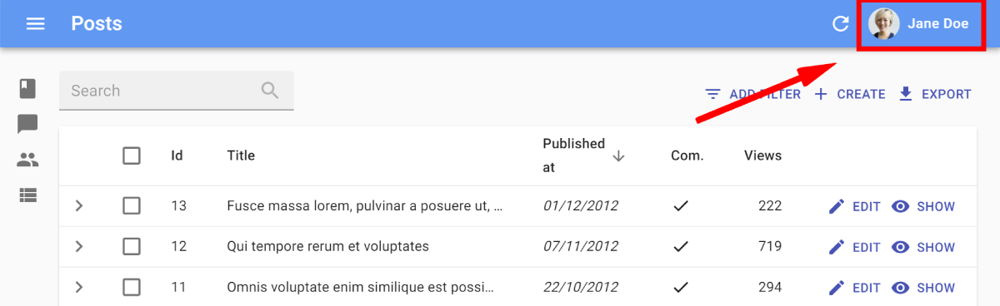

# Authプロバイダーの作成

ここでは、`authProvider`オブジェクトがreact-adminによって期待されるインターフェースを示します。

```jsx
    const authProvider = {
        // 認証
        login: params => Promise.resolve(/* ... */),
        checkError: error => Promise.resolve(/* ... */),
        checkAuth: params => Promise.resolve(/* ... */),
        logout: () => Promise.resolve(/* ... */),
        getIdentity: () => Promise.resolve(/* ... */),
        handleCallback: () => Promise.resolve(/* ... */), // サードパーティの認証のみ
        // 認可
        getPermissions: () => Promise.resolve(/* ... */),
    };
```

**Tip**: TypeScriptユーザーの場合、`AuthProvider`型を使用してコンパイル時に`authProvider`が正しいか確認できます。

```tsx
import { AuthProvider } from 'react-admin';

const authProvider: AuthProvider = {
    // ...
};
```

## 例

ここでは、完全な例ですが架空のauthプロバイダーの実装を示します。これは"john"というユーザーと"123"というパスワードのみを受け付けます。

```jsx
const authProvider = {
    login: ({ username, password }) => {
        if (username !== 'john' || password !== '123') {
            return Promise.reject();
        }
        localStorage.setItem('username', username);
        return Promise.resolve();
    },
    logout: () => {
        localStorage.removeItem('username');
        return Promise.resolve();
    },
    checkAuth: () =>
        localStorage.getItem('username') ? Promise.resolve() : Promise.reject(),
    checkError: (error) => {
        const status = error.status;
        if (status === 401 || status === 403) {
            localStorage.removeItem('username');
            return Promise.reject();
        }
        // 他のエラーコード（404, 500など）：ログアウトの必要はなし
        return Promise.resolve();
    },
    getIdentity: () =>
        Promise.resolve({
            id: 'user',
            fullName: 'John Doe',
        }),
    getPermissions: () => Promise.resolve(''),
};

export default authProvider;
```

## ステップバイステップ

独自のauthプロバイダーを実装する必要がある場合は、以下のステップバイステップガイドを参考にしてください。

### `login`

管理者が`authProvider`を持つと、react-adminは`/login`ルートに新しいページを有効にし、ユーザー名とパスワードを要求するログインフォームを表示します。


送信すると、このフォームは`authProvider.login({ username, password })`メソッドを呼び出します。このメソッドは、資格情報が正しければ解決されたPromiseを返し、正しくなければ拒否されたPromiseを返すことをreact-adminは期待しています。

例えば、HTTPSを介して認証ルートにクエリを実行し、資格情報（トークン）をローカルストレージに保存するには、次のように`authProvider`を設定します。

```js
// src/authProvider.js
const authProvider = {
    login: ({ username, password }) =>  {
        const request = new Request('https://mydomain.com/authenticate', {
            method: 'POST',
            body: JSON.stringify({ username, password }),
            headers: new Headers({ 'Content-Type': 'application/json' }),
        });
        return fetch(request)
            .then(response => {
                if (response.status < 200 || response.status >= 300) {
                    throw new Error(response.statusText);
                }
                return response.json();
            })
            .then(auth => {
                localStorage.setItem('auth', JSON.stringify(auth));
            })
            .catch(() => {
                throw new Error('Network error')
            });
    },
    checkAuth: () => {
        // 認証が機能するために必要
        return Promise.resolve();
    },
    getPermissions: () => {
        // 認証が機能するために必要
        return Promise.resolve();
    },
    // ...
};

export default authProvider;
```

Promiseが解決されると、ログインフォームは前のページにリダイレクトされるか、ユーザーが到着した場合は管理インデックスにリダイレクトされます。

**Tip**: この例のように資格情報を`localStorage`に保存するのは良いアイデアです。これにより、新しいブラウザタブを開くときに再接続する必要がなくなります。ただし、これによりアプリケーションが[XSS攻撃に対して脆弱](https://www.redotheweb.com/2015/11/09/api-security.html)になるため、セキュリティを強化し、サーバー側で`httpOnly`クッキーも追加する方が良いでしょう。

ログイン後、react-adminはユーザーを`authProvider.login()`によって返される場所にリダイレクトします - またはメソッドが何も返さない場合は前のページにリダイレクトします。ログイン後のリダイレクトURLをカスタマイズするには、`redirectTo`キーを含むオブジェクトを返し、文字列またはログイン後のリダイレクトを無効にするにはfalseを返します。

```js
// src/authProvider.js
const authProvider = {
    login: ({ username, password }) =>  {
        const request = new Request('https://mydomain.com/authenticate', {
            method: 'POST',
            body: JSON.stringify({ username, password }),
            headers: new Headers({ 'Content-Type': 'application/json' }),
        });
        return fetch(request)
            .then(response => {
                // ...
                return { redirectTo: false };
            })
            .catch(() => {
                throw new Error('Network error')
            });
    },
    checkAuth: () => { /* ... */ },
    getPermissions: () => { /* ... */ },
    // ...
};

```

ログインが失敗した場合、`authProvider.login()`はErrorオブジェクトを持つ拒否されたPromiseを返すべきです。react-adminはエラーメッセージを通知でユーザーに表示します。

### `checkError`

ユーザーの資格情報が欠落しているか無効になった場合、安全なAPIは通常、HTTPエラーコード401または403で`dataProvider`に応答します。

幸いなことに、`dataProvider`または`authProvider.getPermissions`がエラーを返すたびに、react-adminは`authProvider.checkError()`メソッドを呼び出します。これが拒否されたPromiseを返すと、react-adminは直ちに`authProvider.logout()`メソッドを呼び出し、ユーザーに再ログインを要求します。

したがって、どのHTTPステータスコードがユーザーを続行させるべきか（Promiseを解決することによって）またはログアウトさせるべきか（Promiseを拒否することによって）を決定するのはあなた次第です。

例えば、401および403の両方のコードでユーザーをログアウトさせるには、次のようにします。

```js
// src/authProvider.js
export default {
    login: ({ username, password }) => { /* ... */ },
    checkError: (error) => {
        const status = error.status;
        if (status === 401 || status === 403) {
            localStorage.removeItem('auth');
            return Promise.reject();
        }
        // 他のエラーコード（404, 500など）：ログアウトの必要はなし
        return Promise.resolve();
    },
    // ...
};
```

`authProvider.checkError()`が拒否されたPromiseを返すと、react-adminは`/login`ページまたは`error.redirectTo` URLにリダイレクトします。これにより、デフォルトのリダイレクトを次のように上書きできます。

```js
// src/authProvider.js
export default {
    login: ({ username, password }) => { /* ... */ },
    checkError: (error) => {
        const status = error.status;
        if (status === 401 || status === 403) {
            localStorage.removeItem('auth');
            return Promise.reject({ redirectTo: '/credentials-required' });
        }
        // 他のエラーコード（404, 500など）：ログアウトの必要はなし
        return Promise.resolve();
    },
    // ...
};
```

ユーザーをログアウトさせずにリダイレクトすることも可能です。これには、`Promise.reject`に`error.redirectTo` URLとともに`error.logoutUser = false`を渡します。

```js
// src/authProvider.js
export default {
    login: ({ username, password }) => { /* ... */ },
    checkError: (error) => {
        const status = error.status;
        if (status === 401 || status === 403) {
            return Promise.reject({ redirectTo: '/unauthorized', logoutUser: false });
        }
        // 他のエラーコード（404, 500など）：ログアウトの必要はなし
        return Promise.resolve();
    },
    // ...
};
```

`authProvider.checkError()`が拒否されたPromiseを返すと、react-adminはエンドユーザーに通知を表示します。ただし、`error.message`が`false`の場合は表示しません。これにより、次のようにエラー時の通知を無効化またはカスタマイズできます。

```js
// src/authProvider.js
export default {
    login: ({ username, password }) => { /* ... */ },
    checkError: (error) => {
        const status = error.status;
        if (status === 401 || status === 403) {
            localStorage.removeItem('auth');
            return Promise.reject({ message: false });
            // return Promise.reject({ message: 'Unauthorized user!' });
        }
        // 他のエラーコード（404, 500など）：ログアウトの必要はなし
        return Promise.resolve();
    },
    // ...
};
```

### `checkAuth`

RESTレスポンスが401ステータスコードを使用するたびにログインページにリダイレクトするだけでは通常十分ではありません。react-adminはクライアント側でデータを保持し、サーバーと連絡を取る際に資格情報が無効になっても古いデータを一時的に表示することがあります。

幸いなことに、ユーザーがリスト、編集、作成、または表示ページに移動するたびに、react-adminは`authProvider.checkAuth()`メソッドを呼び出します。このメソッドが拒否されたPromiseを返すと、react-adminは`authProvider.logout()`を呼び出し、ユーザーをログインページにリダイレクトします。したがって、資格情報がまだ有効であることを確認するための理想的な場所です。

例えば、ローカルストレージに認証データが存在するかどうかを確認するには次のようにします。

```js
// src/authProvider.js
export default {
    login: ({ username, password }) => { /* ... */ },
    checkError: (error) => { /* ... */ },
    checkAuth: () => localStorage.getItem('auth')
        ? Promise.resolve()
        : Promise.reject(),
    // ...
};
```

Promiseが拒否された場合、react-adminはデフォルトで`/login`ページにリダイレクトします。`checkAuth()`でユーザーのリダイレクト先を上書きするには、リダイレクト先を持つオブジェクトを拒否します。

```js
// src/authProvider.js
export default {
    login: ({ username, password }) => { /* ... */ },
    checkError: (error) => { /* ... */ },
    checkAuth: () => localStorage.getItem('auth')
        ? Promise.resolve()
        : Promise.reject({ redirectTo: '/no-access' }),
    // ...
}
```

**Tip**: `authProvider.checkAuth()`と`authProvider.logout()`の両方がリダイレクトURLを返す場合、`authProvider.checkAuth()`のリダイレクト先が優先されます。

Promiseが拒否された場合、react-adminはエンドユーザーに通知を表示します。このメッセージをカスタマイズするには、`message`プロパティを持つエラーを拒否します。

```js
// src/authProvider.js
export default {
    login: ({ username, password }) => { /* ... */ },
    checkError: (error) => { /* ... */ },
    checkAuth: () => localStorage.getItem('auth')
        ? Promise.resolve()
        : Promise.reject({ message: 'login.required' }), // react-adminはエラーメッセージを翻訳レイヤーに渡します
    // ...
}
```

この通知を完全に無効にすることも可能です。そのためには、`message`プロパティに`false`を持つエラーを拒否します。

```js
// src/authProvider.js
export default {
    login: ({ username, password }) => { /* ... */ },
    checkError: (error) => { /* ... */ },
    checkAuth: () => localStorage.getItem('auth')
        ? Promise.resolve()
        : Promise.reject({ message: false }),
    // ...
}
```

### `logout`

認証を有効にすると、react-adminはトップバーのユーザーメニュー（またはモバイルではスライドメニュー）にログアウトボタンを追加します。ユーザーがログアウトボタンをクリックすると、`authProvider.logout()`メソッドが呼び出され、[react-admin Store](./Store.md)に保存されている可能性のある機密データが削除されます。その後、ユーザーはログインページにリダイレクトされます。前の2つのセクションでも示したように、react-adminはAPIが403エラーを返したときやローカルの資格情報が期限切れになったときに`authProvider.logout()`を呼び出すことがあります。

`authProvider.logout()`メソッドは、現在の認証データをクリーンアップする責任を負います。例えば、認証がローカルストレージに保存されているトークンであった場合、これを削除するコードは次のとおりです。

```js
// src/authProvider.js
export default {
    login: ({ username, password }) => { /* ... */ },
    checkError: (error) => { /* ... */ },
    checkAuth: () => { /* ... */ },
    logout: () => {
        localStorage.removeItem('auth');
        return Promise.resolve();
    },
    // ...
};
```
<video controls autoplay playsinline muted loop> <source src="./img/logout.webm" type="video/webm"/> <source src="./img/logout.mp4" type="video/mp4"/> お使いのブラウザはvideoタグをサポートしていません。 </video>

`authProvider.logout()`メソッドは、ログアウト後に認証バックエンドにユーザー資格情報が無効になったことを通知するための良い場所でもあります。

ログアウト後、react-adminは`authProvider.logout()`によって返される文字列にユーザーをリダイレクトします - またはメソッドが何も返さない場合は`/login` URLにリダイレクトします。ログアウト後のリダイレクトURLをカスタマイズするには、ルート文字列を返すか、ログアウト後のリダイレクトを無効にするには`false`を返します。

```js
// src/authProvider.js
export default {
    login: ({ username, password }) => { /* ... */ },
    checkError: (error) => { /* ... */ },
    checkAuth: () => { /* ... */ },
    logout: () => {
        localStorage.removeItem('auth');
        return Promise.resolve('/my-custom-login');
    },
    // ...
};
```

### `getIdentity`

react-adminは画面右上に現在のユーザー名とアバターを表示できます。この機能を有効にするには、`authProvider.getIdentity()`メソッドを実装します。

```js
// src/authProvider.js
const authProvider = {
    login: ({ username, password }) => { /* ... */ },
    checkError: (error) => { /* ... */ },
    checkAuth: () => { /* ... */ },
    logout: () => { /* ... */ },
    getIdentity: () => {
        try {
            const { id, fullName, avatar } = JSON.parse(localStorage.getItem('auth'));
            return Promise.resolve({ id, fullName, avatar });
        } catch (error) {
            return Promise.reject(error);
        }
    }
    // ...
};

export default authProvider;
```

react-adminは、App Barで`fullName`と`avatar`（画像ソースまたはdata-uri）を使用します。



**Tip**: `useGetIdentity`フックを呼び出すことで、コード内で現在のユーザーを識別するために`id`フィールドを使用できます。

```jsx
import { useGetIdentity, useGetOne } from 'react-admin';

const PostDetail = ({ id }) => {
    const { data: post, isLoading: postLoading } = useGetOne('posts', { id });
    const { identity, isLoading: identityLoading } = useGetIdentity();
    if (postLoading || identityLoading) return <>Loading...</>;
    if (!post.lockedBy || post.lockedBy === identity.id) {
        // ポストはロックされていないか、自分によってロックされている
        return <PostEdit post={post} />
    } else {
        // ポストは他の誰かによってロックされており、編集できない
        return <PostShow post={post} />
    }
}
```

### `getPermissions`

このメソッドはユーザーの権限を返すべきです。形式は任意で構いません - 単純な文字列（例：`'editor'`）、文字列の配列（例：`['editor', 'admin']`）、または複雑なオブジェクト（例：`{ posts: 'editor', comments: 'moderator', users: 'admin' }`）。

react-adminはデフォルトでは権限を使用しませんが、現在のユーザーの権限を取得するための [`usePermissions`フック](./usePermissions.md)を提供します。これにより、コンポーネント内にニーズに合った権限ロジックを追加できます。

[役割ベースのアクセス制御（RBAC）モジュール](./AuthRBAC.md)は、react-adminアプリで詳細な権限を可能にし、`authProvider.getPermissions()`のカスタムリターン形式を指定します。詳細については[RBACドキュメント](./AuthRBAC.md#authprovider-methods)を参照してください。

### `handleCallback`

このメソッドは、[Auth0](https://auth0.com/)などのサードパーティの認証プロバイダーを統合する際に使用されます。react-adminは認証サービスのコールバックURLとして使用される`/auth-callback`パスにルートを提供します。認証サービスを使用してログインした後、ユーザーはこのルートにリダイレクトされます。`/auth-callback`ルートはマウント時に`authProvider.handleCallback`メソッドを呼び出します。

したがって、`handleCallback`はサードパーティの認証サービスによって渡されたクエリパラメータを処理し、例として認証トークンを取得します。

ここでは、Auth0を使用した例を示します。

```jsx
import { PreviousLocationStorageKey } from 'react-admin';
import { Auth0Client } from './Auth0Client';

export const authProvider = {
    async login() { /* ここでは何もする必要はありません。この関数は呼び出されることはありません */ },
    async checkAuth() {
        const isAuthenticated = await client.isAuthenticated();
        if (isAuthenticated) {
            return;
        }
        // 認証されていない：ユーザーがアクセスしようとした場所を保存
        localStorage.setItem(PreviousLocationStorageKey, window.location.href);
        // その後、ユーザーをAuth0サービスにリダイレクト
        client.loginWithRedirect({
            authorizationParams: {
                // ログイン後、Auth0はユーザーをこのページにリダイレクトします
                redirect_uri: `${window.location.origin}/auth-callback`,
            },
        });
    },
    // ユーザーがAuth0サービスで正常にログインし、
    // アプリの/auth-callbackルートにリダイレクトされた
    async handleCallback() {
        const query = window.location.search;
        if (!query.includes('code=') && !query.includes('state=')) {
            throw new Error('ログインコールバックの処理に失敗しました。');
        }
        // Auth0パラメータを受け取った場合、
        // クエリパラメータに基づいてアクセストークンを取得
        await Auth0Client.handleRedirectCallback();
    },
    ...
}
```

`handleCallback`が解決されたPromiseを返すと、react-adminはユーザーをホームページまたは`localStorage.getItem(PreviousLocationStorageKey)`に格納されている場所にリダイレクトします。上記の例では、`authProvider.checkAuth()`がユーザーがアクセスしようとしていたページをこの場所に設定します。

この動作を上書きするには、`redirectTo`プロパティを持つオブジェクトを返します。

```jsx
async handleCallback() {
    if (!query.includes('code=') && !query.includes('state=')) {
        throw new Error('ログインコールバックの処理に失敗しました。');
    }
    // Auth0パラメータを受け取った場合、
    // クエリパラメータに基づいてアクセストークンを取得
    await Auth0Client.handleRedirectCallback();
    return { redirectTo: '/posts' };
},
```

## リクエスト形式

react-adminは以下のパラメータで`authProvider`メソッドを呼び出します：

|メソッド|使用例|パラメータ形式|
|---|---|---|
|`login`|ユーザーのログイン|`Object` ログインフォームに含まれる任意のフィールド|
|`checkError`|`dataProvider`エラーが認証エラーであるか確認|`{ message: string, status: number, body: Object }` `dataProvider`が返すエラー|
|`checkAuth`|新しいルートに移動する前に資格情報を確認|`Object` `useCheckAuth()`に渡される任意のパラメータ - react-adminデフォルトルートの場合は空|
|`logout`|ユーザーのログアウト||
|`getIdentity`|現在のユーザーのアイデンティティを取得||
|`handleCallback`|サードパーティ認証サービスのリダイレクト後にユーザーを検証||
|`getPermissions`|現在のユーザーの資格情報を取得|`Object` `usePermissions()`に渡される任意のパラメータ - react-adminデフォルトルートの場合は空|

## レスポンス形式

`authProvider`メソッドはPromiseを返さなければなりません。成功の場合、Promiseは次の値を返すべきです：

|メソッド|解決される条件|レスポンス形式|
|---|---|---|
|`login`|ログイン資格情報が受け入れられた|\`void|
|`checkError`|エラーが認証エラーでない|`void`|
|`checkAuth`|ユーザーが認証されている|`void`|
|`logout`|認証バックエンドがログアウトを確認|\`string|
|`getIdentity`|認証バックエンドがアイデンティティを返した|\`{ id: string|
|`handleCallback`|ユーザーが認証された|\`void|
|`getPermissions`|認証バックエンドが権限を返した|\`Object|

## エラー形式

認証バックエンドがエラーを返す場合、Authプロバイダーは以下の値で拒否されたPromiseを返すべきです：

|メソッド|拒否される条件|エラー形式|
|---|---|---|
|`login`|ログイン資格情報が受け入れられなかった|\`string|
|`checkError`|エラーが認証エラーである場合|\`void|
|`checkAuth`|ユーザーが認証されていない場合|\`void|
|`logout`|認証バックエンドがユーザーのログアウトに失敗|`void`|
|`getIdentity`|認証バックエンドがアイデンティティを返すのに失敗|`Object` 自由形式 - `useGetIdentity()`が呼び出されたときに`error`として返される|
|`handleCallback`|リダイレクト後にユーザーの認証に失敗|\`void|
|`getPermissions`|認証バックエンドが権限を返すのに失敗|`Object` 自由形式 - `usePermissions()`が呼び出されたときに`error`として返される。エラーは`checkError`に渡される|

