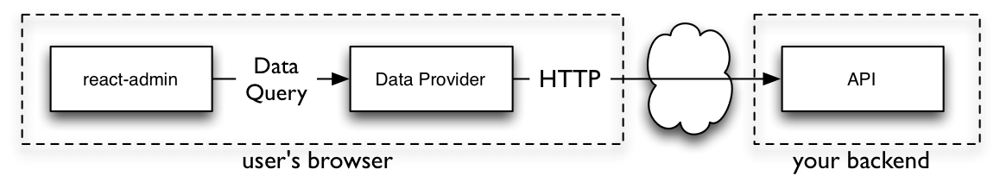
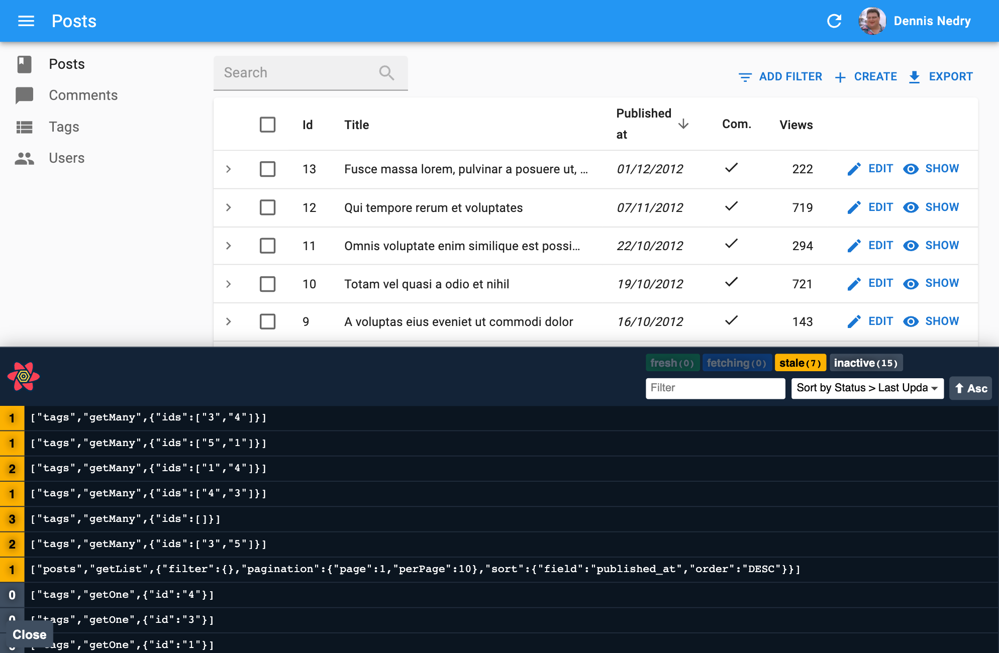

# データフェッチング

React-adminアプリは、使用するAPIがREST、GraphQL、RPC、さらにはSOAPであっても、その方言に関係なく構築できます。これは、react-adminが`fetch`を直接使用しないためです。代わりに、APIとインターフェースするためのデータプロバイダーオブジェクトと、データフェッチングを処理するための[react-query](https://tanstack.com/query/v3/docs/react/overview)を使用します。

## データプロバイダー

react-adminがAPIと通信する必要があるときは、`dataProvider`と呼ばれるオブジェクトを介して行います。この`dataProvider`は、react-adminが標準化された方法でAPIをクエリできるようにする定義済みインターフェースを公開します。



例えば、APIから単一のレコードを取得するために、react-adminは`dataProvider.getOne()`を呼び出します：

```js
    dataProvider
        .getOne('posts', { id: 123 })
        .then(response => {
            console.log(response.data); // { id: 123, title: "hello, world" }
        });
```

データプロバイダーの役割は、これらのメソッド呼び出しをHTTPリクエストに変換し、HTTPレスポンスをreact-adminが期待するデータ形式に変換することです。技術的には、データプロバイダーはAPIの*アダプター*です。

このアダプターシステムのおかげで、react-adminはどのAPIとも通信できます。オープンソースパッケージのリストについては、[サポートされているバックエンドのリスト](./DataProviderList.md)を参照して、APIに適したものを選んでください。

特定のバックエンドに対応するために、[独自のデータプロバイダーを作成](./DataProviderWriting.md)することもできます。データプロバイダーは、`fetch`、`axios`、`apollo-client`、その他のライブラリを使用してAPIと通信できます。また、データプロバイダーはカスタムHTTPヘッダー、認証などを追加する理想的な場所でもあります。

データプロバイダーは、以下のメソッドを持つ必要があります：

```jsx
const dataProvider = {
    getList:    (resource, params) => Promise, // ソート、フィルター、ページネーションに基づいてレコードのリストを取得
    getOne:     (resource, params) => Promise, // IDで単一のレコードを取得
    getMany:    (resource, params) => Promise, // IDの配列に基づいてレコードのリストを取得
    getManyReference: (resource, params) => Promise, // 他のレコードに参照されているレコードを取得（例：投稿に対するコメント）
    create:     (resource, params) => Promise, // レコードを作成
    update:     (resource, params) => Promise, // パッチに基づいてレコードを更新
    updateMany: (resource, params) => Promise, // IDの配列と共通のパッチに基づいてレコードのリストを更新
    delete:     (resource, params) => Promise, // IDでレコードを削除
    deleteMany: (resource, params) => Promise, // IDの配列に基づいてレコードのリストを削除
}
```

**ヒント**: データプロバイダーは、上記の9つのメソッド以外に[カスタムメソッドを追加](#adding-custom-methods)することもできます。例えば、非REST APIエンドポイントを呼び出すカスタムメソッドや、ツリー構造の操作、リアルタイム更新の購読などのためのデータプロバイダーを作成できます。

データプロバイダーはreact-adminのアーキテクチャの中心にあります。データプロバイダーインターフェースについて非常に意見が分かれるため、react-adminは非常に柔軟で高度な機能を提供できます。これには、参照の取り扱い、楽観的更新、自動ナビゲーションが含まれます。

## `<Admin dataProvider>`

データプロバイダーを使用する最初のステップは、[`<Admin>`コンポーネント](./Admin.md)にデータプロバイダーを渡すことです。`dataProvider`プロップを使用して渡すことができます。

[サポートされているAPIバックエンドのリスト](./DataProviderList.md)からデータプロバイダーを選ぶか、[独自に作成](./DataProviderWriting.md)することができます。

例として、[Simple RESTデータプロバイダー](https://github.com/marmelab/react-admin/tree/master/packages/ra-data-simple-rest)に焦点を当てます。これは、フィルターとソートのためにシンプルなGETパラメーターを使用するREST APIに適しています。

このプロバイダーを使用するには、`ra-data-simple-rest`パッケージをインストールします。

```sh
yarn add ra-data-simple-rest
```

次に、RESTバックエンドURLでプロバイダーを初期化し、その結果を`<Admin>`コンポーネントの`dataProvider`プロップに渡します：

```jsx
// src/App.js
import * as React from "react";
import { Admin, Resource } from 'react-admin';
import simpleRestProvider from 'ra-data-simple-rest';

import { PostList } from './posts';

const dataProvider = simpleRestProvider('http://path.to.my.api/');

const App = () => (
    <Admin dataProvider={dataProvider}>
        <Resource name="posts" list={PostList} />
    </Admin>
);

export default App;
```

これだけで、すべてのreact-adminコンポーネントが動作します。

この特定のデータプロバイダーがreact-adminの呼び出しをAPI呼び出しにマッピングする方法は次の通りです：

|メソッド名|API呼び出し|
|---|---|
|`getList`|`GET http://my.api.url/posts?sort=["title","ASC"]&range=[0, 24]&filter={"title":"bar"}`|
|`getOne`|`GET http://my.api.url/posts/123`|
|`getMany`|`GET http://my.api.url/posts?filter={"ids":[123,456,789]}`|
|`getManyReference`|`GET http://my.api.url/posts?filter={"author_id":345}`|
|`create`|`POST http://my.api.url/posts`|
|`update`|`PUT http://my.api.url/posts/123`|
|`updateMany`|`PUT http://my.api.url/posts/123`の複数回呼び出し|
|`delete`|`DELETE http://my.api.url/posts/123`|
|`deleteMany`|`DELETE http://my.api.url/posts/123`の複数回呼び出し|

**注意**: Simple RESTクライアントは、`getList`呼び出しに対するレスポンスに`Content-Range`ヘッダーを含めることをAPIに期待します。この値はコレクション内のリソースの総数でなければなりません。これにより、react-adminはリソースの総ページ数を知り、ページネーションコントロールを構築できます。

```css
Content-Range: posts 0-24/319
```

APIがJSコードとは別のドメインにある場合、このヘッダーを`Access-Control-Expose-Headers`という[CORS](https://developer.mozilla.org/en-US/docs/Web/HTTP/Access_control_CORS)ヘッダーでホワイトリストに登録する必要があります。

```mathematica
Access-Control-Expose-Headers: Content-Range
```

## クエリログの有効化

react-adminは`react-query`を使用してデータプロバイダーを呼び出します。ブラウザでreact-queryによって行われたすべての呼び出しを[react-query devtools](https://react-query-v3.tanstack.com/devtools)で確認できます。



これらのデブツールを有効にするには、カスタムレイアウトに`<ReactQueryDevtools>`コンポーネントを追加します：

```jsx
import { Layout } from 'react-admin';
import { ReactQueryDevtools } from 'react-query/devtools';

export const MyLayout = props => (
    <>
        <Layout {...props} />
        <ReactQueryDevtools initialIsOpen={false} />
    </>
);
```

次に、このレイアウトを`<Admin>`で使用します：

```jsx
import { Admin, Resource } from 'react-admin';

import { dataProvider } from './dataProvider';
import { MyLayout } from './MyLayout';

export const App = () => (
    <Admin dataProvider={dataProvider} layout={MyLayout}>
        <Resource name="posts" list={PostList} />
    </Admin>
);
```

**ヒント**: デフォルトでは、React Query Devtoolsは`process.env.NODE_ENV === 'development'`の場合にのみバンドルに含まれるため、プロダクションビルド時に除外する心配はありません。

**ヒント**: 一部のデータプロバイダーには独自のロギングシステムがあります。詳細については、それらのドキュメントを参照してください。例えば、[`ra-data-fakerest`パッケージ](https://github.com/marmelab/react-admin/tree/master/packages/ra-data-fakerest)は、第二引数に`true`を渡すと、REST APIへのすべての呼び出しをブラウザコンソールにログします：

```jsx
// src/App.js
import * as React from "react";
import { Admin, Resource } from 'react-admin';
import fakeDataProvider from 'ra-data-fakerest';

const dataProvider = fakeDataProvider({ /* データをここに */ }, true);

const App = () => (
    <Admin dataProvider={dataProvider}>
        // ...
    </Admin>
);
```

## 認証の処理

react-adminでは、データのフェッチを担当するのは`dataProvider`であり、認証の管理を担当するのは[`authProvider`](./Authentication.md)です。APIリクエストを認証するために、`dataProvider`が行うクエリに`authProvider`の情報を使用する必要があります。この目的のために`localStorage`を使用できます。

例えば、ログインプロセス中に返されたトークンを使用して、Bearerトークンを介してAPIへのすべてのリクエストを認証する方法を示します。Simple RESTデータプロバイダーを使用します：

```js
// authProvider.js
const authProvider = {
    login: ({ username, password }) =>  {
        const request = new Request('https://mydomain.com/authenticate', {
            method: 'POST',
            body: JSON.stringify({ username, password }),
            headers: new Headers({ 'Content-Type': 'application/json' }),
        });
        return fetch(request)
            .then(response => {
                if (response.status < 200 || response.status >= 300) {
                    throw new Error(response.statusText);
                }
                return response.json();
            })
            .then(({ token }) => {
                // トークンをローカルストレージに保存
                localStorage.setItem('token', token);
            })
            .catch(() => {
                throw new Error('ネットワークエラー')
            });
    },
    // ...
};

// dataProvider.js
import { fetchUtils } from 'react-admin';
import simpleRestProvider from 'ra-data-simple-rest';

const fetchJson = (url, options = {}) => {
    options.user = {
        authenticated: true,
        // ローカルストレージからトークンを使用
        token: localStorage.getItem('token')
    };
    return fetchUtils.fetchJson(url, options);
};
const dataProvider = simpleRestProvider('http://path.to.my.api/', fetchJson);
```

これで、REST APIへのすべてのリクエストに`Authorization: SRTRDFVESGNJYTUKTYTHRG`ヘッダーが含まれます。

この例では、`simpleRestProvider`は認証を設定するために第二引数を受け入れます。各データプロバイダーには資格情報を受け入れる独自の方法があります。詳細については、使用するデータプロバイダーのドキュメントを参照してください。

## カスタムヘッダーの追加

データプロバイダーはHTTPを「話しません」ので、HTTPヘッダーの概念はありません。APIにカスタムヘッダーを渡す必要がある場合、使用するデータプロバイダーによって構文が異なります。

例えば、`simpleRestProvider`関数は第二引数としてHTTPクライアント関数を受け入れます。デフォルトでは、react-adminの[`fetchUtils.fetchJson()`](./fetchJson.md)関数をHTTPクライアントとして使用します。これはHTML5の`fetch()`に似ていますが、JSONデコードとHTTPエラ ーコードを自動的に処理します。

カスタムヘッダーをリクエストに追加する必要がある場合、`fetchJson()`呼び出しを独自の関数内で*ラップ*するだけです：

```jsx
import { fetchUtils, Admin, Resource } from 'react-admin';
import simpleRestProvider from 'ra-data-simple-rest';

const fetchJson = (url, options = {}) => {
    if (!options.headers) {
        options.headers = new Headers({ Accept: 'application/json' });
    }
    // ここに独自のヘッダーを追加
    options.headers.set('X-Custom-Header', 'foobar');
    return fetchUtils.fetchJson(url, options);
}
const dataProvider = simpleRestProvider('http://path.to.my.api/', fetchJson);

const App = () => (
    <Admin dataProvider={dataProvider}>
        <Resource name="posts" list={PostList} />
    </Admin>
);
```

**ヒント**: TypeScriptユーザー向けに、`fetchJson`関数の型付きバージョンを以下に示します：

```ts
const fetchJson = (url: string, options: fetchUtils.Options = {}) => {
    const customHeaders = (options.headers ||
        new Headers({
            Accept: 'application/json',
        })) as Headers;
    // ここに独自のヘッダーを追加
    customHeaders.set('X-Custom-Header', 'foobar');
    options.headers = customHeaders;
    return fetchUtils.fetchJson(url, options);
}
```

これで、REST APIへのすべてのリクエストに`X-Custom-Header: foobar`ヘッダーが含まれます。

**警告**: APIがJSコードとは別のドメインにある場合、このヘッダーを`Access-Control-Expose-Headers`という[CORS](https://developer.mozilla.org/en-US/docs/Web/HTTP/Access_control_CORS)ヘッダーでホワイトリストに登録する必要があります。

```mathematica
Access-Control-Expose-Headers: X-Custom-Header
```

これはサーバー側で行う必要があります。

## ライフサイクルコールバックの追加

データプロバイダーの呼び出しの前後に特定のデータロジックを実行する必要がある場合があります。例えば、投稿自体を削除する前に関連するコメントを削除したい場合などです。一般的なアドバイスは、このコードを**サーバー側に置く**ことです。もしできない場合、次に最適な場所はデータプロバイダーです。

データプロバイダーメソッドに`if`ステートメントを使用して、特定のリソースにのみロジックを実行することはもちろん可能です。以下のように：

```jsx
const dataProvider = {
    // ...
    delete: async (resource, params) => {
        if (resource === 'posts') {
            // 投稿に関連するすべてのコメントを削除
            // まず、コメントを取得
            const { data: comments } = await httpClient(`${apiUrl}/comments?post_id=${params.id}`);
            // 次に、それらを削除
            await Promise.all(comments.map(comment => httpClient(`${apiUrl}/comments/${comment.id}`, {
                method: 'DELETE',
            })));
        }
        // デフォルトの実装にフォールバック
        const { data } = await httpClient(`${apiUrl}/${resource}/${params.id}`, {
            method: 'DELETE',
        });

        return { data };
    },
    // ...
}
```

しかし、データプロバイダーコードはすぐに読みづらく、保守が難しくなります。react-adminは、データプロバイダーにライフサイクルコールバックを追加するのを容易にするために`withLifecycleCallbacks`というヘルパー関数を提供しています：

```jsx
import { withLifecycleCallbacks } from 'react-admin';

const dataProvider = withLifecycleCallbacks(baseDataProvider, [
    {
        resource: 'posts',
        beforeDelete: async (params, dataProvider) => {
            // 投稿に関連するすべてのコメントを削除
            // まず、コメントを取得
            const { data: comments } = await dataProvider.getList('comments', {
                filter: { post_id: params.id },
                pagination: { page: 1, perPage: 1000 },
                sort: { field: 'id', order: 'DESC' },
            });
            // 次に、それらを削除
            await dataProvider.deleteMany('comments', { ids: comments.map(comment => comment.id) });

            return params;
        },
    },
]);
```

詳細については、[withLifecycleCallbacks](./withLifecycleCallbacks.md)のドキュメントを参照してください。

## カスタムメソッドの追加

APIバックエンドは、非CRUDエンドポイントを公開している場合があります。例えば、RPCエンドポイントを呼び出すためのものです。

例えば、APIがユーザーを`id`に基づいて禁止するエンドポイントを公開しているとします：

```bash
POST /api/user/123/ban
```

これらのエンドポイントをアプリコンポーネントに公開するreact-adminの方法は、`dataProvider`にカスタムメソッドを追加することです：

```jsx
import simpleRestDataProvider from 'ra-data-simple-rest';

const baseDataProvider = simpleRestDataProvider('http://path.to.my.api/');

export const dataProvider = {
    ...baseDataProvider,
    banUser: (userId) => {
        return fetch(`/api/user/${userId}/ban`, { method: 'POST' })
            .then(response => response.json());
    },
}
```

次に、react-queryの`useMutation`フックを使用して`dataProvider.banUser()`メソッドを呼び出します：

```jsx
import { useDataProvider } from 'react-admin';
import { useMutation } from 'react-query';

const BanUserButton = ({ userId }) => {
    const dataProvider = useDataProvider();
    const { mutate, isLoading } = useMutation(
        () => dataProvider.banUser(userId)
    );
    return <Button label="Ban" onClick={() => mutate()} disabled={isLoading} />;
};
```

詳細については、[カスタムメソッドの呼び出し](./Actions.md#calling-custom-methods)のドキュメントを参照してください。

## 非同期初期化

一部のデータプロバイダーは、非同期初期化フェーズを必要とします（例えば、APIに接続するため）。そのようなデータプロバイダーを使用するには、Reactの`useState`と`useEffect`を活用してreact-adminリソースをレンダリングする前にそれらを初期化します。

例えば、`ra-data-hasura`データプロバイダーは初期化が必要です：

```jsx
import React, { useState, useEffect } from 'react';
import buildHasuraProvider from 'ra-data-hasura';
import { Admin, Resource } from 'react-admin';

import { PostCreate, PostEdit, PostList } from './posts';

const App = () => {
    // 空のデータプロバイダーで開始
    const [dataProvider, setDataProvider] = useState(null);

    // マウント時に初期化
    useEffect(() => {
        buildHasuraProvider({
            clientOptions: { uri: 'http://localhost:8080/v1/graphql' }
        }).then(() => setDataProvider(() => dataProvider));
    }, []);

    // データプロバイダーが準備完了するまで管理コンポーネントを非表示にする
    if (!dataProvider) return <p>Loading...</p>;

    return (
        <Admin dataProvider={dataProvider}>
            <Resource name="Post" list={PostList} edit={PostEdit} create={PostCreate} />
        </Admin>
    );
};

export default App;
```

**ヒント**: この例では、`setState`の関数バージョン（`setDataProvider(() => dataProvider))`）を使用しています。これは、一部のレガシーデータプロバイダーが実際には関数であり、`setState`がマウント時にすぐにそれらを呼び出すためです。

## データプロバイダーの組み合わせ

複数のAPIに依存するアプリを構築する必要がある場合、`<Admin>`コンポーネントは1つの`dataProvider`プロップしか受け入れないため、問題に直面することがあります。`combineDataProviders`ヘルパーを使用して、複数のデータプロバイダーを1つに組み合わせることができます。このヘルパーは、リソース名を受け取り、そのリソース用のデータプロバイダーを返す関数をパラメーターとして受け取ります。

例えば、次のアプリは`posts`と`comments`リソースに`ra-data-simple-rest`を使用し、`user`リソースに`ra-data-local-storage`を使用します：

```jsx
import buildRestProvider from 'ra-data-simple-rest';
import buildStorageProvider from 'ra-data-local-storage';
import { Admin, Resource, combineDataProviders } from 'react-admin';

const dataProvider1 = buildRestProvider('http://path.to.my.api/');
const dataProvider2 = buildStorageProvider();

const dataProvider = combineDataProviders((resource) => {
    switch (resource) {
        case 'posts':
        case 'comments':
            return dataProvider1;
        case 'users':
            return dataProvider2;
        default:
            throw new Error(`Unknown resource: ${resource}`);
    }
});

export const App = () => (
    <Admin dataProvider={dataProvider}>
        <Resource name="posts" list={PostList} />
        <Resource name="comments" list={CommentList} />
        <Resource name="users" list={UserList} />
    </Admin>
);
```

データプロバイダーの選択がリソース名だけに依存しない場合、またはリソース名を操作したい場合、JavaScriptの`Proxy`オブジェクトを使用してデータプロバイダーを手動で組み合わせます。

例えば、API選択を容易にするためにリソース名にプレフィックスを付けることができます：

```jsx
import buildRestProvider from 'ra-data-simple-rest';
import buildStorageProvider from 'ra-data-local-storage';
import { Admin, Resource, defaultDataProvider } from 'react-admin';

const dataProvider1 = buildRestProvider('http://path.to.my.api/');
const dataProvider2 = buildStorageProvider();

const dataProvider = new Proxy(defaultDataProvider, {
    get: (target, name) => {
        return (resource, params) => {
            if (typeof name === 'symbol' || name === 'then') {
                return;
            }
            if (resource.startsWith('api1/')) {
                return dataProvider1[name](resource.substring(5), params);
            }
            if (resource.startsWith('api2/')) {
                return dataProvider2[name](resource.substring(5), params);
            }
        }
    },
});

export const App = () => (
    <Admin dataProvider={dataProvider}>
        <Resource name="api1/posts" list={PostList} />
        <Resource name="api1/comments" list={CommentList} />
        <Resource name="api2/users" list={UserList} />
    </Admin>
);
```

## React-Queryオプション

react-adminは、データのフェッチ、キャッシュ、更新に[react-query](https://react-query-v3.tanstack.com/)を使用します。内部的に、`<Admin>`コンポーネントはマウント時にreact-queryの[`QueryClient`](https://tanstack.com/query/v3/docs/react/reference/QueryClient)を作成し、[react-queryの「攻撃的だが理にかなっている」デフォルト](https://react-query-v3.tanstack.com/guides/important-defaults)を使用します：

* クエリはキャッシュされたデータを古いと見なします
* 古いクエリは以下の場合にバックグラウンドで自動的に再フェッチされます：
  * クエリの新しいインスタンスがマウントされたとき
  * ウィンドウがフォーカスされたとき
  * ネットワークが再接続されたとき
  * クエリがオプションで再フェッチ間隔で設定されている場合
* 現在のページで使用されていないクエリ結果は「非アクティブ」とラベル付けされ、後で再度使用される場合に備えてキャッシュに残ります
* デフォルトでは、「非アクティブ」なクエリは5分後にガベージコレクションされます
* 失敗したクエリはサイレントに3回再試行され、指数バックオフ遅延後にUIにエラーを表示します
* クエリ結果はデフォルトで構造的に共有され、データが実際に変更されたかどうかを検出し、そうでない場合はデータ参照が変更されず、`useMemo`や`useCallback`に関する値の安定化が向上します。

react-queryのデフォルトクエリおよびミューテーションデフォルトオプションを上書きしたり、特定のクライアントやミューテーションキャッシュを使用したりする場合は、独自の`QueryClient`インスタンスを作成し、`<Admin queryClient>`プロップに渡すことができます：

```jsx
import { Admin } from 'react-admin';
import { QueryClient } from 'react-query';

const queryClient = new QueryClient({
    defaultOptions: {
        queries: {
            retry: false,
            structuralSharing: false,
        },
        mutations: {
            retryDelay: 10000,
        },
    },
});

const App = () => (
    <Admin queryClient={queryClient} dataProvider={...}>
        ...
    </Admin>
);
```

`QueryClient`コンストラクタに渡すオプションについては、[react-queryのドキュメント](https://tanstack.com/query/v3/docs/react/reference/QueryClient)および[クエリオプション](https://tanstack.com/query/v3/docs/react/reference/useQuery)と[ミューテーションオプション](https://tanstack.com/query/v3/docs/react/reference/useMutation)セクションを確認してください。

react-adminの開発者がよく上書きする設定は次のとおりです：

```jsx
import { QueryClient } from 'react-query';

const queryClient = new QueryClient({
    defaultOptions: {
        queries: {
            /**
             * データが古いと見なされるまでの時間（ミリ秒単位）。
             * `Infinity`に設定すると、データは古いと見なされません。
             */
            staleTime: 10000,
            /**
             * `false`に設定すると、失敗したクエリはデフォルトで再試行されません。
             * `true`に設定すると、失敗したクエリは無限に再試行されます。
             * 整数（例：3）に設定すると、失敗したクエリは失敗回数がその数に達するまで再試行されます。
             * `(failureCount, error) => boolean`の関数に設定すると、関数がfalseを返すまで失敗したクエリが再試行されます。
             */
            retry: false,
            /**
             * `true`に設定すると、データが古い場合、ウィンドウフォーカス時にクエリが再フェッチされます。
             * `false`に設定すると、クエリはウィンドウフォーカス時に再フェッチされません。
             * `always`に設定すると、クエリはウィンドウフォーカス時に常に再フェッチされます。
             * 関数に設定すると、最新のデータとクエリを使用して値を計算するために関数が実行されます。
             * デフォルトは`true`です。
             */
            refetchOnWindowFocus: false,
        },
    },
});
```

## データプロバイダーの呼び出し

独自のReactコンポーネントからデータプロバイダーを直接呼び出し、react-queryの`useQuery`と`useMutation`フックを組み合わせて使用できます。ただし、これは非常に一般的なユースケースであるため、react-adminはデータプロバイダーメソッドごとにフックを提供しています。

例えば、`dataProvider.getOne()`を呼び出すには、`useGetOne`フックを使用します：

```jsx
import { useGetOne } from 'react-admin';
import { Loading, Error } from './MyComponents';

const UserProfile = ({ userId }) => {
    const { data: user, isLoading, error } = useGetOne('users', { id: userId });

    if (isLoading) return <Loading />;
    if (error) return <Error />;
    if (!user) return null;

    return (
        <ul>
            <li>Name: {user.name}</li>
            <li>Email: {user.email}</li>
        </ul>
    )
};
```

[APIのクエリ](./Actions.md)ドキュメントには、APIをクエリするためのフック、およびそれらのオプションと戻り値のすべてがリストされています。

## ファイルアップロードの処理

ユーザーがファイル入力を含むフォームを送信すると、データプロバイダーメソッド（`create`または`update`）は[ファイルオブジェクト](https://developer.mozilla.org/en-US/docs/Web/API/File)を受け取ります。この`File`オブジェクトを使用して、サーバーが期待する形式でファイルを送信できます：

* [`FileReader`](https://developer.mozilla.org/en-US/docs/Web/API/FileReader) APIを使用して、[Base64文字列としてファイルを送信](#sending-files-in-base64)できます。
* レコードデータとそのファイルを1つのクエリで送信する[multipart/form-dataを使用してファイルを送信](#sending-files-in-multipartform-data)できます。
* または、[CDNなどのサードパーティサービスにファイルを送信](#sending-files-to-a-third-party-service)することもできます。
* その他。

### Base64でファイルを送信する

以下のデータプロバイダーは、`dataProvider.update('posts')`に渡された画像をBase64文字列に変換する既存のデータプロバイダーを拡張します。この例では、`withLifecycleCallbacks`を活用して、`posts`リソースのみの`dataProvider.update()`メソッドを変更しています。

```js
import { withLifecycleCallbacks, DataProvider } from 'react-admin';
import simpleRestProvider from 'ra-data-simple-rest';

const dataProvider = withLifecycleCallbacks(simpleRestProvider('http://path.to.my.api/'), [
    {
        /**
         * 投稿の更新のみ、アップロードされた画像をbase64に変換し、
         * それらを`src`および`title`属性を持つ`picture`送信プロパティに添付します。
         */
        resource: 'posts',
        beforeUpdate: async (params: any, dataProvider: DataProvider) => {
            // 新しくドロップされた画像はFileオブジェクトであり、base64文字列に変換する必要があります
            const newPictures = params.data.pictures.filter(
                p => p.rawFile instanceof File
            );
            const formerPictures = params.data.pictures.filter(
                p => !(p.rawFile instanceof File)
            );

            const base64Pictures = await Promise.all(
                newPictures.map(convertFileToBase64)
            )
            
            const pictures = [
                ...base64Pictures.map((dataUrl, index) => ({
                    src: dataUrl,
                    title: newPictures[index].name,
                })),
                ...formerPictures,
            ];

            return {
                ...params,
                data: {
                    ...params.data,
                    pictures,
                }
            };
        }
    }
]);

/**
 * アップロード入力から返された`File`オブジェクトをbase64文字列に変換します。
 * これは、製品で画像を保存するための最適な方法ではありませんが、
 * データプロバイダーの装飾のアイデアを示すのに十分です。
 */
const convertFileToBase64 = file =>
    new Promise((resolve, reject) => {
        const reader = new FileReader();
        reader.onload = () => resolve(reader.result);
        reader.onerror = reject;
        reader.readAsDataURL(file.rawFile);
    });

export default myDataProvider;
```

**ヒント**: `create`と`update`の両方の呼び出しについて同じことを行うには、`beforeUpdate`の代わりに`beforeSave`を使用します。

### `multipart/form-data`でファイルを送信する

HTMLフォームのように、APIにファイルをアップロードする必要がある場合、[FormData](https://developer.mozilla.org/en-US/docs/Web/API/FormData) APIを使用できます。これは、エンコーディングタイプが`multipart/form-data`に設定された場合のフォームが使用する形式と同じです。

次のデータプロバイダーは、既存のものを拡張し、`posts`リソースのみの`create`および`update`メソッドを調整します。APIがリクエストを交渉し、画像を処理する役割です。

データプロバイダーは、`post`データと添付ファイルを1つのクエリで送信し、次のように機能します：

* リソースが`posts`であるかどうかを確認します。
* そうであれば、フォームから受け取った`post`データとファイルで新しい`FormData`オブジェクトを作成します。
* この`FormData`をAPIにreact-adminの[`fetchUtils.fetchJson()`](./fetchJson.md)関数を使用して送信します。
* リソースが`posts`以外の場合、単に`baseDataProvider`のベースメソッドを使用します。

見てみましょう：

```ts
import simpleRestDataProvider from "ra-data-simple-rest";
import {
  CreateParams,
  UpdateParams,
  DataProvider,
  fetchUtils,
} from "react-admin";

const endpoint = "http://path.to.my.api";
const baseDataProvider = simpleRestDataProvider(endpoint);

type PostParams = {
  id: string;
  title: string;
  content: string;
  picture: {
    rawFile: File;
    src?: string;
    title?: string;
  };
};

const createPostFormData = (
  params: CreateParams<PostParams> | UpdateParams<PostParams>
) => {
  const formData = new FormData();
  params.data.picture?.rawFile && formData.append("file", params.data.picture.rawFile);
  params.data.title && formData.append("title", params.data.title);
  params.data.content && formData.append("content", params.data.content);

  return formData;
};

export const dataProvider: DataProvider = {
  ...baseDataProvider,
  create: (resource, params) => {
    if (resource === "posts") {
      const formData = createPostFormData(params);
      return fetchUtils
        .fetchJson(`${endpoint}/${resource}`, {
          method: "POST",
          body: formData,
        })
        .then(({ json }) => ({ data: json }));
    }

    return baseDataProvider.create(resource, params);
  },
  update: (resource, params) => {
    if (resource === "posts") {
      const formData = createPostFormData(params);
      formData.append("id", params.id);
      return fetchUtils
        .fetchJson(`${endpoint}/${resource}`, {
          method: "PUT",
          body: formData,
        })
        .then(({ json }) => ({ data: json }));
    }

    return baseDataProvider.update(resource, params);
  },
};
```

### サードパーティサービスへのファイル送信

シングルページアプリケーションでファイルアップロードを処理する一般的な方法は、最初に[Cloudinary](https://cloudinary.com/)や[CloudImage](https://www.cloudimage.io/en/home)などのCDNにファイルをアップロードし、CDNが生成したファイルURLをレコード作成/変更ペイロードに使用することです。

[Cloudinary](https://cloudinary.com/)サービスを例にとって、彼らの["Authenticated requests" example](https://cloudinary.com/documentation/upload_images#authenticated_requests)に従って`dataProvider`を適応させる方法を見てみましょう。

これを行うためには、Cloudinaryが期待する形式の[`署名`](https://cloudinary.com/documentation/upload_images#generating_authentication_signatures)を提供するAPIが必要です。これを容易にするために[`cloudinary`パッケージ](https://cloudinary.com/documentation/node_integration#installation_and_setup)をインストールできます。

次の例は、ファイルをCloudinaryに送信するために必要な署名を生成して提供するものです。Remixを使用しています：

```ts
// "get-cloudinary-signature"ルートを処理し、セキュリティ保護する必要があります
import { LoaderFunctionArgs, json } from "@remix-run/node";
import cloudinary from "cloudinary";

export const loader = ({ request }: LoaderFunctionArgs) => {
  cloudinary.v2.config({
    api_key: process.env.CLOUDINARY_API_KEY,
    api_secret: process.env.CLOUDINARY_API_SECRET,
    cloud_name: process.env.CLOUDINARY_CLOUD_NAME,
    secure: false,
  });

  const timestamp = Math.round(new Date().getTime() / 1000);

  const signature = cloudinary.v2.utils.api_sign_request(
    {
      timestamp: timestamp,
    },
    process.env.CLOUDINARY_API_SECRET as string
  );

  return json({
    timestamp,
    signature,
    cloud_name: process.env.CLOUDINARY_CLOUD_NAME,
    api_key: process.env.CLOUDINARY_API_KEY,
  });
};
```

次のデータプロバイダーは、既存のものを拡張し、[`withLifecycleCallbacks`](#adding-lifecycle-callbacks)を活用して、`posts`リソースのみの`dataProvider.create()`および`dataProvider.update()`メソッドを[`beforeSave`](./withLifecycleCallbacks.md#beforesave)メソッドで変更します。

次のように動作します：

* Cloudinaryの署名を取得してリクエストの認証を許可します。
* フォームから受け取ったファイルで新しい`FormData`オブジェクトを作成します。
* このファイルをCloudinary APIに送信します。
* Cloudinaryから送信されたデータで`params.picture`オブジェクトを埋めます。
* 親データプロバイダーがそのプロセスを実行できるように`params`オブジェクトを返します。

例を見てみましょう：

```ts
// dataProvider.ts
import { DataProvider, withLifecycleCallbacks } from "react-admin";
import simpleRestProvider from "ra-data-simple-rest";

type CloudinaryFile = {
  asset_id: string;
  secure_url: string;
};

type SignData = {
  api_key: string;
  timestamp: string;
  signature: string;
  cloud_name: string;
};

const endpoint = "http://path.to.my.api";

const dataProvider = withLifecycleCallbacks(
  simpleRestProvider(endpoint),
  [
    {
      resource: "posts",
      beforeSave: async (params: any, dataProvider: DataProvider) => {
        const response = await fetch(
          `${endpoint}/get-cloudinary-signature`,
          { method: "GET" }
          // 正しい認証情報でヘッダーを送信する必要があります
        );

        const signData: SignData = await response.json();

        const url = `https://api.cloudinary.com/v1_1/${signData.cloud_name}/auto/upload`;

        const formData = new FormData();
        formData.append("file", params.picture.rawFile);
        formData.append("api_key", signData.api_key);
        formData.append("timestamp", signData.timestamp);
        formData.append("signature", signData.signature);

        const imageResponse = await fetch(url, {
          method: "POST",
          body: formData,
        });

        const image: CloudinaryFile = await imageResponse.json();

        return {
          ...params,
          picture: {
            src: image.secure_url,
            title: image.asset_id,
          },
        };
      },
    },
  ]
);
```

詳細については、[Cloudinaryのスタートガイド](https://cloudinary.com/documentation/programmable_media_overview)を参照してください。


