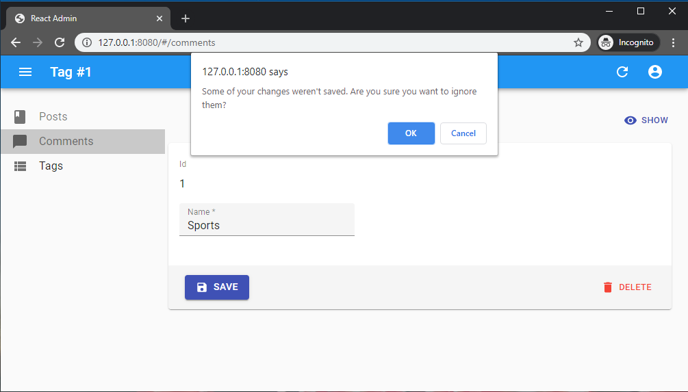

# 作成ページと編集ページ

React-adminは、Material UIとreact-hook-formを活用してレコードの編集や作成のためのカスタムユーザーエクスペリエンスを構築するための多くのフックとコンポーネントを提供します。


## ピュアReactからReact-Adminへ

シングルページアプリケーションでは、編集ビューは非常に一般的です。ユーザーがレコードを更新する最も一般的な方法は、URLパラメータに基づいてAPIからレコードを取得し、フォームにそのレコードを初期化し、ユーザーが値を変更するたびに入力を更新し、送信時に新しい値でAPIを呼び出してレコードを更新することです。

[](./img/edit-from-react-to-react-admin.webp)

React-adminの編集と作成に特化したさまざまなフックとコンポーネントの使い方を理解するために、まず手動でそのような編集ビューを構築することから始めましょう。

### 手動で構築された編集ビュー

以下は、react-adminの[データ取得フック](./Actions.md)と[react-hook-form](https://react-hook-form.com/)を活用して、レコードオブジェクトとフォーム入力をバインドする純粋なReactでの書籍編集ビューの例です：

```jsx
    import * as React from "react";
    import { useParams, useNavigate } from "react-router-dom";
    import { useForm, Controller } from "react-hook-form";
    import { useGetOne, useUpdate, Title } from "react-admin";
    import { Card, TextField, Button, Stack, MenuItem } from "@mui/material";

    export const BookEdit = () => {
      const { id } = useParams();
      const { handleSubmit, reset, control } = useForm();
      const { isLoading } = useGetOne(
        "books",
        { id },
        { onSuccess: (data) => reset(data) }
      );
      const [update, { isLoading: isSubmitting }] = useUpdate();
      const navigate = useNavigate();
      const onSubmit = (data) => {
        update(
          "books",
          { id, data },
          { onSuccess: () => { navigate('/books'); } }
        );
      };

      if (isLoading) return null;
      return (
        <div>
          <Title title="Book Edition" />
          <Card>
            <form onSubmit={handleSubmit(onSubmit)}>
              <Stack spacing={2}>
                <Controller
                  name="title"
                  render={({ field }) => <TextField label="Title" {...field} />}
                  control={control}
                />
                <Controller
                  name="author"
                  render={({ field }) => <TextField label="Author" {...field} />}
                  control={control}
                />
                <Controller
                  name="availability"
                  render={({ field }) => (
                    <TextField select label="Availability" {...field}>
                      <MenuItem value="in_stock">In stock</MenuItem>
                      <MenuItem value="out_of_stock">Out of stock</MenuItem>
                      <MenuItem value="out_of_print">Out of print</MenuItem>
                    </TextField>
                  )}
                  control={control}
                />
                <Button type="submit" disabled={isSubmitting}>
                  Save
                </Button>
              </Stack>
            </form>
          </Card>
        </div>
      );
    };
```

このフォームは3つの入力（2つのテキスト入力と1つの選択入力）を表示し、送信成功後に書籍リストビューにリダイレクトします。デフォルト値やバリデーション、依存入力なども含まれていませんが、それでもかなり冗長です。

このようなコンポーネントは非常に一般的であり、その機能の多くは他のページで再利用するために抽出することができます。コードと開発者体験を向上させる方法を見てみましょう。

### `<Form>`: フォームロジック

Material UI入力と一緒に`react-hook-form`を使用するために、前の例では`<Controller>`タグを活用し、これは`useForm`フックによって生成された`control`オブジェクトを期待します（[関連する`react-hook-form`のドキュメントを参照](https://react-hook-form.com/get-started#IntegratingControlledInputs))。

このロジックをカスタムコンポーネント内に入れることで`useForm`の呼び出しを避けることができます。これがまさにreact-adminの[`<Form>`コンポーネント](./Form.md)が行うことです。`<Form>`はまたreact-hook-formの`<FormProvider>`も作成するので、`<Controller>`要素に`control`プロップを渡す必要はもうありません。

```diff
import * as React from "react";
import { useParams, useNavigate } from "react-router-dom";
-import { useForm, Controller } from "react-hook-form";
+import { Controller } from "react-hook-form";
-import { useGetOne, useUpdate, Title } from "react-admin";
+import { useGetOne, useUpdate, Title, Form } from "react-admin";
import { Card, TextField, Stack, MenuItem } from "@mui/material";

export const BookEdit = () => {
  const { id } = useParams();
- const { handleSubmit, reset, control } = useForm();
- const { isLoading } = useGetOne(
+ const { isLoading, data } = useGetOne(
    "books",
    { id },
-   { onSuccess: (data) => reset(data) }
  );
  const [update, { isLoading: isSubmitting }] = useUpdate();
  const navigate = useNavigate();
  const onSubmit = (data) => {
    update(
      "books",
      { id, data },
      { onSuccess: () => { navigate('/books'); } }
    );
  };
  if (isLoading) return null;
  return (
    <div>
      <Title title="Book Edition" />
      <Card>
-       <form onSubmit={handleSubmit(onSubmit)}>
+       <Form record={data} onSubmit={onSubmit}>
          <Stack spacing={2}>
            <Controller
              name="title"
              render={({ field }) => <TextField label="Title" {...field} />}
-             control={control}
            />
            <Controller
              name="author"
              render={({ field }) => <TextField label="Author" {...field} />}
-             control={control}
            />
            <Controller
              name="availability"
              render={({ field }) => (
                <TextField select label="Availability" {...field}>
                  <MenuItem value="in_stock">In stock</MenuItem>
                  <MenuItem value="out_of_stock">Out of stock</MenuItem>
                  <MenuItem value="out_of_print">Out of print</MenuItem>
                </TextField>
              )}
-             control={control}
            />
            <Button type="submit" disabled={isSubmitting}>
              Save
            </Button>
          </Stack>
-       </form>
+       </Form>
      </Card>
    </div>
  );
};
```

### `<SimpleForm>`: スタックレイアウト

スタックに入力を表示するのは一般的なUIパターンです。[`<SimpleForm>`コンポーネント](./SimpleForm.md)は、このスタックレイアウトを提供する`<Form>`の便利なラッパーです。また、送信ボタンも含まれているので、`BookEdit`コンポーネントのコードはビジネスロジックにより集中することができます。

```diff
import * as React from "react";
import { useParams, useNavigate } from "react-router-dom";
import { Controller } from "react-hook-form";
-import { useGetOne, useUpdate, Title, Form } from "react-admin";
+import { useGetOne, useUpdate, Title, SimpleForm } from "react-admin";
-import { Card, TextField, Stack, MenuItem } from "@mui/material";
+import { Card, TextField, MenuItem } from "@mui/material";

export const BookEdit = () => {
  const { id } = useParams();
  const { isLoading, data } = useGetOne("books", { id });
  const [update, { isLoading: isSubmitting }] = useUpdate();
  const navigate = useNavigate();
  const onSubmit = (data) => {
    update(
      "books",
      { id, data },
      { onSuccess: () => { navigate('/books'); } }
    );
  };
  if (isLoading) return null;
  return (
    <div>
      <Title title="Book Edition" />
      <Card>
-       <Form record={data} onSubmit={onSubmit}>
+       <SimpleForm record={data} onSubmit={onSubmit}>
-         <Stack spacing={2}>
          <Controller
            name="title"
            render={({ field }) => <TextField label="Title" {...field} />}
          />
          <Controller
            name="author"
            render={({ field }) => <TextField label="Author" {...field} />}
          />
          <Controller
            name="availability"
            render={({ field }) => (
              <TextField select label="Availability" {...field}>
                <MenuItem value="in_stock">In stock</MenuItem>
                <MenuItem value="out_of_stock">Out of stock</MenuItem>
                <MenuItem value="out_of_print">Out of print</MenuItem>
              </TextField>
            )}
          />
-         <Button type="submit" disabled={isSubmitting}>
-           Save
-         </Button>
-       </Stack>
-       </Form>
+       </SimpleForm>
      </Card>
    </div>
  );
};
```

React-adminは、代替のフォームレイアウト（[`<TabbedForm>`](./TabbedForm.md)、[`<AccordionForm>`](./AccordionForm.md)、[`<WizardForm>`](./WizardForm.md)、[`<CreateDialog>、<EditDialog> & <ShowDialog>`](https://marmelab.com/ra-enterprise/modules/ra-form-layout#createdialog-editdialog--showdialog)）およびヘッドレス[`<Form>`](./Form.md)コンポーネントも提案しています。

### 入力コンポーネントの使用

フォーム入力を`<Controller>`タグでラップするのは一般的なパターンなので、react-adminはすべての一般的な入力タイプのショートカットを提供しています：[入力コンポーネント](./Inputs.md)。これにより、`BookEdit`コンポーネントは`react-hook-form`の`<Controller>`を直接使用する必要がなくなります：

```diff
import * as React from "react";
import { useParams, useNavigate } from "react-router-dom";
-import { Controller } from "react-hook-form";
-import { useGetOne, useUpdate, Title, SimpleForm } from "react-admin";
+import { useGetOne, useUpdate, Title, SimpleForm, TextInput, SelectInput } from "react-admin";
-import { Card, TextField, MenuItem } from "@mui/material";
+import { Card } from "@mui/material";

export const BookEdit = () => {
  const { id } = useParams();
  const { isLoading, data } = useGetOne("books", { id });
  const [update, { isLoading: isSubmitting }] = useUpdate();
  const navigate = useNavigate();
  const onSubmit = (data) => {
    update(
      "books",
      { id, data },
      { onSuccess: () => { navigate('/books'); } }
    );
  };
  if (isLoading) return null;
  return (
    <div>
      <Title title="Book Edition" />
      <Card>
        <SimpleForm record={data} onSubmit={onSubmit}>
-         <Controller
-           name="title"
-           render={({ field }) => <TextField label="Title" {...field} />}
-         />
+         <TextInput source="title" />
-         <Controller
-           name="author"
-           render={({ field }) => <TextField label="Author" {...field} />}
-         />
+         <TextInput source="author" />
-         <Controller
-           name="availability"
-           render={({ field }) => (
-             <TextField select label="Availability" {...field}>
-               <MenuItem value="in_stock">In stock</MenuItem>
-               <MenuItem value="out_of_stock">Out of stock</MenuItem>
-               <MenuItem value="out_of_print">Out of print</MenuItem>
-             </TextField>
-           )}
-         />
+         <SelectInput source="availability" choices={[
+           { id: "in_stock", name: "In stock" },
+           { id: "out_of_stock", name: "Out of stock" },
+           { id: "out_of_print", name: "Out of print" },
+         ]} />
        </SimpleForm>
      </Card>
    </div>
  );
};
```

### `<EditContext>`データとコールバックの公開

`record`と`onSubmit`コールバックを`<SimpleForm>`要素に渡す代わりに、react-adminは[`<EditContext>`](./useEditContext.md)コンテキストにそれらを配置することを好みます。これにより、任意の子孫要素がコンテキストからデータとコールバックを「プル」できるようになります。

```diff
import * as React from "react";
import { useParams, useNavigate } from "react-router-dom";
-import { useGetOne, useUpdate, Title, SimpleForm, TextInput, SelectInput } from "react-admin";
+import { useGetOne, useUpdate, Title, EditContextProvider, SimpleForm, TextInput, SelectInput } from "react-admin";
import { Card } from "@mui/material";

export const BookEdit = () => {
  const { id } = useParams();
  const { isLoading, data } = useGetOne("books", { id });
  const [update, { isLoading: isSubmitting }] = useUpdate();
  const navigate = useNavigate();
  const onSubmit = (data) => {
    update(
      "books",
      { id, data },
      { onSuccess: () => { navigate('/books'); } }
    );
  };
  if (isLoading) return null;
  return (
+   <EditContextProvider value={{
+     record: data,
+     isLoading,
+     save: onSubmit,
+     saving: isSubmitting,
+   }}>
      <div>
        <Title title="Book Edition" />
        <Card>
-         <SimpleForm record={data} onSubmit={onSubmit}>
+         <SimpleForm>
            <TextInput source="title" />
            <TextInput source="author" />
            <SelectInput source="availability" choices={[
              { id: "in_stock", name: "In stock" },
              { id: "out_of_stock", name: "Out of stock" },
              { id: "out_of_print", name: "Out of print" },
            ]} />
          </SimpleForm>
        </Card>
      </div>
+   </EditContextProvider>
  );
};
```

`<EditContextProvider>`のおかげで、`<SimpleForm>`コンポーネントは明示的なプロップを必要としなくなります。これは少し冗長に見えるかもしれませんが、`EditContext`値を標準化することで、react-adminコンポーネントにシンプルなAPIを提供します。そして、以下で説明するさらなる簡略化を可能にします。

### `useEditController`: コントローラーロジック

場所からidを取得し、APIからレコードを取得し、`save`コールバックを準備する初期ロジックも一般的であり、react-adminはこれを行うための [`useEditController` フック](./useEditController.md)を公開しています：

```diff
import * as React from "react";
-import { useParams, useNavigate } from "react-router-dom";
-import { useGetOne, useUpdate, Title, EditContextProvider, SimpleForm, TextInput, SelectInput } from "react-admin";
+import { useEditController, Title, EditContextProvider, SimpleForm, TextInput, SelectInput } from "react-admin";
import { Card } from "@mui/material";

export const BookEdit = () => {
- const { id } = useParams();
- const { isLoading, data } = useGetOne("books", { id });
- const [update, { isLoading: isSubmitting }] = useUpdate();
- const navigate = useNavigate();
- const onSubmit = (data) => {
-   update(
-       "books",
-       { id, data },
-       { onSuccess: () => { navigate('/books'); } }
-   );
- };
+ const editContext = useEditController();
- if (isLoading) return null;
+ if (editContext.isLoading) return null;
  return (
-   <EditContextProvider value={{
-     record: data,
-     isLoading,
-     save: onSubmit,
-     saving: isSubmitting,
-   }}>
+   <EditContextProvider value={editContext}>
      <div>
        <Title title="Book Edition" />
        <Card>
          <SimpleForm>
            <TextInput source="title" />
            <TextInput source="author" />
            <SelectInput source="availability" choices={[
              { id: "in_stock", name: "In stock" },
              { id: "out_of_stock", name: "Out of stock" },
              { id: "out_of_print", name: "Out of print" },
            ]} />
          </SimpleForm>
        </Card>
      </div>
    </EditContextProvider>
  );
};
```

`useEditController`はリソース名を必要としません。これは`ResourceContext`に依存し、`<Resource>`コンポーネントによって推測されます。

### `<EditBase>`: コントローラのコンポーネント版

`useEditController`フックを呼び出してその結果をコンテキストに配置するのも一般的なので、react-adminはこれを行うための[`<EditBase>`コンポーネント](./EditBase.md)を提供します。したがって、この例はさらに簡略化できます：

```diff
import * as React from "react";
-import { useEditController, Title, EditContextProvider, SimpleForm, TextInput, SelectInput } from "react-admin";
+import { EditBase, Title, SimpleForm, TextInput, SelectInput } from "react-admin";
import { Card } from "@mui/material";

export const BookEdit = () => {
- const editContext = useEditController();
- if (editContext.isLoading) return null;
  return (
-   <EditContextProvider value={editContext}>
+   <EditBase>
      <div>
        <Title title="Book Edition" />
        <Card>
          <SimpleForm>
            <TextInput source="title" />
            <TextInput source="author" />
            <SelectInput source="availability" choices={[
              { id: "in_stock", name: "In stock" },
              { id: "out_of_stock", name: "Out of stock" },
              { id: "out_of_print", name: "Out of print" },
            ]} />
          </SimpleForm>
        </Card>
      </div>
-   </EditContextProvider>
+   </EditBase>
  );
};
```

### `<Edit>` タイトル、フィールド、およびアクションをレンダリングする

`<EditBase>`はヘッドレスコンポーネントであり、その子要素のみをレンダリングします。しかし、ほとんどの編集ビューはラッピング`<div>`、タイトル、および`<Card>`が必要です。そのため、react-adminは [`<Edit>` コンポーネント](./Edit.md)を提供しており、`<EditBase>`コンポーネント、リソース名から構築されたタイトル、そしてリソースに表示コンポーネントがある場合は「表示」ボタンも含んでいます：

```diff
import * as React from "react";
-import { EditBase, Title, SimpleForm, TextInput, SelectInput } from "react-admin";
+import { Edit, SimpleForm, TextInput, SelectInput } from "react-admin";

export const BookEdit = () => (
- <EditBase>
-   <div>
-     <Title title="Book Edition" />
-     <Card>
+ <Edit>
    <SimpleForm>
      <TextInput source="title" />
      <TextInput source="author" />
      <SelectInput source="availability" choices={[
        { id: "in_stock", name: "In stock" },
        { id: "out_of_stock", name: "Out of stock" },
        { id: "out_of_print", name: "Out of print" },
      ]} />
    </SimpleForm>
-     </Card>
-   </div>
- </EditBase>
+ </Edit>
);
```

以上です！これでコードが簡潔で表現力があり、メンテナンスも容易になりました。

### 典型的なReact-Adminの編集ビュー

Reactの例はほぼ60行のコードでしたが、react-adminの例はその4分の1しかありません：

```jsx
import * as React from "react";
import { Edit, SimpleForm, TextInput, SelectInput } from "react-admin";

export const BookEdit = () => (
  <Edit>
    <SimpleForm>
      <TextInput source="title" />
      <TextInput source="author" />
      <SelectInput source="availability" choices={[
        { id: "in_stock", name: "In stock" },
        { id: "out_of_stock", name: "Out of stock" },
        { id: "out_of_print", name: "Out of print" },
      ]} />
    </SimpleForm>
  </Edit>
);
```

React-adminのコンポーネントは魔法ではありません。それらはReactコンポーネントであり、ビジネスロジックに集中し、繰り返し作業を避けるために設計されています。

ヒント：実際には、`<Edit>`は前の例で置き換えられたコードよりも多くのことを行います：送信時の通知とリダイレクトを処理し、ページタイトルを設定し、エラーロジックを処理します。

## デフォルト値の設定

フォームと入力コンポーネントの責任でデフォルト値を定義します。

デフォルト値を定義するには、フォームコンポーネント（[`<SimpleForm>`](./SimpleForm.md)、[`<TabbedForm>`](./TabbedForm.md)など）に`defaultValues`プロップを追加するか、個々の入力コンポーネントに`defaultValue`を追加します。各オプションを見てみましょう。

### グローバルデフォルト値

フォームレベルで`defaultValues`を設定できます。期待される値はオブジェクトまたはオブジェクトを返す関数であり、作成されたレコードのデフォルト値を指定します。例えば：

```jsx
const postDefaultValue = () => ({ id: uuid(), created_at: new Date(), nb_views: 0 });

export const PostCreate = () => (
    <Create>
        <SimpleForm defaultValues={postDefaultValue}>
            <TextInput source="title" />
            <RichTextInput source="body" />
            <NumberInput source="nb_views" />
        </SimpleForm>
    </Create>
);
```

**ヒント**：フォーム`defaultValues`に入力コンポーネントとしてリストされていないプロパティを含めることができます。例えば前の例の`created_at`プロパティなどです。

### 入力ごとのデフォルト値

または、`<Input>`コンポーネントに直接`defaultValue`プロップを指定することもできます。フォームがすでにグローバル`defaultValues`を定義している場合、React-adminはこれらのデフォルト値を無視します（フォーム>入力）：

```jsx
export const PostCreate = () => (
    <Create>
        <SimpleForm>
            <TextInput source="title" />
            <RichTextInput source="body" />
            <NumberInput source="nb_views" defaultValue={0} />
        </SimpleForm>
    </Create>
);
```

**ヒント**：入力ごとのデフォルト値は関数ではありえません。レンダリング時に計算されるデフォルト値については、前のセクションで説明したように、フォームレベルで`defaultValues`を設定します。

## ユーザー入力の検証

React-adminは最も一般的な検証戦略をサポートしています：

* [フィールドごとのバリデータ](./Validation.md#per-input-validation-built-in-field-validators),
* [フォームバリデーション](./Validation.md#global-validation),
* [yupまたはzodを利用した検証スキーマ](./Validation.md#schema-validation),
* [サーバー側の検証](./Validation.md#server-side-validation)。


フォームバリデーションには専用のセクションが必要です。詳細については[バリデーション章](./Validation.md)を参照してください。

## 提出前にフォーム値を変更する

場合によっては、`dataProvider`に送信する前にフォームの値を変更したい場合があります。その場合は、ビューコンポーネント（`<Create>`または`<Edit>`）または`<SaveButton>`コンポーネントに`transform`プロップを使用します。

以下の例では、投稿の作成ビューに2つの送信ボタンが表示されます。どちらのボタンも新しいレコードを作成しますが、「保存して通知」ボタンはサーバー側で他の管理者に通知するメールをトリガーする必要があります。`POST /posts`APIルートは、リクエストに特別なHTTPヘッダーが含まれている場合にのみメールを送信します。

したがって、「保存して通知」ボタンは、react-adminが`dataProvider.create()`メソッドを呼び出す前にレコードを*変換*し、`notify`フィールドを追加します：

```jsx
const PostCreateToolbar = () => (
    <Toolbar>
        <SaveButton />
        <SaveButton
            label="post.action.save_and_notify"
            transform={data => ({ ...data, notify: true })}
            type="button"
        />
    </Toolbar>
);

const PostCreate = () => (
    <Create>
        <SimpleForm toolbar={<PostCreateToolbar />}>
            // ...
        </SimpleForm>
    </Create>
);
```

次に、`dataProvider.create()`コードで、データに`notify`フィールドがあるかどうかを検出し、必要に応じてHTTPヘッダーを追加します。例えば：

```js
const dataProvider = {
    // ...
    create: (resource, params) => {
        const { notify, ...record } = params.data;
        const headers = new Headers({
            'Content-Type': 'application/json',
        });
        if (notify) {
            headers.set('X-Notify', 'true');
        }
        return httpClient(`${apiUrl}/${resource}`, {
            method: 'POST',
            body: JSON.stringify(record),
            headers,
        }).then(({ json }) => ({
            data: { ...record, id: json.id },
        }));
    },
}
```

**ヒント**：`<Edit>`の`transform`プロップ関数は、第二引数で`previousData`も取得します：

```jsx
const PostEditToolbar = () => (
    <Toolbar>
        <SaveButton />
        <SaveButton
            label="post.action.save_and_notify"
            transform={(data, { previousData }) => ({
                ...data,
                avoidChangeField: previousData.avoidChangeField
            })}
            type="button"
        />
    </Toolbar>
);

const PostEdit = () => (
    <Edit>
        <SimpleForm toolbar={<PostEditToolbar />}>
            // ...
        </SimpleForm>
    </Edit>
);
```

## 保存されていない変更についての警告

React-adminはフォームの状態を追跡し、ユーザーが保存されていない変更がある状態で`Edit`または`Create`ページを離れるときに検出できます。データの損失を防ぐために、この機能を使用して、保存されていない変更があるページを離れる前にユーザーに確認を求めることができます。



保存されていない変更について警告するのはオプトイン機能です。この機能を有効にするには、フォームコンポーネントに`warnWhenUnsavedChanges`プロップを設定する必要があります：

```jsx
export const TagEdit = () => (
    <Edit>
        <SimpleForm warnWhenUnsavedChanges>
            <TextField source="id" />
            <TextInput source="name" />
            ...
        </SimpleForm>
    </Edit>
);
```

これで完了です。`warnWhenUnsavedChanges`は`<SimpleForm>`と`<TabbedForm>`の両方で機能します。実際、この機能は`useWarnWhenUnsavedChanges()`というカスタムフックによって提供されており、独自のreact-hook-formフォームでも使用できます。

```jsx
import { useForm } from 'react-hook-form';
import { useWarnWhenUnsavedChanges } from 'react-admin';

const MyForm = ({ onSubmit }) => {
    const form = useForm();
    return (
        <Form onSubmit={form.handleSubmit(onSubmit)} />
    );
}

const Form = ({ onSubmit }) => {
    // 保存されていない変更についての警告機能を有効にする
    useWarnWhenUnsavedChanges(true);
    return (
        <form onSubmit={onSubmit}>
            <label id="firstname-label">First Name</label>
            <Field name="firstName" aria-labelledby="firstname-label" component="input" />
            <button type="submit">Submit</button>
        </form>
    );
};
```

**ヒント**：表示される確認ダイアログのメッセージをカスタマイズするには、i18nProviderで`ra.message.unsaved_changes`メッセージを設定できます。

**警告**：この機能は、react-router 6.3.0 **以下**に依存して動作します。react-routerチームはreact-router 6.4でこの可能性を無効にしたため、`warnWhenUnsavedChanges`はreact-router 6.4以降では静かに失敗します。

## Enterキーでの送信

デフォルトでは、フォーム入力のいずれかで`ENTER`キーを押すとフォームが送信されます。これはほとんどの場合期待される動作です。自動フォーム送信をEnterキーで無効にするには、`SaveButton`コンポーネントの`type`プロップを`button`に設定します。

```jsx
const MyToolbar = () => (
    <Toolbar>
        <SaveButton type="button" />
        <DeleteButton />
    </Toolbar>
);

export const PostEdit = () => (
    <Edit>
        <SimpleForm toolbar={<MyToolbar/>}>
            ...
        </SimpleForm>
    </Edit>
);
```

ただし、カスタム入力コンポーネントの一部（例えばGoogleマップウィジェット）には、`ENTER`キーに特別なハンドラーがある場合があります。その場合、これらの入力でイベントのデフォルト処理を防ぐ必要があります。これにより、他の入力はEnterキーでフォームを送信できます：

```jsx
export const PostEdit = () => (
    <Edit>
        <SimpleForm>
            <TextInput
                source="name"
                onKeyUp={event => {
                    if (event.key === 'Enter') {
                        event.stopPropagation();
                    }
                }}
            /> 
        </SimpleForm>
    </Edit>
);
```

**ヒント**：`<SaveButton type="button">`は、囲む`<Form>`に渡されたカスタム`onSubmit`プロップを考慮しません。`<SaveButton type="button">`のデフォルトの送信コールバックをオーバーライドする必要がある場合は、ボタンに`onClick`プロップを含める必要があります。

```jsx
const MyToolbar = () => {
    const [update] = useUpdate();
    const { getValues } = useFormContext();
    const redirect = useRedirect();

    const handleClick = e => {
        e.preventDefault(); // デフォルトのSaveButton送信ロジックを防ぐために必要
        const { id, ...data } = getValues();
        update(
            'posts',
            { id, data },
            { onSuccess: () => { redirect('list'); }}
        );
    };

    return (
        <Toolbar>
            <SaveButton type="button" onClick={handleClick} />
            <DeleteButton />
        </Toolbar>
    );
};

export const PostEdit = () => (
    <Edit>
        <SimpleForm toolbar={<MyToolbar/>}>
          ...
        </SimpleForm>
    </Edit>
);
```

## 自動保存

ユーザーが多くの時間を費やす可能性があるフォームでは、数秒間の非アクティブ後にフォームを自動保存するのが良いアイデアです。フォームの内容を自動保存するには、 [`<AutoSave>` コンポーネント](./AutoSave.md)を使用します。

<video controls autoplay playsinline muted loop> <source src="./img/AutoSave.webm" type="video/webm"/> <source src="./img/AutoSave.mp4" type="video/mp4"/> Your browser does not support the video tag. </video>
```tsx
import { AutoSave } from '@react-admin/ra-form-layout';
import { Edit, SimpleForm, TextInput, DateInput, SelectInput, Toolbar } from 'react-admin';

const AutoSaveToolbar = () => (
    <Toolbar>
        <AutoSave />
    </Toolbar>
);

const PersonEdit = () => (
    <Edit mutationMode="optimistic">
        <SimpleForm
            resetOptions={{ keepDirtyValues: true }}
            toolbar={<AutoSaveToolbar />}
        >
            <TextInput source="first_name" />
            <TextInput source="last_name" />
            <DateInput source="dob" />
            <SelectInput source="sex" choices={[
                { id: 'male', name: 'Male' },
                { id: 'female', name: 'Female' },
            ]}/>
        </SimpleForm>
    </Edit>
);
```

**注意**： `<SimpleForm resetOptions>`プロップを`{ keepDirtyValues: true }`に設定する必要があります。このプロップを忘れると、自動保存後からサーバー側での承認前にエンドユーザーが入力した変更は失われます。

`<Edit>`ページで使用する場合は、`pessimistic`または`optimistic` [`mutationMode`](https://marmelab.com/react-admin/Edit.html#mutationmode)も使用する必要があります - `<AutoSave>`はデフォルトの`mutationMode="undoable"`では機能しません。

詳細については、 [`<AutoSave>` コンポーネント](./AutoSave.md)のドキュメントを確認してください。

## ラベル付きフィールドの追加

すべてのreact-admin入力は、その内容を`<Labeled>`コンポーネント内にラップすることでラベルの表示を処理します。

独自のコンポーネントを`<Labeled>`コンポーネント内にラップすることもできます。`label`プロップを直接提供するか、`source`プロップを提供して自動ラベル推測を活用することができます：

```jsx
const IdentifierField = ({ label }) => {
    const record = useRecordContext();
    return (
        <Labeled label={label}>
            <Typography>{record.id}</Typography>
        </Labeled>
    );
};

// ここではLabeledが翻訳キー`resources.posts.fields.body`でラベルを翻訳し、`Body`という推測されたデフォルトを使用します
const BodyField = () => {
    const record = useRecordContext();
    return (
        <Labeled source="body">
            <Typography>
                {record.body}
            </Typography>
        </Labeled>
    )
};

const PostEdit = () => (
    <Create>
        <SimpleForm>
            <IdentifierField label="Identifier" />
            <TextField source="title" />
            <BodyField />
            <NumberInput source="nb_views" />
        </SimpleForm>
    </Create>
);
```

## 入力のグループ化

場合によっては、フォームをより使いやすくするために入力をグループ化したい場合があります。 [`<TabbedForm>`](./TabbedForm.md)や[`<AccordionForm>`](./AccordionForm.md)を使用するか、自分のレイアウトを作成することもできます。この場合、グループの入力の状態（有効かどうか、ユーザーが変更したかどうか（dirty/touched状態））を知る必要があるかもしれません。

これには、グループ名を受け入れる`<FormGroupContextProvider>`を使用できます。このコンテキスト内でレンダリングされるすべての入力はそれに登録されます（`useInput`フックのおかげで）。次に、`useFormGroup`フックを呼び出してグループの状態を取得できます。例えば：

```jsx
import { Edit, SimpleForm, TextInput, FormGroupContextProvider, useFormGroup, minLength } from 'react-admin';
import { Accordion, AccordionDetails, AccordionSummary, Typography } from '@mui/material';
import ExpandMoreIcon from '@mui/icons-material/ExpandMoreIcon';

const PostEdit = () => (
    <Edit>
        <SimpleForm>
            <TextInput source="title" />
            <FormGroupContextProvider name="options">
                <Accordion>
                    <AccordionSummary
                        expandIcon={<ExpandMoreIcon />}
                        aria-controls="options-content"
                        id="options-header"
                    >
                        <AccordionSectionTitle name="options">
                            Options
                        </AccordionSectionTitle>
                    </AccordionSummary>
                    <AccordionDetails
                        id="options-content"
                        aria-labelledby="options-header"
                    >
                        <TextInput source="teaser" validate={minLength(20)} />
                    </AccordionDetails>
                </Accordion>
            </FormGroupContextProvider>
        </SimpleForm>
    </Edit>
);

const AccordionSectionTitle = ({ children, name }) => {
    const formGroupState = useFormGroup(name);

    return (
        <Typography color={
              !formGroupState.isValid && formGroupState.isDirty
                ? 'error'
                : 'inherit'
          }
        >
            {children}
        </Typography>
    );
};
```

## 提出後のリダイレクト

デフォルトでは：

* `<Create>`ビューでフォームを送信すると、`<Edit>`ビューにリダイレクトします
* `<Edit>`ビューでフォームを送信すると、`<List>`ビューにリダイレクトします

リダイレクトをカスタマイズするには、`<Create>`または`<Edit>`コンポーネントに`redirect`プロップを設定します。可能な値は「edit」、「show」、「list」、およびリダイレクトを無効にする`false`です。カスタムパス（例えば`/my-custom-route`）を指定することもできます。例えば、編集後に表示ビューにリダイレクトするには：

```jsx
export const PostEdit = () => (
    <Edit redirect="show">
        <SimpleForm>
            ...
        </SimpleForm>
    </Edit>
);
```

カスタムルート（例えば`"/home"`）や関数を`redirect`プロップ値として渡すこともできます。例えば、現在のオブジェクトに関連するページにリダイレクトしたい場合：

```jsx
// 関連する著者の表示ページにリダイレクト
const redirect = (resource, id, data) => `/author/${data.author_id}/show`;

export const PostEdit = () => (
    <Edit redirect={redirect}>
        <SimpleForm>
            // ...
        </SimpleForm>
    </Edit>
);
```

これは送信ボタンと、ユーザーがフォームフィールドの1つで`ENTER`キーを押したときのフォーム送信の両方に影響します。

**ヒント**：`onSuccess`プロップを`<Edit>`/`<Create>`コンポーネント、または`<SaveButton>`コンポーネントに設定している場合、`redirect`プロップは無視されます。

## ネストされたフォーム

ユーザーは同じフォーム内で複数のリソースのデータを編集する必要があることがよくあります。React-adminはネストされたフォームをサポートしていませんが、関連データをユーザーフレンドリーに編集する方法を提供しています：

* [`<EditInDialogButton>`](./EditInDialogButton.md)は、ユーザーが関連するレコードを編集するためのモーダルを開くことを可能にします
* [`<ReferenceOneInput>`](./ReferenceOneInput.md)は、1つの関連レコードを編集することを可能にします
* [`<ReferenceManyInput>`](./ReferenceManyInput.md)は、関連レコードのリストを編集することを可能にします
* [`<ReferenceManyToManyInput>`](./ReferenceManyToManyInput.md)は、関連レコードのリストを関連テーブル経由で編集することを可能にします
<video controls autoplay playsinline muted loop> <source src="https://marmelab.com/ra-enterprise/modules/assets/ra-form-layout/latest/InDialogButtons.webm" type="video/webm" /> <source src="https://marmelab.com/ra-enterprise/modules/assets/ra-form-layout/latest/InDialogButtons.mp4" type="video/mp4" /> Your browser does not support the video tag. </video> <video controls autoplay playsinline muted loop> <source src="./img/reference-many-input.webm" type="video/webm"/> <source src="./img/reference-many-input.mp4" type="video/mp4"/> Your browser does not support the video tag. </video> \`\`\`

