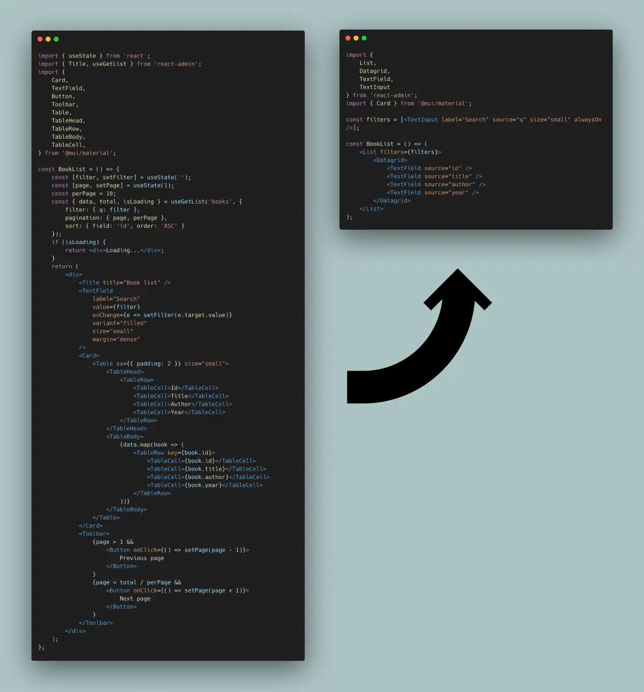

# 特徴

React-adminは、典型的な管理およびB2Bアプリケーションのニーズの大部分をカバーする**リッチなフレームワーク**です。これは、あなたの創造性を解放し、素晴らしいアプリケーションを構築するのに役立つ時間節約ツールです。その独自で意見のある機能により、シングルページアプリケーション開発者にとって最適な選択肢となります。

## 素晴らしい開発者体験

React-adminを使用すると、開発者は低レベルの詳細に煩わされることなく、アプリケーションコンポーネントを組み立てることができます。開発者は同じ結果を得るために少ないコードで済み、アプリの**ビジネスロジックに集中**できます。

[](./img/list-from-react-to-react-admin.webp)

React-adminのコンポーネントとフックのAPIは、できるだけ**直感的**になるように設計されています。React-adminのコアチームは日々React-adminを使用しており、常に開発者体験を向上させる方法を模索しています。

React-adminは、**最高クラスのドキュメント**、デモアプリ、およびサポートを提供します。エラーメッセージは明確で実行可能です。広範なTypeScriptの型とJSDocのおかげで、任意のIDEでReact-adminを簡単に使用できます。APIは安定しており、**互換性のない変更は非常にまれ**です。アプリを[クエリ](./DataProviders.md#enabling-query-logs)および[フォーム](https://react-hook-form.com/dev-tools)の開発者ツールでデバッグし、React-adminのコードをブラウザで直接検査できます。

これがおそらく、React-adminを使用して毎月3,000以上の新しいアプリが公開される理由です。

したがって、React-adminは単なる[react-query](https://react-query.tanstack.com/)、[react-hook-form](https://react-hook-form.com/)、[react-router](https://reacttraining.com/react-router/)、[Material UI](https://mui.com/material-ui/getting-started/)および[Emotion](https://github.com/emotion-js/emotion)の組み合わせではありません。Reactでのシングルページアプリケーション開発を加速し、容易にするために作られた**フレームワーク**です。

## 基本的なCRUD

ほとんどの管理およびB2Bアプリは、レコードを操作するためのいくつかの基本画面から始まります：

- レコードのフィルタリング、ページネーション、並べ替えを行うリストページ
- レコードの詳細を表示する読み取り専用ページ
- フォームを通じてレコードを更新する編集ページ
- レコードを作成する作成ページ

このタイプのインターフェースを「CRUD」インターフェースと呼びます。これは、レコードの作成（Create）、読み取り（Read）、更新（Update）、削除（Delete）が可能であるためです。

React-adminは、そのようなCRUDインターフェースを生成するエンジンとして始まり、今でも非常にうまく機能しています。**React-adminでのCRUDインターフェースの構築はほとんど労力を必要とせず、非常に簡単にカスタマイズできます**。

<video controls autoplay playsinline muted loop width="100%">
  <source src="./img/CRUD.webm" type="video/webm" />
  <source src="./img/CRUD.mp4" type="video/mp4" />
  お使いのブラウザは動画タグをサポートしていません。
</video>

React-adminのCRUDインターフェースの基本的な構成要素は次のとおりです：

- [`<Resource>`](./Resource.md)：特定のAPIリソースのCRUDルートを定義
- [`<List>`](./ListTutorial.md)：レコードのリストを表示
- [`<Edit>`](./EditTutorial.md)：レコードを編集するためのフォームを表示
- [`<Create>`](./Create.md)：レコードを作成するためのフォームを表示
- [`<Show>`](./Show.md)：読み取り専用モードでレコードを表示

もちろん、React-adminはCRUDインターフェースに限定されません。必要に応じてカスタマイズされたインターフェースを構築するためのコンポーネントも提供します。

## バックエンドに依存しない

React-adminアプリはブラウザ内で実行されます - これらは「シングルページアプリ」です。データの取得および更新にはAPIに依存します。

どのようなAPIでも？ **すべての種類**です。React-adminはバックエンドに依存しません。APIがREST APIであるか、GraphQL APIであるか、SOAP APIであるか、JSON-RPC APIであるか、ローカルAPIであるかは関係ありません。APIがPHP、Python、Ruby、Java、あるいはJavaScriptで書かれているかどうかも関係ありません。APIがサードパーティAPIであるか、自家製APIであるかも関係ありません。


React-adminは、人気のあるAPIフレーバーの[50以上のアダプター](./DataProviderList.md)を提供し、独自のアダプターを作成するためのすべてのツールを提供します。これは[データプロバイダー](./DataProviders.md)と呼ばれる強力な抽象化レイヤーのおかげで機能します。

React-adminアプリでは、APIコールを書きません。代わりに、「データプロバイダーメソッド」と呼ばれる一連の高レベル関数を使用してAPIと通信します。例えば、投稿リストを取得するには、リソース名とクエリパラメーターを渡して`getList()`メソッドを呼び出します。

```jsx
import { useState, useEffect } from 'react';
import { useDataProvider } from 'react-admin';

    const PostList = () => {
        const [posts, setPosts] = useState([]);
        const [error, setError] = useState();
        const [isLoading, setIsLoading] = useState(true);
        const dataProvider = useDataProvider();
        useEffect(() => {
            dataProvider.getList('posts', {
                pagination: { page: 1, perPage: 10 },
                sort: { field: 'published_at', order: 'DESC' },
                filter: { status: 'published' }
            })
                .then(({ data }) => setPosts(data))
                .catch(error => setError(error))
                .finally(() => setIsLoading(false));
        }, []);
        if (isLoading) { return <p>Loading</p>; }
        if (error) { return <p>ERROR</p>; }
        return (
            <ul>
                {posts.map(post => (
                    <li key={post.id}>{post.title}</li>
                ))}
            </ul>
        );
    };
```


データプロバイダーオブジェクトは、データプロバイダーメソッドの呼び出しをHTTPリクエストに変換し、HTTPレスポンスをデータプロバイダーメソッドの結果に変換する責任を負います。

ちなみに、データ取得に`useEffect`を使用するのは面倒です。代わりに、`useGetList`のような[専用のデータプロバイダーフック](./Actions.md#dataprovider-method-hooks)を使用できます：

```jsx
import { useGetList } from 'react-admin';

const PostList = () => {
    const { data, isLoading, error } = useGetList('posts', {
        pagination: { page: 1, perPage: 10 },
        sort: { field: 'published_at', order: 'DESC' },
        filter: { status: 'published' }
    });
    if (isLoading) { return <Loading />; }
    if (error) { return <p>ERROR</p>; }
    return (
        <ul>
            {data.map(post => (
                <li key={post.id}>{post.title}</li>
            ))}
        </ul>
    );
};
```

React-adminは、**認証および認可に対してもバックエンドに依存しません**。APIがJWT、OAuth、Auth0やCognitoのようなサードパーティプロバイダー、あるいはAzure Active Directoryを使用しているかどうかに関係なく、[認証プロバイダー](./Authentication.md)と呼ばれるアダプターオブジェクトを介して認証バックエンドと通信できます。

その後、コンポーネント上で特定のフックを使用してアクセスを制限できます。例えば、匿名アクセスを禁止するには、`useAuthenticated`を使用します：

```jsx
import { useAuthenticated } from 'react-admin';

const MyPage = () => {
    useAuthenticated(); // 認証されていない場合はログインページにリダイレクト
    return (
        <div>
            ...
        </div>
    )
};

export default MyPage;
```

## リレーションシップ

APIはしばしばリレーショナルモデルを公開します。つまり、他のエンドポイントへの外部キーを返すエンドポイントです。**React-adminはリレーショナルAPIを活用**して、関連するレコードを表示するスマートコンポーネントや、関連するレコードの編集を可能にするコンポーネントを提供します。

```bash
┌──────────────┐       ┌────────────────┐
│ books        │       │ authors        │
│--------------│       │----------------│
│ id           │   ┌───│ id             │
│ author_id    │╾──┘   │ first_name     │
│ title        │       │ last_name      │
│ published_at │       │ date_of_birth  │
└──────────────┘       └────────────────┘
```

例えば、`<ReferenceField>`は本の著者名のような関連レコードの名前を表示します。

```jsx
const BookList = () => (
    <List>
        <Datagrid>
            <TextField source="id" />
            <TextField source="title" />
            <ReferenceField source="authorId" reference="authors" />
            <TextField source="year" />
        </Datagrid>
    </List>
);
```


これをサポートするためにAPI側で特別なことは必要ありません。`books`および`authors`リソースに対する単純なCRUDルートだけで十分です。`<ReferenceField>`は単一のAPIコールで本の著者を取得します：

```css
GET https://my.api.url/authors?filter={ids:[1,2,3,4,5,6,7]}
```

`<ReferenceField>`は関連する著者の呼び出しを**集約し、N+1クエリ問題を回避**します（[N+1クエリ問題とは](https://stackoverflow.com/questions/97197/what-is-the-n1-selects-problem-in-orm-object-relational-mapping)）。

同様に、リファレンス入力コンポーネントはユーザーがメインレコードと共に関連レコードを編集することを可能にします。例えば、商品のバリアントを編集するには：

```jsx
const ProductEdit = () => (
    <Edit mutationMode="optimistic">
        <SimpleForm>
            <TextInput source="name" />
            <NumberInput source="price" />
            <ReferenceInput source="category_id" reference="categories" />
            <ReferenceManyInput reference="variants" target="product_id">
                <SimpleFormIterator inline>
                    <TextInput source="sku" />
                    <SelectInput source="size" choices={sizes} />
                    <SelectInput source="color" choices={colors} />
                    <NumberInput source="stock" defaultValue={0} />
                </SimpleFormIterator>
            </ReferenceManyInput>
        </SimpleForm>
    </Edit>
);
```
<video controls autoplay playsinline muted loop> <source src="./img/reference-many-input.webm" type="video/webm"/> <source src="./img/reference-many-input.mp4" type="video/mp4"/> お使いのブラウザは動画タグをサポートしていません。 </video>

リファレンス入力コンポーネントは、関連するレコードでビューをフィルタリングする際にも非常に便利です。例えば、特定の著者の本のリストを表示するには：

```jsx
const BookList = () => (
    <List filters={[
        <ReferenceInput source="authorId" reference="authors" alwaysOn />,
    ]}>
        <Datagrid rowClick="edit">
            <TextField source="id" />
            <TextField source="title" />
            <ReferenceField source="authorId" reference="authors" />
            <TextField source="year" />
        </Datagrid>
    </List>
);
```
<video controls autoplay playsinline muted loop width="100%"> <source src="./img/reference-input-filter.webm" type="video/webm" /> <source src="./img/reference-input-filter.mp4" type="video/mp4" /> お使いのブラウザは動画タグをサポートしていません。 </video>

React-adminは**一対多、多対一、一対一、および多対多のリレーションシップ**をサポートしています。[リレーションシップのフィールド](./FieldsForRelationships.md)ページには、すべてのリファレンスフィールドとその一般的な使用法が記載されています。リレーションシップについて詳しく知りたい場合は、以下のコンポーネントを確認してください：

* [`<ReferenceField>`](./ReferenceField.md)
* [`<ReferenceArrayField>`](./ReferenceArrayField.md)
* [`<ReferenceManyField>`](./ReferenceManyField.md)
* [`<ReferenceManyCount>`](./ReferenceManyCount.md)
* [`<ReferenceManyToManyField>`](./ReferenceManyToManyField.md)
* [`<ReferenceOneField>`](./ReferenceOneField.md)
* [`<ReferenceInput>`](./ReferenceInput.md)
* [`<ReferenceArrayInput>`](./ReferenceArrayInput.md)
* [`<ReferenceManyInput>`](./ReferenceManyInput.md)
* [`<ReferenceManyToManyInput>`](./ReferenceManyToManyInput.md)
* [`<ReferenceOneInput>`](./ReferenceOneInput.md)

リファレンスコンポーネントは、複雑なフロントエンド機能の開発を大幅に加速させます。また、バックエンド開発者が複雑な結合を実装する負担から解放されます。

## 醜くない

現実的に言えば、多くの開発者はまず機能に焦点を当て、ユーザーインターフェース（UI）を磨くための時間をほとんど持っていません。私たちもそのような傾向があります！その結果、管理アプリが醜いことがよくあります。スペーシングが一貫しておらず、ボタンが最適な位置に配置されておらず、色の組み合わせが目に痛いことがあります。

React-adminは**初期状態で見た目がかなり良いコンポーネント**を提供するため、UIに時間をかけなくても（意図的に醜くしない限り）悪く見えることはありません。React-adminは、[Material UI](https://mui.com/material-ui/getting-started/)を使用しています。これは、[Material Design](https://material.io/)ガイドラインのReact実装であり、最も実績のあるデザインシステムです。

<video controls autoplay playsinline muted loop width="100%"> <source src="https://user-images.githubusercontent.com/99944/116970434-4a926480-acb8-11eb-8ce2-0602c680e45e.mp4" type="video/webm" /> お使いのブラウザは動画タグをサポートしていません。 </video>

デフォルトのデザインが十分でない場合は、すべてのReact-adminコンポーネントが**完全にテーマ化可能**であり、独自のコンポーネントに置き換えることも簡単です（[テーマ設定](#theming)を参照）。

## 高密度UI

現代のウェブアプリはしばしば非常に視覚的に魅力的ですが、情報密度が低いために使いにくいことがあります。エンドユーザーは、比較的複雑なタスクを完了するために多くのスクロールとクリックが必要です。

一方、React-adminのデフォルトスキンは高密度に設計されており、**クロームに対してコンテンツにより多くのスペースを与え**、ユーザーの操作を高速化します。

[](https://marmelab.com/react-admin-demo/#/)

ユーザーフィードバックに基づいて、このデフォルトレイアウトに多くの改良を加えてきました。私たちの経験では、管理アプリ、ダッシュボード、およびB2Bアプリでは、大きなマージンよりも効率性が重要です。もしこれがあなたのユースケースに当てはまらない場合は、[テーマ](./AppTheme.md)を使用してUIのマージンと密度を簡単にカスタマイズできます。

モバイルユーザーの場合、React-adminはより大きなマージンと低い情報密度を持つ異なるレイアウトをレンダリングします（[レスポンシブ](#responsive)を参照）。

## ヘッドレスコア

React-adminコンポーネントはデフォルトでMaterial UIコンポーネントを使用しており、ページのスキャフォールディングを迅速に行えます。Material UIが[テーマ設定](#theming)をサポートしているため、アプリの外観と感触を簡単にカスタマイズできます。しかし、場合によってはこれだけでは不十分であり、他のUIライブラリを使用する必要があります。

React-adminを使用するUIライブラリを変更して[Ant Design](https://ant.design/)、[Daisy UI](https://daisyui.com/)、[Chakra UI](https://chakra-ui.com/)、あるいは独自のカスタムUIライブラリを使用することができます。React-adminコンポーネントの背後にある**ヘッドレスロジック**はUIライブラリに依存せず、`...Base`コンポーネントおよびコントローラーフックを介して公開されています。

例えば、ここでは[Ant Design](https://ant.design/)を使用して構築されたリストビューです：


`useListController`フックを活用しています：



```jsx
import { useListController } from 'react-admin'; 
import { Card, Table, Button } from 'antd';
import {
  CheckCircleOutlined,
  PlusOutlined,
  EditOutlined,
} from '@ant-design/icons';
import { Link } from 'react-router-dom';

const PostList = () => {
  const { data, page, total, setPage, isLoading } = useListController({
    sort: { field: 'published_at', order: 'DESC' },
    perPage: 10,
  });
  const handleTableChange = (pagination) => {
    setPage(pagination.current);
  };
  return (
    <>
      <div style={{ margin: 10, textAlign: 'right' }}>
        <Link to="/posts/create">
          <Button icon={<PlusOutlined />}>Create</Button>
        </Link>
      </div>
      <Card bodyStyle={{ padding: '0' }} loading={isLoading}>
        <Table
          size="small"
          dataSource={data}
          columns={columns}
          pagination={{ current: page, pageSize: 10, total }}
          onChange={handleTableChange}
        />
      </Card>
    </>
  );
};

const columns = [
  { title: 'Id', dataIndex: 'id', key: 'id' },
  { title: 'Title', dataIndex: 'title', key: 'title' },
  {
    title: 'Publication date',
    dataIndex: 'published_at',
    key: 'pub_at',
    render: (value) => new Date(value).toLocaleDateString(),
  },
  {
    title: 'Commentable',
    dataIndex: 'commentable',
    key: 'commentable',
    render: (value) => (value ? <CheckCircleOutlined /> : null),
  },
  {
    title: 'Actions',
    render: (_, record) => (
      <Link to={`/posts/${record.id}`}>
        <Button icon={<EditOutlined />}>Edit</Button>
      </Link>
    ),
  },
];

export default PostList;
```



ヘッドレスコントローラーについて詳しく知りたい場合は、以下のフックを確認してください：

* [`useListController`](./useListController.md)
* [`useEditController`](./useEditController.md)
* [`useCreateController`](./useCreateController.md)
* [`useShowController`](./useShowController.md)

また、Material UIを使用せずにReact-adminで構築された管理パネルの例を以下に示します：

* [DaisyUI、Tailwind CSS、Tanstack TableおよびReact-Aria](https://marmelab.com/blog/2023/11/28/using-react-admin-with-your-favorite-ui-library.html)
* [shadcn/ui、Tailwind CSSおよびRadix UI](https://github.com/marmelab/ra-shadcn-demo)

## 推測とスキャフォールディング

新しいAPIルートをCRUDビューにマッピングする際に、フィールドを一つ一つ追加するのは面倒です。React-adminは、APIレスポンスに基づいて**完全なCRUD UIを自動生成**する推測機能を提供します。

例えば、次のコードは`posts`リソースの完全なCRUD UIを生成します：

```jsx
import { Admin, Resource, ListGuesser, EditGuesser, ShowGuesser } from 'react-admin';

const App = () => (
    <Admin dataProvider={dataProvider}>
        <Resource name="posts" list={ListGuesser} edit={EditGuesser} show={ShowGuesser} />
    </Admin>
);
```

推測コンポーネントは、まずAPIからデータを取得し、レスポンスの形状を分析し、データ型に一致するフィールドおよび入力コンポーネントを選択します。また、生成されたコードをコンソールにダンプし、UIのカスタマイズを開始することができます。


推測について詳しく知りたい場合は、以下のコンポーネントを確認してください：

* [`<ListGuesser>`](./ListGuesser.md)
* [`<EditGuesser>`](./EditGuesser.md)
* [`<ShowGuesser>`](./ShowGuesser.md)

## 強力なデータグリッドコンポーネント

ほとんどの管理アプリはレコードのリストを表示し、ユーザーがそれをソート、フィルタリング、およびページネーションすることを可能にします。React-adminは、そのようなリストを構築するためのコンポーネントセット、つまり「データグリッドコンポーネント」を提供します。

基本的な[`<Datagrid>`コンポーネント](./Datagrid.md)は、レコードを表形式で表示し、各レコードに対して1行、各フィールドに対して1列を持ちます。展開パネル、行選択チェックボックス、および一括アクションツールバーもサポートしています。

<video controls autoplay playsinline muted loop> <source src="./img/datagrid.mp4" type="video/mp4"/> お使いのブラウザは動画タグをサポートしていません。 </video>

[`<EditableDatagrid>`コンポーネント](./EditableDatagrid.md)は、編集フォームに移動することなく、レコードをその場で編集できるようにします。データ入力のスピードを大幅に向上させる方法です。

<video controls autoplay playsinline muted loop> <source src="https://react-admin-ee.marmelab.com/assets/ra-editable-datagrid-overview.webm" type="video/webm" /> <source src="https://react-admin-ee.marmelab.com/assets/ra-editable-datagrid-overview.mp4" type="video/mp4" /> お使いのブラウザは動画タグをサポートしていません。 </video>

最後に、[`<DatagridAG>`コンポーネント](./DatagridAG.md)は、[AG Grid](https://www.ag-grid.com/)ライブラリを統合し、セル編集、集計、行グループ化、マスターディテール、クリップボード、ピボット、列フィルタリング、Excelへのエクスポート、コンテキストメニュー、ツリーデータ、チャーティングなどの豊富な機能を提供します。

<video controls autoplay playsinline muted loop> <source src="https://react-admin-ee.marmelab.com/assets/DatagridAG-enterprise.mp4" type="video/mp4"/> お使いのブラウザは動画タグをサポートしていません。 </video>
## 検索とフィルタリング

ほとんどの管理およびB2Bアプリでは、最も一般的なタスクはレコードを検索することです。React-adminは、**検索ワークフローを合理化するユーザーエクスペリエンスを構築する**のに役立つ多くの機能を提供します。

<table><tbody> <tr style="border:none"> <td style="width:50%;border:none;text-align:center"> <a title="フィルターボタン/フォームコンボ" href="./img/list\_filter.webm"> <video controls autoplay playsinline muted loop> <source src="./img/list\_filter.webm" type="video/webm"/> <source src="./img/list\_filter.mp4" type="video/mp4"/> お使いのブラウザは動画タグをサポートしていません。 </video> </a> <a href="./FilteringTutorial.html#the-filter-buttonform-combo" style="display: block;transform: translateY(-10px);">フィルターボタン/フォームコンボ</a> </td> <td style="width:50%;border:none;text-align:center"> <a title="<FilterList>サイドバー" href="./img/filter-sidebar.webm"> <video controls autoplay playsinline muted loop> <source src="./img/filter-sidebar.webm" type="video/webm"/> <source src="./img/filter-sidebar.mp4" type="video/mp4"/> お使いのブラウザは動画タグをサポートしていません。 </video> </a> <a href="./FilteringTutorial.html#the-filterlist-sidebar" style="display: block;transform: translateY(-10px);"><code>&lt;FilterList&gt;</code>サイドバー</a> </td> </tr> <tr style="border:none;background-color:#fff;"> <td style="width:50%;border:none;text-align:center"> <a title="積み重ねフィルター" href="https://react-admin-ee.marmelab.com/assets/ra-form-layout/latest/stackedfilters-overview.webm"> <video controls autoplay playsinline muted loop width="90%" style="margin:1rem;box-shadow:0px 4px 4px 0px rgb(0 0 0 / 24%);"> <source src="https://react-admin-ee.marmelab.com/assets/ra-form-layout/latest/stackedfilters-overview.webm" type="video/mp4" /> お使いのブラウザは動画タグをサポートしていません。 </video> </a> <a href="./FilteringTutorial.html#the-stackedfilters-component" style="display: block;transform: translateY(-10px);"><code>&lt;StackedFilters&gt;</code>ダイアログ</a> </td> <td style="width:50%;border:none;text-align:center;vertical-align:top;"> <a title="<Search>入力" href="https://react-admin-ee.marmelab.com/assets/ra-search-overview.gif"></a> <a href="./FilteringTutorial.html#global-search" style="display: block;transform: translateY(-10px);">グローバル<code>&lt;Search&gt;</code></a> </td> </tr> </tbody></table>

これらの機能は、直感的なAPIを持つ強力なコンポーネントに依存しています。例えば、`<List filters>`プロップを使用してフィルターボタン/フォームコンボを設定し、編集フォームと同じ入力コンポーネントを使用できます：

```jsx
import { List, TextInput } from 'react-admin';

const postFilters = [
    <TextInput label="検索" source="q" alwaysOn />,
    <TextInput label="タイトル" source="title" defaultValue="Hello, World!" />,
];

export const PostList = () => (
    <List filters={postFilters}>
        {/* ... */}
    </List>
);
```

各検索およびフィルタリングコンポーネントについて詳しく知りたい場合は、以下の章を確認してください：

* [フィルターボタン/フォームコンボ](./FilteringTutorial.md#the-filter-buttonform-combo)
* [`<FilterList>`](./FilterList.md)
* [`<StackedFilters>`](./StackedFilters.md)
* [`<Search>`](./Search.md)

ユーザーは同じフィルターを何度も適用することがよくあります。保存されたクエリを使用すると、ユーザーは**フィルターとソートパラメーターの組み合わせを保存**し、新しい個人的なフィルターとしてセッション間で保持できます。

<video controls autoplay playsinline muted loop> <source src="./img/SavedQueriesList.webm" type="video/webm"/> <source src="./img/SavedQueriesList.mp4" type="video/mp4"/> お使いのブラウザは動画タグをサポートしていません。 </video>

以下は、保存されたクエリを持つ`<FilterList>`サイドバーの例です：

```jsx
import { FilterList, FilterListItem, List, Datagrid } from 'react-admin';
import { Card, CardContent } from '@mui/material';

import { SavedQueriesList } from 'react-admin';

const SongFilterSidebar = () => (
    <Card>
        <CardContent>
            <SavedQueriesList />
            <FilterList label="レコード会社" icon={<BusinessIcon />}>
                ...
            </FilterList>
            <FilterList label="リリース" icon={<DateRangeeIcon />}>
               ...
            </FilterList>
        </CardContent>
    </Card>
);

const SongList = () => (
    <List aside={<SongFilterSidebar />}>
        <Datagrid>
            ...
        </Datagrid>
    </List>
);
```

[保存されたクエリのチュートリアル](./FilteringTutorial.md#saved-queries-let-users-save-filter-and-sort)で詳細を確認してください。

最後に、React-adminは**独自の検索UIを構築するための低レベルコンポーネントおよびフック**を提供します：

* [`<FilterButton>`](./FilterButton.md)
* [`<SearchInput>`](./FilteringTutorial.md#searchinput)
* [`<FilterLiveSearch>`](./FilterLiveSearch.md)
* [`<SavedQueriesList>`](./SavedQueriesList.md)
* [`useListContext()`](./useListContext.md)
* [`useList()`](./useList.md)

[カスタムフィルターチュートリアル](./FilteringTutorial.md#building-a-custom-filter)を確認して詳細を学んでください。

## フォームとバリデーション

多くの管理アプリは、複数のフィールドおよびレコードを更新する複雑なタスクをユーザーに実行させます。そのような複雑なワークフローを可能にするために、開発者は精巧なバリデーションルールを持つ高度なフォームを構築できる必要があります。

React-adminは、フォームを構築するための**豊富な入力コンポーネントおよびフォームレイアウト**を提供します。これらは、[Material UI](https://mui.com/material-ui/getting-started/)および[react-hook-form](https://react-hook-form.com/)によって強化されています。React-adminのフォームコンポーネントは、フォームの値を編集中のレコードにバインドし、フォーム入力のバリデーションを行うことも自動的に行います。

例えば、ブログ投稿を編集するためのタブ付きフォームを構築する方法は次のとおりです：



```jsx
import {
    TabbedForm,
    Edit,
    Datagrid,
    TextField,
    DateField,
    TextInput,
    ReferenceManyField,
    NumberInput,
    DateInput,
    BooleanInput,
    EditButton
} from 'react-admin';

export const PostEdit = () => (
    <Edit>
        <TabbedForm>
            <TabbedForm.Tab label="概要">
                <TextInput label="ID" source="id" InputProps={{ disabled: true }} />
                <TextInput source="title" validate={required()} />
                <TextInput multiline source="teaser" validate={required()} />
            </TabbedForm.Tab>
            <TabbedForm.Tab label="本文">
                <RichTextInput source="body" validate={required()} label={false} />
            </TabbedForm.Tab>
            <TabbedForm.Tab label="その他">
                <TextInput label="パスワード（保護された投稿の場合）" source="password" type="password" />
                <DateInput label="公開日" source="published_at" />
                <NumberInput source="average_note" validate={[ number(), minValue(0) ]} />
                <BooleanInput label="コメントを許可しますか？" source="commentable" defaultValue />
                <TextInput label="ビュー数" source="views" InputProps={{ disabled: true }} />
            </TabbedForm.Tab>
            <TabbedForm.Tab label="コメント">
                <ReferenceManyField reference="comments" target="post_id" label={false}>
                    <Datagrid>
                        <TextField source="body" />
                        <DateField source="created_at" />
                        <EditButton />
                    </Datagrid>
                </ReferenceManyField>
            </TabbedForm.Tab>
        </TabbedForm>
    </Edit>
);
```



<video controls autoplay playsinline muted loop> <source src="./img/tabbed-form.webm" type="video/webm"/> <source src="./img/tabbed-form.mp4" type="video/mp4"/> お使いのブラウザは動画タグをサポートしていません。 </video>
### フォームレイアウト

React-adminは、初期状態でいくつかのフォームレイアウトを提供します：

* [`<SimpleForm>`](./SimpleForm.md)：シングルカラムレイアウト用
* [`<TabbedForm>`](./TabbedForm.md)：タブ付きレイアウト用
* [`<AccordionForm>`](./AccordionForm.md)：折りたたみセクション付きの長いフォーム用
* [`<LongForm>`](./LongForm.md)：ナビゲーションサイドバー付きの長いフォーム用
* [`<WizardForm>`](./WizardForm.md)：マルチステップフォーム用
* [`<EditDialog>`](./EditDialog.md)：モーダルダイアログ内のサブフォーム用
* [`Form`](./Form.md)：カスタムレイアウトのベースとして使用するヘッドレスコンポーネント

### 入力コンポーネント

フォーム内では、多くのデータタイプに対応した[入力コンポーネント](./Inputs.md)を使用できます：

|データタイプ|例|入力コンポーネント|
|---|---|---|
|文字列|`'Lorem Ipsum'`|[`<TextInput>`](./TextInput.md)|
|リッチテキスト|`<p>Lorem Ipsum</p>`|[`<RichTextInput>`](./RichTextInput.md)|
|Markdown|`# Lorem Ipsum`|[`<MarkdownInput>`](./MarkdownInput.md)|
|パスワード|`'********'`|[`<PasswordInput>`](./PasswordInput.md)|
|画像URL|`'https://example.com/image.png'`|[`<ImageInput>`](./ImageInput.md)|
|ファイルURL|`'https://example.com/file.pdf'`|[`<FileInput>`](./FileInput.md)|
|数値|`42`, `1.345`|[`<NumberInput>`](./NumberInput.md)|
|真偽値|`true`|[`<BooleanInput>`](./BooleanInput.md), [`<NullableBooleanInput>`](./NullableBooleanInput.md)|
|日付|`'2022-10-23'`|[`<DateInput>`](./DateInput.md)|
|時間|`'14:30:00'`|[`<TimeInput>`](./TimeInput.md)|
|日付と時間|`'2022-10-24T19:40:28.003Z'`|[`<DateTimeInput>`](./DateTimeInput.md)|
|オブジェクト|`{ foo: 'bar' }`|すべての入力コンポーネント (例： [`source`](./Inputs.md#source))|
|列挙型|`'foo'`|[`<SelectInput>`](./SelectInput.md), [`<AutocompleteInput>`](./AutocompleteInput.md), [`<RadioButtonGroupInput>`](./RadioButtonGroupInput.md)|
|外部キー|`42`|[`<ReferenceInput>`](./ReferenceInput.md)|
|オブジェクトの配列|`[{ item: 'jeans', qty: 3 }, { item: 'shirt', qty: 1 }]`|[`<ArrayInput>`](./ArrayInput.md)|
|列挙型の配列|`['foo', 'bar']`|[`<SelectArrayInput>`](./SelectArrayInput.md), [`<AutocompleteArrayInput>`](./AutocompleteArrayInput.md), [`<CheckboxGroupInput>`](./CheckboxGroupInput.md), [`<DualListInput>`](./DualListInput.md)|
|外部キーの配列|`[42, 43]`|[`<ReferenceArrayInput>`](./ReferenceArrayInput.md)|
|翻訳|`{ en: 'Hello', fr: 'Bonjour' }`|[`<TranslatableInputs>`](./TranslatableInputs.md)|
|関連レコード|`[{ id: 42, title: 'Hello' }, { id: 43, title: 'World' }]`|[`<ReferenceManyInput>`](./ReferenceManyInput.md), [`<ReferenceManyToManyInput>`](./ReferenceManyToManyInput.md), [`<ReferenceOneInput>`](./ReferenceOneInput.md)|

### 従属入力

[react-hook-formの`useWatch`フック](https://react-hook-form.com/docs/usewatch)を使用して従属入力を構築できます。例えば、選択された国の都市を表示する`CityInput`は次のようになります：

```jsx
import * as React from 'react';
import { Edit, SimpleForm, SelectInput } from 'react-admin';
import { useWatch } from 'react-hook-form';

const countries = ['USA', 'UK', 'France'];
const cities = {
    USA: ['New York', 'Los Angeles', 'Chicago', 'Houston', 'Phoenix'],
    UK: ['London', 'Birmingham', 'Glasgow', 'Liverpool', 'Bristol'],
    France: ['Paris', 'Marseille', 'Lyon', 'Toulouse', 'Nice'],
};
const toChoices = items => items.map(item => ({ id: item, name: item }));
// toChoices(countries)は[{ id: 'USA', name: 'USA' }, ...]になります


const CityInput = () => {
    const country = useWatch({ name: 'country' });
    return (
        <SelectInput
            choices={country ? toChoices(cities[country]) : []}
            source="cities"
        />
    );
};

const OrderEdit = () => (
    <Edit>
        <SimpleForm>
            <SelectInput source="country" choices={toChoices(countries)} />
            <CityInput />
        </SimpleForm>
    </Edit>
);

export default OrderEdit;
```

### バリデーション

React-adminは強力で多用途なバリデーションエンジンを備えています。


React-adminのフォームは、最も一般的なバリデーション戦略をサポートしています：

* [フィールドごとのバリデーター](./Validation.md#per-input-validation-built-in-field-validators),
* [フォーム全体のバリデーション](./Validation.md#global-validation),
* [yupまたはzodによるバリデーションスキーマ](./Validation.md#schema-validation),
* [サーバーサイドバリデーション](./Validation.md#server-side-validation).

以下はフィールドごとのバリデーションの例です：

```jsx
import {
    required,
    minLength,
    maxLength,
    minValue,
    maxValue,
    number,
    regex,
    email,
    choices
} from 'react-admin';

const validateFirstName = [required(), minLength(2), maxLength(15)];
const validateEmail = email();
const validateAge = [number(), minValue(18)];
const validateZipCode = regex(/^\d{5}$/, 'Must be a valid Zip Code');
const validateGender = choices(['m', 'f', 'nc'], 'Please choose one of the values');

export const UserCreate = () => (
    <Create>
        <SimpleForm>
            <TextInput label="First Name" source="firstName" validate={validateFirstName} />
            <TextInput label="Email" source="email" validate={validateEmail} />
            <TextInput label="Age" source="age" validate={validateAge}/>
            <TextInput label="Zip Code" source="zip" validate={validateZipCode}/>
            <SelectInput label="Gender" source="gender" choices={[
                { id: 'm', name: 'Male' },
                { id: 'f', name: 'Female' },
                { id: 'nc', name: 'Prefer not say' },
            ]} validate={validateGender}/>
        </SimpleForm>
    </Create>
);
```

### 自動保存

React-adminでは、ユーザーが変更を失うことがないように、変更を自動的に保存するフォームを[`<AutoSave>`](./AutoSave.md)を使用して構築できます。

<video controls autoplay playsinline muted loop> <source src="./img/AutoSave.webm" type="video/webm"/> <source src="./img/AutoSave.mp4" type="video/mp4"/> お使いのブラウザは動画タグをサポートしていません。 </video>
### JSONスキーマフォーム

最後に、[`<JsonSchemaForm>`コンポーネント](./JsonSchemaForm.md)を使用して、**JSONスキーマに基づいてフォーム全体を生成**できます。



```jsx
import { Edit } from "react-admin";
import { JsonSchemaForm } from "@react-admin/ra-json-schema-form";

const CustomerEdit = () => (
  <Edit>
    <JsonSchemaForm
      schema={{
        type: "object",
        properties: {
          id: { type: "number" },
          first_name: { type: "string", title: "First name" },
          last_name: { type: "string", minLength: 3 },
          dob: { type: "string", format: "date" },
          sex: { type: "string", enum: ["male", "female"] },
          employer_id: { type: "number" },
          occupations: {
            type: "array",
            items: {
              type: "object",
              properties: {
                name: { type: "string" },
                from: { type: "string", format: "date" },
                to: { type: "string", format: "date" },
              },
            },
          },
        },
        required: ["id", "last_name", "employer_id"],
      }}
      uiSchema={{
        id: { "ui:disabled": true },
        employer_id: {
          "ui:widget": "reference",
          "ui:options": {
            reference: "employers",
            optionText: "name",
          },
        },
      }}
      onChange={(change) =>
        process.env.NODE_ENV !== "test" && console.log("changed", change)
      }
      onError={(error) =>
        process.env.NODE_ENV !== "test" && console.log("error", error)
      }
    />
  </Edit>
);
```




React-adminがサポートしていないカスタム要件がある場合は、直接[react-hook-form](https://react-hook-form.com/)を使用することもできます。

## AI搭載コンポーネント

React-adminは、人工知能（AI）の最近の進歩を活用して**ユーザーの生産性を向上**させます。

例として、`<PredictiveTextInput>`は、お気に入りのAIバックエンドを使用して入力値の補完を提案するコンポーネントです。ユーザーは`Tab`キーを押して補完を受け入れることができます。これは、フォームのためのIntellisenseやCopilotのようなものです。

<video controls autoplay playsinline muted loop> <source src="./img/PredictiveTextInput.mp4" type="video/mp4"/> お使いのブラウザは動画タグをサポートしていません。 </video>

任意のReact-adminフォームで`<PredictiveTextInput>`を使用します：

```jsx
import { Edit, SimpleForm, TextInput } from 'react-admin';
import { PredictiveTextInput } from '@react-admin/ra-ai';

const PersonEdit = () => (
    <Edit>
        <SimpleForm>
            <TextInput source="firstName" />
            <TextInput source="lastName" />
            <TextInput source="company" />
            <PredictiveTextInput source="email" />
            <PredictiveTextInput source="website" />
            <PredictiveTextInput source="bio" multiline />
        </SimpleForm>
    </Edit>
);
```

また、HTMLドキュメントをWYSIWYGで編集する`<SmartRichTextInput>`コンポーネントも使用できます。

<video controls playsinline muted loop poster="https://react-admin-ee.marmelab.com/assets/SmartRichTextInput.png" > <source src="https://react-admin-ee.marmelab.com/assets/SmartRichTextInput.mp4" type="video/mp4" /> お使いのブラウザは動画タグをサポートしていません。 </video>
## 高速

React-adminはシングルページアプリケーションのアーキテクチャを活用し、React-adminアプリをデフォルトで非常に高速にするさまざまなパフォーマンス最適化を実装しています。

* **非ブロッキングデータ取得**：APIデータを待つ代わりに、UIのレンダリングプロセスをすぐに開始します。この戦略により、ユーザーインタラクションが即座にフィードバックを受け取り、サーバーサイドレンダリングアプリよりも高速なアプリケーションを実現します。
* **再検証中の表示**：ページは以前のリクエストからのデータを表示しながら新しいデータを取得します。ほとんどの場合、新しいデータは同じまま（例：リストページを再訪する場合）であり、ユーザーはネットワークリクエストによる遅延を感じません。
* **ローカルデータベースミラー**：React-adminは、`dataProvider.getList()`を使用してフェッチされた個々のレコードで内部キャッシュを埋めます。ユーザーが特定のレコードを表示すると、React-adminは内部データベースを活用して`dataProvider.getOne()`クエリレスポンスを事前に入力します。これにより、レコードの詳細が即座に表示され、サーバーレスポンスの待機時間がなくなります。
* **楽観的更新**：ユーザーがレコードを編集し、「保存」ボタンを押すと、React-adminはすぐにローカルデータベースを更新し、更新クエリをサーバーに送信する前に変更されたデータを表示します。その結果、UIの変更は即座に表示されます - サーバーレスポンスの待機時間は必要ありません。同じロジックはレコードの削除にも適用されます。
* **クエリの重複排除**：React-adminは、ページの複数のコンポーネントが同じデータプロバイダークエリを同一のデータに対して呼び出す場合を識別し、その場合にはデータプロバイダーへの呼び出しを単一にまとめます。
* **クエリの集約**：React-adminは、リスト内で`<ReferenceField>`を使用する際に、関連データに対するすべての`dataProvider.getOne()`呼び出しを傍受し、要求されたIDを集約および重複排除し、単一の`dataProvider.getMany()`リクエストを発行します。この技術により、n+1クエリ問題が効果的に解決され、サーバークエリが減少し、リストビューのレンダリングが高速化されます。
* **オプトインクエリキャッシュ**：React-adminは、特定の期間APIエンドポイントを再フェッチしないオプションを提供し、APIレスポンスが時間経過とともに一貫している場合に使用できます。

## アンドゥ

ユーザーがフォームを送信したり、レコードを削除したりすると、UIは即座に変更を反映します。ユーザーは変更の確認メッセージも表示され、そこに「アンドゥ」ボタンが表示されます。確認がスライドアウトする前に（デフォルトの遅延は5秒）、アンドゥボタンをクリックすると、React-adminは前の状態に戻り、データプロバイダーへの呼び出しをキャンセルします。

<video controls autoplay playsinline muted loop> <source src="./img/tutorial\_post\_edit\_undo.webm" type="video/webm"/> <source src="./img/tutorial\_post\_edit\_undo.mp4" type="video/mp4"/> お使いのブラウザは動画タグをサポートしていません。 </video>

このアンドゥ機能はデフォルトで有効になっており、サーバー側で特別な設定は不要です。実際、React-adminはユーザーに「猶予」期間を与えるために、データプロバイダーへのミューテーション呼び出しを遅延させます。そのため、ユーザーが更新フォームを送信してから実際に`dataProvider.update()`呼び出しが行われるまでの間に5秒の遅延があります - UIはすぐに変更を反映しますが。

この機能をページごとに無効にすることもでき、異なる[ミューテーションモード](./Edit.md#mutationmode)を選択することができます。

## ロールと権限

特定のアクションが特定のユーザーに許可されているかを確認し、ユーザーの権限に基づいてコンテンツをフィルタリングするのはサーバーの責任です。しかし、ロールと権限はクライアント側の問題でもあります。ユーザーのロールに基づいてアクションを非表示または無効にしたい場合があります。例えば、`admin`ロールを持たないユーザーには「削除」ボタンを表示したくない場合があります。

React-adminでは、**単純なルールセットに基づいてユーザーインターフェースをカスタマイズ**し、各ロールの権限を中央で定義できます。特定のロールにカスタムページを持たせたり、ユーザーのロールに基づいてコンポーネントのプロップを変更したりする必要がある場合でも、React-adminでそれを行うことができます。この機能は、`dataProvider`と同じアダプターアプローチを使用しているため、任意の認証バックエンドを使用できます。

<video controls="controls" style="max-width: 100%"> <source src="./img/ra-rbac.mp4" type="video/mp4" /> </video>

ページ、フィールド、ボタンなどの権限を定義できます。ロールと権限は`authProvider`によって管理されるため、任意のデータソース（Active Directoryサーバーなど）を使用できます。

上記のデモは、以下の権限セットを使用しています：

```jsx
const roles = {
    accountant: [
        { action: ['list', 'show'], resource: 'products' },
        { action: 'read', resource: 'products.*' },
        { type: 'deny', action: 'read', resource: 'products.description' },
        { action: 'list', resource: 'categories' },
        { action: 'read', resource: 'categories.*' },
        { action: ['list', 'show'], resource: 'customers' },
        { action: 'read', resource: 'customers.*' },
        { action: '*', resource: 'invoices' },
    ],
    contentEditor: [
        {
            action: ['list', 'create', 'edit', 'delete', 'export'],
            resource: 'products',
        },
        { action: 'read', resource: 'products.*' },
        { type: 'deny', action: 'read', resource: 'products.stock' },
        { type: 'deny', action: 'read', resource: 'products.sales' },
        { action: 'write', resource: 'products.*' },
        { type: 'deny', action: 'write', resource: 'products.stock' },
        { type: 'deny', action: 'write', resource: 'products.sales' },
        { action: 'list', resource: 'categories' },
        { action: ['list', 'edit'], resource: 'customers' },
        { action: ['list', 'edit'], resource: 'reviews' },
    ],
    stockManager: [
        { action: ['list', 'edit', 'export'], resource: 'products' },
        { action: 'read', resource: 'products.*' },
        {
            type: 'deny',
            action: 'read',
            resource: 'products.description',
        },
        { action: 'write', resource: 'products.stock' },
        { action: 'write', resource: 'products.sales' },
        { action: 'list', resource: 'categories' },
    ],
    administrator: [{ action: '*', resource: '*' }],
};
```

認証、ロール、および権限について詳細を知りたい場合は、以下のページを確認してください：

* [セキュリティの導入](./Authentication.md)
* [ロールベースのアクセス制御（RBAC）](./AuthRBAC.md)
* [`Authenticated`](./Authenticated.md)
* [`IfCanAccess`](./IfCanAccess.md)
* [`WithPermissions`](./WithPermissions.md)
* [`useAuthProvider`](./useAuthProvider.md)
* [`useAuthenticated`](./useAuthenticated.md)
* [`useAuthstate`](./useAuthState.md)
* [`useGetIdentity`](./useGetIdentity.md)
* [`useLogin`](./useLogin.md)
* [`useLogout`](./useLogout.md)
* [`usePermissions`](./usePermissions.md)
* [`useCanAccess`](./useCanAccess.md)
* [`canAccess`](./canAccess.md)

## リビジョンとバージョニング

React-adminはユーザーに対して**任意のレコードの変更を追跡**することを可能にします。ユーザーは**リビジョンの履歴**を確認し、任意の2つのバージョン間の**違いを比較**し、必要に応じて**以前の状態に戻す**ことができます。

<video controls autoplay playsinline muted loop> <source src="https://react-admin-ee.marmelab.com/assets/ra-history.mp4" type="video/mp4"/> お使いのブラウザは動画タグをサポートしていません。 </video>

具体的には、リビジョントラッキングにより以下が可能になります：

* 強力なバージョン管理によりデータ損失を防ぐ
* 詳細な変更ログで透明性を高める
* バージョン比較機能で洞察を得る
* 簡単なロールバックオプションで変更の自信を高める

これらの機能は、以下のコンポーネントを通じて提供されます：

* [`<SimpleFormWithRevision>`](https://react-admin-ee.marmelab.com/documentation/ra-history#simpleformwithrevision)
* [`<TabbedFormWithRevision>`](https://react-admin-ee.marmelab.com/documentation/ra-history#tabbedformwithrevision)
* [`<RevisionsButton>`](./RevisionsButton.md)
* [`<RevisionListWithDetailsInDialog>`](https://react-admin-ee.marmelab.com/documentation/ra-history#revisionlistwithdetailsindialog)
* [`<FieldDiff>`](https://react-admin-ee.marmelab.com/documentation/ra-history#fielddiff)
* [`<SmartFieldDiff>`](https://react-admin-ee.marmelab.com/documentation/ra-history#smartfielddiff)

## 監査ログ

ほとんどの管理およびB2Bアプリでは、監査目的でユーザーアクションを記録する必要があります。React-adminは、そのような監査ログを表示するためのテンプレートと、ユーザーアクションを自動的に**記録するためのヘルパー**を提供します。

<video controls autoplay playsinline muted loop> <source src="https://react-admin-ee.marmelab.com/assets/ra-audit-log/latest/ra-audit-log.webm" type="video/webm" /> <source src="https://react-admin-ee.marmelab.com/assets/ra-audit-log/latest/ra-audit-log.mp4" type="video/mp4" /> お使いのブラウザは動画タグをサポートしていません。 </video>
```jsx
import { useGetList } from "react-admin";
import { Timeline } from "@react-admin/ra-audit-log";

const Dashboard = () => {
  const { data, isLoading } = useGetList(
    "events",
    { page: 1, perPage: 25 },
    { field: "date", order: "desc" }
  );

  return <Timeline isLoading={isLoading} records={data} />;
};
```

監査ログ機能により、以下が可能になります：

* データおよびアクションの追跡規制に準拠
* 明確なアクショントレイルで問題をトラブルシューティングおよび解決
* 詳細なアクション記録でセキュリティを強化
* アクション履歴を通じて説明責任を向上
* 集計されたタイムラインでユーザーアクティビティを監視

これらの機能は、以下のコンポーネントを通じて提供されます：

* [`<Timeline>`](https://react-admin-ee.marmelab.com/documentation/ra-audit-log#timeline)：管理のすべての最近の変更を表示するリストです。ダッシュボードに最適なコンポーネントです。
* [`<RecordTimeline>`](https://react-admin-ee.marmelab.com/documentation/ra-audit-log#recordtimeline)：特定のレコードのすべての最近の変更を表示するリストであり、通常は`<Show>`または`<Edit>`ビューに埋め込まれています。
* [`<EventList>`](https://react-admin-ee.marmelab.com/documentation/ra-audit-log#eventlist)：フィルターとページネーションを完備した、管理履歴をナビゲートするためのリストコンポーネントです。

また、ユーザーアクションを記録するために[`addEventsForMutations`ヘルパー](https://react-admin-ee.marmelab.com/documentation/ra-audit-log#client-side-tracking)を使用できます：

```jsx
import { addEventsForMutations } from "@react-admin/ra-audit-log";
import simpleRestProvider from "ra-data-simple-rest";
import authProvider from "./authProvider";

const dataProvider = addEventsForMutations(
  simpleRestProvider("http://path.to.my.api/"),
  authProvider
);
```

## カレンダー

アプリが**イベント、予定、時間間隔**、またはその他の時間ベースのデータを表示する必要がある場合、[`<Calendar>`](./Calendar.md)コンポーネントを使用できます。

<video controls autoplay playsinline muted loop> <source src="https://react-admin-ee.marmelab.com/assets/ra-calendar.webm" type="video/webm" /> <source src="https://react-admin-ee.marmelab.com/assets/ra-calendar.mp4" type="video/mp4" /> お使いのブラウザは動画タグをサポートしていません。 </video>
```jsx
import { Calendar, getFilterValuesFromInterval } from '@react-admin/ra-calendar';
import { List } from 'react-admin';

const EventList = () => (
    <List
        filterDefaultValues={getFilterValuesFromInterval()}
        perPage={1000}
        pagination={false}
    >
        <Calendar />
    </List>
);
```

ユーザーインターフェースは期待されるすべての機能を提供します：

* 月、週、および日ビュー
* リストビュー
* イベントのドラッグアンドリサイズ
* 終日イベント
* カレンダー上でのクリックによるイベント作成
* イベントタイトルおよびメタデータの編集
* 複数日にわたるイベント
* 繰り返しイベント
* 背景イベント
* テーマ設定
* ロケールおよびタイムゾーン
* リソースタイムグリッド（例：部屋）（Full Calendarの追加ライセンスが必要）

詳細については、以下のコンポーネントを確認してください：

* [`<CompleteCalendar>`](https://react-admin-ee.marmelab.com/documentation/ra-calendar#completecalendar)
* [`<Calendar>`](./Calendar.md)

## ツリービュー

ディレクトリ、カテゴリ、およびその他の**階層データ**を管理するために、管理者はツリーストラクチャーを頻繁に利用します。ツリーストラクチャーのナビゲーションおよび編集は難しい場合がありますが、React-adminはそれを容易にする一連のコンポーネントを提供します。

<video controls autoplay playsinline muted loop> <source src="./img/treewithdetails.webm" type="video/webm"/> <source src="./img/treewithdetails.mp4" type="video/mp4"/> お使いのブラウザは動画タグをサポートしていません。 </video>
```jsx
import { Create, Edit, SimpleForm, TextInput } from 'react-admin';
import { CreateNode, EditNode, EditNodeToolbar, TreeWithDetails } from '@react-admin/ra-tree';

// ツリーの作成ビューは標準の<Create>の代わりに<CreateNode>を使用します
const CategoriesCreate = () => (
    <CreateNode>
        <SimpleForm>
            <TextInput source="name" />
        </SimpleForm>
    </CreateNode>
);

// ツリーの編集ビューは標準の<Edit>の代わりに<EditNode>を使用します
const CategoriesEdit = () => (
    <EditNode>
        <SimpleForm toolbar={<EditNodeToolbar />}>
            <TextInput source="title" />
        </SimpleForm>
    </EditNode>
);

// ツリーのリストビューは<TreeWithDetails>を使用します
export const CategoriesList = () => (
    <TreeWithDetails create={CategoriesCreate} edit={CategoriesEdit} />
);
```

階層データを表示するための以下のコンポーネントを確認してください：

* [`<TreeWithDetails>`](./TreeWithDetails.md)：詳細パネルを持つツリーストラクチャーのリストビュー。
* [`<TreeInput>`](./TreeInput.md)：ツリーストラクチャーの入力コンポーネント。
* [`<Tree>`](https://react-admin-ee.marmelab.com/documentation/ra-tree#tree-component)：Material UIスキンを持つツリーストラクチャーのリストビュー。

## アプリケーション構築ブロック

Material UIのようなUIキットは、ボタン、フォーム、テーブルなどの基本的な構築ブロックを提供します。React-adminはもう一段階上のレベルで、管理およびB2B**アプリケーション**を構築するために特別に設計された一連の\*\*[アプリケーションコンポーネント](./Reference.md#components)\*\*を提供します。

<video controls autoplay playsinline muted loop> <source src="https://react-admin-ee.marmelab.com/assets/ra-editable-datagrid/latest/ra-editable-datagrid-overview.webm" type="video/webm" /> <source src="https://react-admin-ee.marmelab.com/assets/ra-editable-datagrid/latest/ra-editable-datagrid-overview.mp4" type="video/mp4" /> お使いのブラウザは動画タグをサポートしていません。 </video>

これらの構築ブロックには以下が含まれます：

* [通知システム](./useNotify.md)
* [パンくずリスト](./Breadcrumb.md)や[階層メニュー](./MultiLevelMenu.md)の管理を簡素化するスマートロケーションフレームワーク
* [インポート](https://github.com/benwinding/react-admin-import-csv)/[エクスポート](./Buttons.md#exportbutton)ボタン
* [編集可能なデータグリッド](./EditableDatagrid.md)
* [ガイド付きツアーシステム](https://react-admin-ee.marmelab.com/documentation/ra-tour)
* [ユーザーメニュー](./Menu.md)
* [リッチテキストエディタ](./RichTextInput.md)
* [Markdownエディタ](./MarkdownInput.md)
* [複製ボタン](./Buttons.md#clonebutton)
* 各種ナビゲーションメニュー（[シンプル](./Menu.md)、[階層](./MultiLevelMenu.md)、[水平](./HorizontalMenu.md)など）
* 各種[ページ](./ContainerLayout.md)および[フォーム](https://react-admin-ee.marmelab.com/documentation/ra-form-layout)レイアウト
* ...その他多数

そして、React-adminが提供する**ヘッドレスで再利用可能なロジック**を持つ[75以上のフック](./Reference.md#hooks)を使用して独自の構築ブロックを作成することもできます。以下のフックはその一部です：

* アプリ内のどこでも現在のレコードを取得する[`useRecordContext`](./useRecordContext.md)
* ページから離れる際に未保存の変更がある場合にユーザーに警告する[`useWarnWhenUnsavedChanges`](./EditTutorial.md#warning-about-unsaved-changes)
* フォームの送信を調整する[`useSaveContext`](./useSaveContext.md)
* プログラム的にテーマを変更する[`useTheme`](./useTheme.md)

## パブ/サブおよびライブアップデート

React-adminは、複数の人が同時に作業する**共同アプリケーション**向けのフックおよびUIコンポーネントを提供します。リアルタイムイベントの発行および購読、他のユーザーが変更をプッシュした際のビューの更新、イベントのエンドユーザーへの通知、**同じリソースを同時に編集する2人の編集者のデータ損失防止**が可能です。

<video controls autoplay playsinline muted width="100%"> <source src="./img/CollaborativeDemo.mp4" type="video/mp4" /> お使いのブラウザは動画タグをサポートしていません。 </video>

リアルタイムシステムのコアは、リアルタイムイベントを送受信するための**パブ/サブメカニズム**を提供します。イベントはトピックに送信され、そのトピックを購読しているすべての購読者がイベントを受信します。

```jsx
// パブリッシャー側
const [publish] = usePublish();
publish(topic, event);

// サブスクライバー側
useSubscribe(topic, callback);
```

詳細については、以下の低レベルフックを確認してください：

* [`usePublish`](./usePublish.md)
* [`useSubscribe`](./useSubscribe.md)
* [`useSubscribeCallback`](./useSubscribeCallback.md)
* [`useSubscribeToRecord`](./useSubscribeToRecord.md)
* [`useSubscribeToRecordList`](./useSubscribeToRecordList.md)

React-adminは、**ライブアップデート**を専用のフックおよびコンポーネントを介して提供します。これにより、ユーザーがリソースを編集すると、同じリソースで作業している他のユーザーもリスト、詳細表示、編集表示のいずれにいてもリアルタイムで変更を確認できます。

例えば、要素が追加、更新、削除されたときに自動的にリフレッシュされるリストを持つために、`<List>`を`<ListLive>`に置き換えます：

```diff
import {
-   List,
    Datagrid,
    TextField,
    NumberField,
    Datefield,
} from 'react-admin';
+import { ListLive } from '@react-admin/ra-realtime';

const PostList = () => (
-   <List>
+   <ListLive>
        <Datagrid>
            <TextField source="title" />
            <NumberField source="views" />
            <DateField source="published_at" />
        </Datagrid>
-   </List>
+   </ListLive>
);
```
<video controls autoplay playsinline muted loop> <source src="./img/useSubscribeToRecordList.webm" type="video/webm"/> <source src="./img/useSubscribeToRecordList.mp4" type="video/mp4"/> お使いのブラウザは動画タグをサポートしていません。 </video>

この機能は以下のフックを活用しています：

* [`useGetListLive`](./useGetListLive.md)
* [`useGetOneLive`](./useGetOneLive.md)

および以下のコンポーネント：

* [`<ListLive>`](./ListLive.md)
* [`<EditLive>`](./EditLive.md)
* [`<ShowLive>`](./ShowLive.md)

React-adminはまた、**メニュー内のバッジ通知**を提供し、ユーザーが他のリソースリストで作業している間に何か新しいことが起こったことを確認できます。


この機能を使用するには、React-adminの`<Menu>`の代わりに`<MenuLive>`を使用します：

```jsx
import React from 'react';
import { Admin, Layout, Resource } from 'react-admin';
import { MenuLive } from '@react-admin/ra-realtime';

import { PostList, PostShow, PostEdit, realTimeDataProvider } from '.';

const CustomLayout = (props) => (
    <Layout {...props} menu={MenuLive} />
);

const MyReactAdmin = () => (
    <Admin dataProvider={realTimeDataProvider} layout={CustomLayout}>
        <Resource name="posts" list={PostList} show={PostShow} edit={PostEdit} />
    </Admin>
);
```

この機能は以下のコンポーネントを活用しています：

* [`<MenuLive>`](./MenuLive.md)
* [`<MenuLiveItemLink>`](./MenuLive.md)

最後に、React-adminは2人のユーザーが同じリソースを同時に編集するのを防ぐ**ロックメカニズム**を提供します。

<video controls autoplay playsinline muted loop> <source src="./img/locks-demo.webm" type="video/webm"/> <source src="./img/locks-demo.mp4" type="video/mp4"/> お使いのブラウザは動画タグをサポートしていません。 </video>

ユーザーはリソースをロックでき、任意にロックを要求するか、リソースを編集することができます。リソースがロックされると、他のユーザーはそれを編集できません。ロックが解除されると、他のユーザーは再びリソースを編集できます。

```tsx
export const NewMessageForm = () => {
    const [create, { isLoading: isCreating }] = useCreate();
    const record = useRecordContext();

    const { data: lock } = useGetLockLive('tickets', { id: record.id });
    const { identity } = useGetIdentity();
    const isFormDisabled = lock && lock.identity !== identity?.id;

    const [doLock] = useLockOnCall({ resource: 'tickets' });
    const handleSubmit = (values: any) => {
        /* ... */
    };

    return (
        <Form onSubmit={handleSubmit}>
            <TextInput
                source="message"
                multiline
                onFocus={() => {
                    doLock();
                }}
                disabled={isFormDisabled}
            />
            <SelectInput
                source="status"
                choices={statusChoices}
                disabled={isFormDisabled}
            />
            <Button type="submit" disabled={isCreating || isFormDisabled}>
                Submit
            </Button>
        </Form>
    );
};
```

この機能は以下のフックを活用しています：

* [`useLock`](./useLock.md)
* [`useUnlock`](./useUnlock.md)
* [`useGetLock`](./useGetLock.md)
* [`useGetLockLive`](./useGetLockLive.md)
* [`useGetLocks`](./useGetLocks.md)
* [`useGetLocksLive`](./useGetLocksLive.md)
* [`useLockOnCall`](./useLockOnCall.md)
* [`useLockOnMount`](./useLockOnMount.md)

## プリファレンス

エンドユーザーはUIを好みに合わせて調整し、そのプリファレンスが保存されることを期待します。React-adminはユーザープリファレンスのための永続的な`Store`を提供し、多くのコンポーネントで使用されています。

例えば、保存されたクエリ機能により、ユーザーは**フィルターとソートパラメーターの組み合わせを保存**し、新しい個人的なフィルターとしてセッション間で保持できます。

<video controls autoplay playsinline muted loop> <source src="./img/SavedQueriesList.webm" type="video/webm"/> <source src="./img/SavedQueriesList.mp4" type="video/mp4"/> お使いのブラウザは動画タグをサポートしていません。 </video>

保存されたクエリはセッション間で永続化されるため、ユーザーは管理を閉じて再度開いた後でもカスタムクエリを見つけることができます。保存されたクエリは、フィルターボタン/フォームコンボと`<FilterList>`サイドバーの両方で利用可能です。フィルターボタン/フォームコンボではデフォルトで有効ですが、`<FilterList>`サイドバーでは自分で追加する必要があります。

```diff
import { FilterList, FilterListItem, List, Datagrid } from 'react-admin';
import { Card, CardContent } from '@mui/material';

+import { SavedQueriesList } from 'react-admin';

const SongFilterSidebar = () => (
    <Card>
        <CardContent>
+           <SavedQueriesList />
            <FilterList label="レコード会社" icon={<BusinessIcon />}>
                ...
            </FilterList>
            <FilterList label="リリース" icon={<DateRangeeIcon />}>
               ...
            </FilterList>
        </CardContent>
    </Card>
);

const SongList = () => (
    <List aside={<SongFilterSidebar />}>
        <Datagrid>
            ...
        </Datagrid>
    </List>
);
```

React-adminはまた、エンドユーザーのライト/ダークモードおよび言語選択を**永続化**します。

<video controls autoplay playsinline muted loop> <source src="./img/ToggleThemeButton.webm" type="video/webm"/> <source src="./img/ToggleThemeButton.mp4" type="video/mp4"/> お使いのブラウザは動画タグをサポートしていません。 </video>

`Store`とその使用方法について詳しく知りたい場合は、以下のセクションを確認してください：

* [The `Store`](./Store.md)
* [`useStore`](./useStore.md)
* [`useStoreContext`](./useStoreContext.md)
* [`useResetStore`](./useResetStore.md)
* [`<SavedQueriesList>`](./FilteringTutorial.md#saved-queries-let-users-save-filter-and-sort)
* [`<ToggleThemeButton>`](./ToggleThemeButton.md)
* [`<LocalesMenuButton>`](./LocalesMenuButton.md)

## コンフィギュラブルUI

プリファレンスの拡張として、設定可能なコンポーネントがあります。どれだけ洗練されたUIを持っていても、すべてのユースケースに適合することはありません。そこで、React-adminは、エンドユーザーが多くのコンポーネントの機能を視覚的に**カスタマイズ**できる方法を提供します。

<video controls autoplay playsinline muted loop> <source src="./img/DatagridConfigurable.webm" type="video/webm"/> <source src="./img/DatagridConfigurable.mp4" type="video/mp4"/> お使いのブラウザは動画タグをサポートしていません。 </video>

この機能を有効にするには、コンポーネント（この例では`<Datagrid>`）をその設定可能なカウンターパートに置き換えます：

```diff
import {
    List,
-   Datagrid,
+   DatagridConfigurable,
    TextField,
} from 'react-admin';

const PostList = () => (
    <List>
-       <Datagrid>
+       <DatagridConfigurable>
            <TextField source="id" />
            <TextField source="title" />
            <TextField source="author" />
            <TextField source="year" />
-       </Datagrid>
+       </DatagridConfigurable>
    </List>
);
```

React-adminは、独自のコンポーネントを**設定可能にするためのプリミティブおよびコンポーネント**も提供します。

詳細については、以下のコンポーネントを確認してください：

* [`<Configurable>`](./Configurable.md)
* [`<DatagridConfigurable>`](./Datagrid.md#configurable)
* [`<SimpleListConfigurable>`](./SimpleList.md#configurable)
* [`<SimpleFormConfigurable>`](./SimpleForm.md#configurable)

## テーマ設定

デフォルトの[Material Design](https://material.io/)のルックアンドフィールは素晴らしいですが、少し... Google風です。これが気になる場合や、アプリをブランド化する必要がある場合、React-adminは完全にテーマ設定可能です。

React-adminは4つの組み込みテーマを提供します：[デフォルト](./AppTheme.md#default)、[Nano](./AppTheme.md#nano)、[Radiant](./AppTheme.md#radiant)、および[House](./AppTheme.md#house)。[eコマースデモ](https://marmelab.com/react-admin-demo/)にはテーマスイッチャーが含まれており、実際のアプリケーションでそれらをテストできます。

<video controls autoplay playsinline muted loop> <source src="./img/demo-themes.mp4" type="video/mp4"/> お使いのブラウザは動画タグをサポートしていません。 </video>

カスタムテーマを使用するには、テーマオブジェクトを`<Admin>`[`theme`](./Admin.md#theme)および[`darkTheme`](./Admin.md#darktheme)プロップに渡します：

```jsx
import { Admin, nanoLightTheme, nanoDarkTheme } from 'react-admin';
import { dataProvider } from './dataProvider';

export const App = () => (
    <Admin
        dataProvider={dataProvider}
        theme={nanoLightTheme}
        darkTheme={nanoDarkTheme}
    >
        // ...
    </Admin>
);
```

テーマ設定は非常に強力で、React-adminを使用して[音楽プレーヤー](https://demo.navidrome.org/app/)を構築することもできます：


ほぼすべてのReact-adminコンポーネントで`sx`プロップを使用して、デフォルトのスタイルおよび子孫のスタイルを上書きできます。例えば、データグリッド列の幅を変更する方法は次のとおりです：



```jsx
import {
    BooleanField,
    Datagrid,
    DateField,
    EditButton,
    List,
    NumberField,
    TextField,
    ShowButton,
} from 'react-admin';
import Icon from '@mui/icons-material/Person';

export const VisitorIcon = Icon;

export const PostList = () => (
    <List>
        <Datagrid
            sx={{
                backgroundColor: "Lavender",
                "& .RaDatagrid-headerCell": {
                    backgroundColor: "MistyRose",
                },
            }}
        >
            <TextField source="id" />
            <TextField source="title" />
            <DateField source="published_at" sortByOrder="DESC" />
            <BooleanField source="commentable" sortable={false} />
            <NumberField source="views" sortByOrder="DESC" />
            <EditButton />
            <ShowButton />
        </Datagrid>
    </List>
);
```



React-adminは、人気のあるCSS-in-JSライブラリである[Emotion](https://github.com/emotion-js/emotion)を使用して、個々のコンポーネントだけでなく、テーマ定数（色、フォント、間隔など）をカスタマイズできます。

```jsx
import { defaultTheme } from 'react-admin';
import indigo from '@mui/material/colors/indigo';
import pink from '@mui/material/colors/pink';
import red from '@mui/material/colors/red';

const myTheme = {
    ...defaultTheme,
    palette: {
        primary: indigo,
        secondary: pink,
        error: red,
        contrastThreshold: 3,
        tonalOffset: 0.2,
    },
    typography: {
        // デフォルトのRobotoフォントの代わりにシステムフォントを使用します
        fontFamily: ['-apple-system', 'BlinkMacSystemFont', '"Segoe UI"', 'Arial', 'sans-serif'].join(','),
    },
};
```

そして、コンポーネントのスタイルを複数回オーバーライドする必要がある場合は、それをテーマ内でも行うことができます：

```jsx
import { defaultTheme } from 'react-admin';

const theme = {
    ...defaultTheme,
    components: {
        ...defaultTheme.components,
        RaDatagrid: {
            styleOverrides: {
              root: {
                  backgroundColor: "Lavender",
                  "& .RaDatagrid-headerCell": {
                      backgroundColor: "MistyRose",
                  },
              }
           }
        }
    }
};

const App = () => (
    <Admin theme={theme}>
        // ...
    </Admin>
);
```

React-adminのテーマ設定について詳しく知りたい場合は、以下のセクションを確認してください：

* [テーマ設定の導入](./Theming.md)
* [ページレイアウトのカスタマイズ](./Theming.md#customizing-the-page-layout)
* [`sx`プロップ](./SX.md)
* [組み込みテーマ](./AppTheme.md#built-in-themes)
* [アプリ全体のテーマ設定](./AppTheme.md#theming-individual-components)
* [レイアウト用のヘルパーコンポーネント](./BoxStackGrid.md)
* [`<ToggleThemeButton>`](./ToggleThemeButton.md)
* [`useTheme`](./useTheme.md)
* [`useMediaQuery`](./useMediaQuery.md)

## I18n

React-adminは**完全に国際化**されています。

<video controls autoplay playsinline muted loop> <source src="./img/LocalesMenuButton.webm" type="video/webm"/> <source src="./img/LocalesMenuButton.mp4" type="video/mp4"/> お使いのブラウザは動画タグをサポートしていません。 </video>

デフォルトのインターフェースメッセージ（ボタン、ツールチップ、入力ラベルなど）は英語です。[React-adminがサポートする30以上の言語](./TranslationLocales.md)のいずれかに翻訳するには、適切な翻訳パッケージをインポートします。例えば、フランス語に翻訳するには：

```jsx
import { Admin } from 'react-admin';
import polyglotI18nProvider from 'ra-i18n-polyglot';
import fr from 'ra-language-french';

export const i18nProvider = polyglotI18nProvider(() => fr, 'fr');

export const App = () => (
    <Admin i18nProvider={i18nProvider}>
        // ...
    </Admin>
);
```

React-adminがまだサポートしていない言語に翻訳する必要がある場合は、カスタム翻訳パッケージを書くことができます。詳細については、[カスタム翻訳パッケージの作成](./TranslationWriting.md)ページを確認してください。

アプリが複数の言語をサポートする必要がある場合、[`<LocalesMenuButton>`](./LocalesMenuButton.md)コンポーネントを使用して、**ユーザーに言語を選択させる**ことができます：

```jsx
import { LocalesMenuButton, TitlePortal } from 'react-admin';
import { AppBar, Toolbar } from '@mui/material';

export const MyAppBar = () => (
    <AppBar>
        <Toolbar>
            <TitlePortal />
            <LocalesMenuButton />
        </Toolbar>
    </AppBar>
);
```

コンポーネント内でメッセージを翻訳するには、`useTranslate`フックを使用します：

```jsx
import { useTranslate } from 'react-admin';

const MyHelloButton = () => {
    const translate = useTranslate();
    return (
        <button>{translate('myroot.hello.world')}</button>
    );
};

export default MyHelloButton;
```

基盤となる翻訳ライブラリ[polyglot.js](https://airbnb.io/polyglot.js/)は、[複数形](https://airbnb.io/polyglot.js/#pluralization)と[補間](https://airbnb.io/polyglot.js/#interpolation)をサポートしています。これは人気があり、迅速で軽量です。しかし、JSONファイルの代わりにGETTEXTまたはYAMLファイルに翻訳を保存する場合、アダプターアプローチを使用して任意の翻訳ライブラリを利用できます。

React-adminは世界中の何千もの企業で使用されているため、国際化サポートは成熟しており、よくテストされています。React-adminのI18nサポートについて詳しく知りたい場合は、以下のセクションを確認してください：

* [The `i18nProvider`プロップ](./Translation.md)
* [翻訳メッセージ](./TranslationTranslating.md)
* [`<LocalesMenuButton>`](./LocalesMenuButton.md)
* [`useTranslate`](./useTranslate.md)
* [`useLocaleState`](./useLocaleState.md)

## アクセシビリティ

React-adminのコアチームは、**アクセシビリティに強いコミットメント**を持っています。React-adminはデフォルトでアクセシブルな[Material UI](https://mui.com/material-ui/getting-started/)コンポーネントを使用しています。独自のコンポーネントについては、React-adminはそれらをアクセシブルにするために[WAI-ARIA](https://www.w3.org/TR/wai-aria/)標準を使用しています。これには、`aria-`属性、キーボードナビゲーション、およびフォーカスマネジメントが含まれます。

私たちは定期的にReact-adminを[WAVE](https://wave.webaim.org/)および[Axe](https://www.deque.com/axe/)アクセシビリティツールでテストしています。


## レスポンシブ

React-adminのレイアウトおよびコンポーネントは主にデスクトップ画面向けに設計されています。しかし、これらは**モバイルデバイスでもうまく機能**します。モバイルでは、ラベル付きボタンがアイコンボタンになり、サイドバーメニューがドロワーになり、クリック可能な要素のサイズが大きくなり、フォームツールバーが固定され、その他の調整が行われます。

<video controls autoplay playsinline muted loop width="100%"> <source src="./img/responsive.webm" type="video/webm" /> <source src="./img/responsive.mp4" type="video/mp4" /> お使いのブラウザは動画タグをサポートしていません。 </video>

React-adminはモバイル画面向けの特定のコンポーネントを提供し、コンテンツを画面サイズに適応させるためのツールを提供します。

特定のコンポーネントに対して、`sx`プロップを使用して、画面サイズに基づいてそのスタイルをカスタマイズできます。例えば、モバイル画面で要素の幅を縮小するには：



```jsx
<Box
    sx={{
        width: {
            xs: 100, // theme.breakpoints.up('xs')
            sm: 200, // theme.breakpoints.up('sm')
            md: 300, // theme.breakpoints.up('md')
            lg: 400, // theme.breakpoints.up('lg')
            xl: 500, // theme.breakpoints.up('xl')
        },
    }}
>
    このボックスはレスポンシブな幅を持っています。
</Box>
```



コンポーネントをレスポンシブにするには、画面サイズに基づいて条件付きでレンダリングすることもできます。例えば、デスクトップでは`<SimpleList>`をレンダリングし、モバイルでは`<Datagrid>`をレンダリングするには：

```jsx
import * as React from 'react';
import { useMediaQuery } from '@mui/material';
import { List, SimpleList, Datagrid, TextField, ReferenceField, EditButton } from 'react-admin';

export const PostList = () => {
    const isSmall = useMediaQuery(theme => theme.breakpoints.down('sm'));
    return (
        <List>
            {isSmall ? (
                <SimpleList
                    primaryText={record => record.title}
                    secondaryText={record => `${record.views} views`}
                    tertiaryText={record => new Date(record.published_at).toLocaleDateString()}
                />
            ) : (
                <Datagrid>
                    <TextField source="id" />
                    <ReferenceField label="ユーザー" source="userId" reference="users">
                        <TextField source="name" />
                    </ReferenceField>
                    <TextField source="title" />
                    <TextField source="body" />
                    <EditButton />
                </Datagrid>
            )}
        </List>
    );
};
```

アプリをレスポンシブにする方法については、以下のセクションを確認してください：

* [`sx`プロップ](./SX.md)
* [`<SimpleList>`](./SimpleList.md)
* [`useMediaQuery`](./useMediaQuery.md)

## 型安全

React-adminはTypeScriptで書かれています。これは、React-adminを使用するためにTypeScriptを使用する必要があるわけではなく、**JavaScriptでReact-adminアプリを作成することができます**。しかし、TypeScriptを使用すると、コンポーネント、フック、データプロバイダー、認証プロバイダー、翻訳メッセージなどに対してコンパイル時の型チェックが提供されます。

そして、IDEがTypeScriptをサポートしている場合、すべてのReact-adminコンポーネントおよびフックの自動補完とインラインドキュメントを利用できます。

<video controls autoplay playsinline muted loop width="100%"> <source src="./img/typescript.webm" type="video/webm" /> <source src="./img/typescript.mp4" type="video/mp4" /> お使いのブラウザは動画タグをサポートしていません。 </video>

TypeScriptを使用してReact-adminアプリを構築することは、開発ワークフローにさらなる安全性と生産性をもたらします。

## 持続可能

最後に、React-adminはここに留まります。なぜなら、オープンソースプロジェクトの開発は、[Enterprise Edition](https://react-admin-ee.marmelab.com/)の顧客によって**資金提供**されているからです。

大規模なオープンソースプロジェクトを長期的に維持することは課題です。しかし、[Marmelab](https://marmelab.com)に所属するReact-adminのコアチームは、次の資金調達ラウンドやベンチャーキャピタルの返済について心配する必要がなく、価格を引き上げる必要もありません。React-adminには負債がなく、既に**損益分岐点を超えており**、顧客数が増えるに連れてチームも増えていきます。

コアチームはReact-adminにフルタイムで取り組むことができ、このことは以下のことを可能にします：

* 毎週バグ修正をリリース
* 毎月新機能をリリース
* 顧客へのサポートを提供
* ドキュメントを維持
* コードベースをリファクタリング
* デモおよびチュートリアルを作成
* 最新のReactおよびライブラリバージョンに対応
* オープンソースコミュニティに貢献

Marmelabでは、「持続可能」は**低炭素フットプリント**も意味します。React-adminは定期的に、ソフトウェアプロジェクトの炭素フットプリントを測定するツール[GreenFrame](https://greenframe.io/)で監査されます。React-adminでは、環境に配慮した技術選択も行っています。例えば、React-adminでデータキャッシュに[React Query](https://react-query-v3.tanstack.com/)を使用することで、HTTPリクエストの数が減少し、アプリケーションの炭素フットプリントが削減されます。

