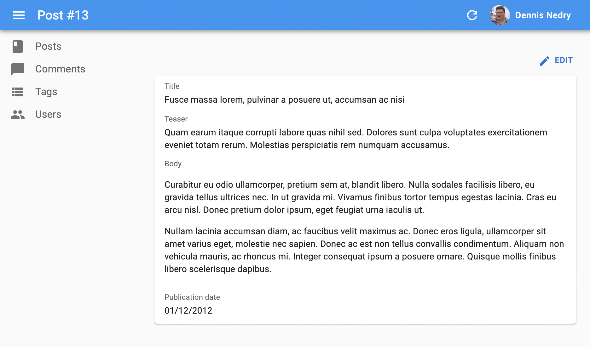

# フィールドコンポーネント

`Field` コンポーネントはレコードの特定のプロパティを表示します。これらのコンポーネントは `List` や `Show` ビューで使用されますが、[`RecordContext`](./useRecordContext.md) が存在する限り、アプリケーションのどこにでも使用できます。

## フィールドの構造

`Field` コンポーネントは現在の `RecordContext` から現在の `record` を読み取ります（react-adminによって設定されます）。特別なことは何もなく、自分で簡単に作成できます。


```jsx
import { useRecordContext } from 'react-admin';

const PurpleTextField = ({ source }) => {
    const record = useRecordContext();
    return (<span style={{ color: 'purple' }}>{record && record[source]}</span>);
};
```



**ヒント**: react-admin はレコードをレンダリングするたびに `RecordContext` を作成します。これにはデータグリッドの行、シンプルリストアイテム、参照フィールド、表示および編集ページが含まれます。独自の `RecordContext` を作成し、カスタムページでreact-adminのフィールドを使用することもできます。

React-admin の Field コンポーネントは `record` プロップも受け取ります。これにより、`RecordContext` 以外の場所で使用したり、現在のコンテキストとは異なるレコードを使用したりできます。

```jsx
// ポストは次のようになります
// { id: 123, title: "Hello, world", author: "John Doe", body: "..." }

const PostShow = ({ id }) => {
    const { data, isLoading } = useGetOne('books', { id });
    if (isLoading) return <span>Loading</span>; 
    return (
        <dl>
            <dt>Title</dt>
            <dd><TextField record={data} source="title" /></dd>
            <dt>Author</dt>
            <dd><PurpleTextField record={data} source="author" /></dd>
        </dl>   
    );
}
```

## 使用方法

レコードフィールド（例：`record.title`）をレンダリングするには、フィールドタイプに対応する Field コンポーネントを選択し（例：テキストフィールドの場合は `TextField`）、フィールド名を `source` プロップとして渡します。

次の Show ビューの場合:

```jsx
import { TextField } from 'react-admin';

export const BookShow = () => (
    <Show>
        <SimpleShowLayout>
            <TextField source="title" />
        </SimpleShowLayout>
    </Show>
);
```

次のレコードに対してレンダリングされると:

```js
{ 
    id: 123,
    title: "War And Peace",
}
```

次のように表示されます:

```jsx
<Typography component="span" variant="body2">
    War And Peace
</Typography>
```

Field コンポーネントは通常、`<Datagrid>`、`<SimpleShowLayout>`、`<TabbedShowLayout>` の子として、リストおよび表示ビューで使用されます。親コンポーネントは通常、タイトルを追加するために `source` や `label` プロップを読み取ります。

```jsx
// src/posts.js にて
import * as React from "react";
import { Show, SimpleShowLayout, TextField, DateField, RichTextField } from 'react-admin';

export const PostShow = () => (
    <Show>
        <SimpleShowLayout>
            <TextField source="title" />
            <TextField source="teaser" />
            <RichTextField source="body" />
            <DateField label="Publication date" source="published_at" />
        </SimpleShowLayout>
    </Show>
);
```



**ヒント**: `Edit` および `Create` ビュー内でも Field コンポーネントを使用して、フォーム内で読み取り専用の値をレンダリングできます:

```jsx
export const PostEdit = () => (
    <Edit>
        <SimpleForm>
            <TextField source="id" /> {/* 読み取り専用 */}
            <TextInput source="title" />
        </SimpleForm>
    </Edit>
);
```

React-admin には数値、画像URL、ブール値、配列などのレンダリングに特化した約20種類のフィールドコンポーネントが用意されています。また、必要なフィールドが見つからない場合は、独自に作成することもできます。

## 共通のフィールドプロップ

すべてのフィールドコンポーネントは次のプロップを受け入れます：

|プロップ名|必須|タイプ|デフォルト|説明|
|---|---|---|---|---|
|[`source`](#source)|必須|`string`|\-|表示するプロパティの名前|
|[`label`](#label)|任意|`string` \| `ReactElement`|`source`|Datagrid の列見出しや Show レイアウトで使用される|
|[`record`](#record)|任意|`Object`|\-|表示するプロパティを含むオブジェクトで、現在の `RecordContext` からのレコードをオーバーライドするために使用されます|
|[`sortable`](#sortable)|任意|`boolean`|`true`|`List` で使用される場合、このリストは `source` 属性を使用してソート可能かどうか。`false` に設定すると列見出しのクリックハンドラが無効になります。|
|[`sortBy`](#sortby)|任意|`string`|`source`|`List` で使用される場合、ユーザーが列見出しをクリックしたときに使用する実際の `source` を指定します|
|[`sortByOrder`](#sortbyorder)|任意|`ASC` \| `DESC`|`ASC`|`List` で使用される場合、ユーザーが列見出しをクリックしたときに使用するソート順序を指定します|
|[`className`](#classname)|任意|`string`|\-|フィールド要素自体の見た目をカスタマイズするためのクラス名（通常はJSSによって生成されます）|
|[`textAlign`](#textalign)|任意|`string`|'left'|セル内のテキストの位置揃えを定義します。数値の場合は `right` に設定するのが一般的です。|
|[`emptyText`](#emptytext)|任意|`string`|''|フィールドに値がない場合に表示されるテキストを定義します（配列フィールドではサポートされていません）|
|[`sx`](#sx)|任意|`SxProps`|''|テーマへのアクセスを可能にするカスタムスタイルを定義するための Material UI ショートカット|

## `className`

ルートコンポーネントに渡されるCSSクラス名。

```jsx
<TextField source="title" className="number" />
```

**注意**: フィールドスタイルをカスタマイズするには、 [`sx` プロップ](#sx) を使用することをお勧めします。

## `emptyText`

デフォルトでは、フィールドはそのフィールドに値がない場合に空の文字列をレンダリングします。この動作を上書きするには、`emptyText` プロップを設定します。`emptyText` は i8nProvider の翻訳をサポートしており、翻訳が見つからない場合はデフォルトの値が表示されます。

```jsx
const PostList = () => (
    <List>
        <Datagrid>
            <TextField source="title" />
            <TextField source="author" emptyText="missing data" />
        </Datagrid>
    </List>
);
```

## `label`

デフォルトでは、フィールドはラベルを表示しませんが、同じ画面に複数のフィールドを表示する場合、それらにラベルを付ける必要があります。`<SimpleShowLayout>` や `<Datagrid>` のようなコンポーネントはフィールドの `source` を読み取り、人間が読める形式に変換してラベルとして使用します（例：`source="title"` は `Title` というラベルになります）。

`label` プロップを指定することでこの自動ラベルをカスタマイズできます。`<SimpleShowLayout>` や `<Datagrid>` は `source` プロップの代わりに `label` プロップを使用してフィールドをラベル付けします。

```jsx
// label は文字列でもかまいません
<TextField source="author.name" label="Author" />
// label は自動的に翻訳されるため、翻訳識別子を使用できます
<TextField source="author.name" label="ra.field.author" />
// React要素も使用できます
<TextField source="author.name" label={<FieldTitle label="Author" />} />
```

**ヒント**: 管理者が複数の言語をサポートする必要がある場合は、`label` プロップを使用せず、ローカライズされたラベルを辞書に入れてください。詳細は [翻訳ドキュメント](./TranslationTranslating.md#translating-resource-and-field-names) を参照してください。

**ヒント**: `label` プロップに `false` を渡すことでラベル装飾をオプトアウトできます。

```jsx
// ラベルは追加されません
<TextField source="author.name" label={false} />
```

**注意**: このプロップは、`<Datagrid>`、`<SimpleShowLayout>`、`<TabbedShowLayout>`、`<SimpleForm>`、または `<TabbedForm>` 以外の場所でフィールドをレンダリングする場合には効果がありません。

## `record`

デフォルトでは、フィールドは `RecordContext` から `record` を使用します。しかし、`record` プロップを渡すことでこれをオーバーライドできます。例えば、`RecordContext` の外でフィールドをレンダリングする場合や、コンテキスト内のレコードとは異なるレコードを使用する場合です。



```jsx
<TextField source="title" record={{ id: 123, title: "Hello" }} />
```



## `sortable`

`<Datagrid>` では、ユーザーが列見出しをクリックすることでソートフィールドと順序を変更できます。特定のフィールド（例：参照フィールドや計算フィールド）に対してこの動作を無効にしたい場合、`sortable` プロップに `false` を渡します。

```jsx
const PostList = () => (
    <List>
        <Datagrid>
            <TextField source="title" />
            <ReferenceField source="author_id" sortable={false}>
                <TextField source="name" />
            </ReferenceField>
        </Datagrid>
    </List>
);
```

**注意**: このプロップは `<Datagrid>` 外でフィールドをレンダリングする場合には効果がありません。

## `sortBy`

`<Datagrid>` では、ユーザーが列見出しをクリックすることでソートフィールドと順序を変更できます。`<Datagrid>` はフィールド `source` を使用してソートフィールドを決定します（例：`<TextField source="title" />` フィールドの列見出しをクリックするとリストは `title` フィールドに基づいてソートされます）。

`source` とは異なるソートフィールドを使用したい場合（例：参照フィールドの場合）、`sortBy` プロップを使用してソートフィールドを指定します。

```jsx
const PostList = () => (
    <List>
        <Datagrid>
            <TextField source="title" />
            <ReferenceField source="author_id" sortBy="author.name">
                <TextField source="name" />
            </ReferenceField>
        </Datagrid>
    </List>
);
```

**注意**: このプロップは `<Datagrid>` 外でフィールドをレンダリングする場合には効果がありません。

## `sortByOrder`

デフォルトでは、ユーザーが `<Datagrid>` の列見出しをクリックすると、react-admin はフィールドの `source` を使用してリストを並べ替えます（昇順で）。一部のフィールドでは予期しない結果をもたらすことがあります。例えば、「Last seen at」見出しをクリックすると、ユーザーは最近見られたユーザーを期待するでしょう。

このような場合、`sortByOrder` プロップを使用してデフォルトのソート順序を変更できます。

```jsx
const PostList = () => (
    <List>
        <Datagrid>
            <TextField source="title" />
            <DateField source="updated_at" sortByOrder="DESC" />
        </Datagrid>
    </List>
);
```

**注意**: このプロップは `<Datagrid>` 外でフィールドをレンダリングする場合には効果がありません。

## `source`

表示するプロパティの名前です。ネストされたオブジェクトのプロパティにアクセスするためにドットを含めることができます。

```jsx
<TextField source="author.first_name" />
```

## `sx`

すべての react-admin コンポーネントと同様に、Field コンポーネントのスタイルを `sx` プロップを使用してカスタマイズできます。



```jsx
import { List, Datagrid, WrapperField, TextField } from 'react-admin';

const UserList = () => (
    <List>
        <Datagrid>
            <ImageField source="avatar" sx={{ my: -2 }}/>
            <TextField source="username" sx={{ color: 'lightgrey' }} />
            <TextField source="email" sx={{ textOverflow: 'ellipsis' }} />
        </Datagrid>
    </List>
);
```



ルートコンポーネントに加えて、`sx` プロップは内部コンポーネントのスタイルをオーバーライドすることもできます。各フィールドコンポーネントのドキュメントを参照して、オーバーライドできるクラスを確認してください。

詳細は [Material UI システムのドキュメント](https://mui.com/system/the-sx-prop/) を参照してください。

## `textAlign`

このプロップは、`<Datagrid>` セル内でフィールドをレンダリングする際のテキストの位置揃えを定義します。デフォルトではデータグリッドの値は左揃えですが、数値の場合は右揃えが望ましいことが多いです。この場合、`textAlign` を `right` に設定します。

[`<NumberField>`](./NumberField.md) はすでに `textAlign="right"` を使用しています。カスタム数値フィールドを作成する場合、このプロップのデフォルト値を設定します。

```jsx
const BasketTotal = () => {
    const record = useRecordContext();
    if (!record) return null;
    const total = record.items.reduce((total, item) => total + item.price, 0);
    return <span>{total}</span>;
}
BasketTotal.defaultProps = {
    textAlign: 'right',
};
```

## 深いフィールドソース

フィールドは `source` を *パス* として使用して実際の値を読み取ります（[`lodash.get()`](https://lodash.com/docs/4.17.15#get) を使用）。つまり、ネストされた値をレンダリングするためにソース名にドットを含めることができます。

例えば、次のようなレコードがある場合:

```js
{ 
    id: 123,
    title: "War And Peace",
    author: {
        name: "Leo Tolstoy",
    }
}
```

次のようにして著者名をレンダリングできます:

```jsx
<TextField source="author.name" />
```

## フィールドラベルの設定

React-admin のフィールドレイアウトコンポーネント（[`<Datagrid>`](./Datagrid.md) や [`<SimpleShowLayout>`](./SimpleShowLayout.md) など）はその子要素を調査し、`label` プロップを使用してテーブルヘッダーやフィールドラベルを設定します。

そのため、これらのコンポーネント内ではデフォルトのラベルを上書きするために `label` プロップを提供できます。

```jsx
const BookList = () => (
   <List>
       <Datagrid>
            <TextField source="title" label="Post title" />
      </Datagrid>
  </List>
);
```

ラベルは [i18n レイヤー](./Translation.md) を使用しているため、翻訳キーも使用できます:

```jsx
const BookList = () => (
   <List>
       <Datagrid>
            <TextField source="title" label="post.title" />
      </Datagrid>
  </List>
);
```

しかし、フィールドコンポーネント自身はラベルをレンダリングしません（これは親レイアウトコンポーネントの責任でラベルをレンダリングします）。そのため、フォーム内でフィールドを使用する場合や、フィールドがレイアウトコンポーネントの直接の子ではない場合にはこの方法は機能しません。

このような状況でラベル付きフィールドをレンダリングするには、フィールドを [`<Labeled>` コンポーネント](./Labeled.md) でラップします。

```jsx
const BookEdit = () => (
   <Edit>
       <SimpleForm>
            <Labeled label="Post title">
                <TextField source="title" />
            </Labeled>
      </SimpleForm>
  </Edit>
);
```

## フィールドラベルの非表示

React-admin のフィールドレイアウトコンポーネント（[`<Datagrid>`](./Datagrid.md) や [`<SimpleShowLayout>`](./SimpleShowLayout.md) など）はその子要素を調査し、`source` プロップを使用してテーブルヘッダーやフィールドラベルを設定します。この動作をオプトアウトするには、`label` プロップに `false` を渡します。

```jsx
// SimpleShowLayout ではラベルは追加されません
<TextField source="author.name" label={false} />
```

## 条件付きフォーマット

値に応じてフィールドをフォーマットしたい場合は、このフィールドをラップする別のコンポーネントを作成し、フィールド値に応じて `sx` プロップを設定します。



```jsx
const FormattedNumberField = ({ source }) => {
    const record = useRecordContext();
    return <NumberField sx={{ color: record && record[source] < 0 ? 'red' : '' }} source={source} />;
};
FormattedNumberField.defaultProps = {
    textAlign: 'right',
};
```



## 2つのフィールドを組み合わせる

1つのセル（`<Datagrid>` 内）や1行（`<SimpleShowLayout>` 内）に複数のフィールドをレンダリングしたい場合があります。

理論的には、React フラグメント（`<>`）内に2つのフィールドを単純に配置できます。

```jsx
const BookList = () => (
   <List>
       <Datagrid>
            <TextField source="title" />
            <>
                <TextField source="author_first_name" />
                <TextField source="author_last_name" />
            </>
      </Datagrid>
  </List>
);
```

これにより、本のタイトルが表示される列と、著者の名前が表示される列が2列のデータグリッドがレンダリングされます。

実際には、2列目には列タイトルが欠けています。`<Datagrid>` は子要素の `source` や `label` を探して名前を取得しますが、2列目の名前は見つかりません。

解決策は2つあります。1つ目は `<WrapperField>` を使用する方法で、これは一般的なフィールドプロップをサポートし（親による調査を可能にする）、子要素をレンダリングします。

```jsx
import { List, Datagrid, WrapperField, TextField } from 'react-admin';

const BookList = () => (
   <List>
       <Datagrid>
            <TextField source="title" />
            <WrapperField label="author" sortBy="author_last_name">
                <TextField source="author_first_name" />
                <TextField source="author_last_name" />
            </WrapperField>
      </Datagrid>
  </List>
);
```

2つ目の解決策は [`<FunctionField>`](./FunctionField.md) を使用する方法で、これは `render` 関数を受け入れます。

```jsx
import { List, Datagrid, WrapperField, FunctionField } from 'react-admin';

const BookList = () => (
   <List>
       <Datagrid>
            <TextField source="title" />
            <FunctionField label="author" sortBy="author.last_name" render={
                record => `${record.author.first_name} ${record.author.last_name}`
            } />
      </Datagrid>
  </List>
);
```

## 独自のフィールドコンポーネントを作成する

利用可能なフィールドのリストに必要なものが見つからない場合は、独自のフィールドコンポーネントを作成できます。

これは通常の React コンポーネントで、`source` 属性を受け入れ、`useRecordContext` フックを使用して `RecordContext` から `record` を取得します。React-admin は、レンダリング時にAPI応答データに基づいてこのコンテキストに `record` を設定します。フィールドコンポーネントは `record` から `source` を見つけて表示するだけです。

次に、`firstName` および `lastName` プロパティを持つユーザーレコードを返すAPIの例を見てみましょう。

```js
{
    id: 123,
    firstName: 'John',
    lastName: 'Doe'
}
```

以下はフルネームを表示するカスタムフィールドです。

```jsx
import { useRecordContext } from 'react-admin';

export const FullNameField = (props) => {
    const record = useRecordContext(props);
    return record ? <span>{record.firstName} {record.lastName}</span> : null;
}

FullNameField.defaultProps = { label: 'Name' };
```

**ヒント**: react-admin は *レコードをデータプロバイダから取得する前に* Show ビューを表示する場合があるため、プロパティを調査する前に `record` が定義されていることを常に確認してください。そのため、リソースの Show ビューを初めてレンダリングする際、`record` は `undefined` です。

このフィールドは他の react-admin フィールドと同様に使用できます。

```jsx
import { List, Datagrid } from 'react-admin';
import { FullNameField } from './FullNameField';

export const UserList = () => (
    <List>
        <Datagrid>
            <FullNameField source="lastName" />
        </Datagrid>
    </List>
);
```

**ヒント**: このようなカスタムフィールドでは、`source` はオプションです。react-admin は列見出しがクリックされたときにどの列をソートするかを決定するために使用します。`source` プロパティを追加目的で使用する場合、ソートは任意の `Field` コンポーネントの `sortBy` プロパティで上書きできます。

`source` プロップを受け入れる再利用可能なフィールドを作成する場合、深いフィールドソース（例：`author.name`）をサポートする必要があります。単純なオブジェクトルックアップを置き換えるために [lodash/get](https://www.npmjs.com/package/lodash.get) を使用します。例えば、テキストフィールドの場合は次のようにします。

```diff
import * as React from 'react';
+import get from 'lodash/get';
import { useRecordContext } from 'react-admin';

const TextField = ({ source }) => {
    const record = useRecordContext();
-   return record ? <span>{record[source]}</span> : null;
+   return record ? <span>{get(record, source)}</span> : null;
}

export default TextField;
```

## 別の値に基づいてフィールドを非表示にする

Show ビューで、別のフィールドの値に基づいてフィールドを表示または非表示にしたい場合があります。例えば、`hasEmail` ブールフィールドが `true` の場合にのみ `email` フィールドを表示する場合です。

そのような場合には、[`<WithRecord>` コンポーネント](./WithRecord.md) を使用するか、カスタムフィールドアプローチを取ります。`record` をコンテキストから読み取り、値に基づいて別のフィールドをレンダリングするカスタムフィールドを作成します。

```jsx
import { Show, SimpleShowLayout, TextField, EmailField } from 'react-admin';

const ConditionalEmailField = () => {
    const record = useRecordContext();
    return record && record.hasEmail ? <EmailField source="email" /> : null;
}

const UserShow = () => (
    <Show>
        <SimpleShowLayout>
            <TextField source="first_name" />
            <TextField source="last_name" />
            <ConditionalEmailField />
        </SimpleShowLayout>
    </Show>
);
```

この `<ConditionalEmailField>` は `hasEmail` が `false` の場合には適切に非表示になります。しかし、フィールドのラベルは表示されません。デフォルトの `label` プロップを追加すると、`SimpleShowLayout` レイアウトは `hasEmail` の値に関係なくラベルをレンダリングします。

React の条件文を使用して `UserShow` 内で `record.hasEmail` が `true` の場合にのみ `<EmailField>` フィールドを追加することを検討してみてください。しかし、`useRecordContext()` フックは `<UserShow>` 内では機能しません（レコードを取得し、それをコンテキストに置くのは `<Show>` コンポーネントの責任です）。

```jsx
const UserShow = () => (
    <Show>
        <SimpleShowLayout>
            <TextField source="first_name" />
            <TextField source="last_name" />
            {/* record をどこから取得できますか？ */}
            {record.hasEmail && <EmailField source="email" />}
        </SimpleShowLayout>
    </Show>
);
```

解決策は、`<UserShow>` コンポーネントを2つに分割することです。1つはレコードを取得し、もう1つは表示レイアウトをレンダリングします。`<Show>` の子孫では、`useRecordContext()` フックを使用できます。

```jsx
const UserShow = () => (
    <Show>
        <UserShowLayout />
    </Show>
);

const UserShowLayout = () => {
    const record = useRecordContext();
    if (!record) return null;
    return (
        <SimpleShowLayout>
            <TextField source="first_name" />
            <TextField source="last_name" />
            {record.hasEmail && <EmailField source="email" />}
        </SimpleShowLayout>
    );
};
```

これで、通常のフィールドコンポーネントを使用でき、Show ビューでラベルが正しく表示されます。

## 他のレコードへのリンク

カスタムフィールドコンポーネントは、別のレコードへのリンクを表示する必要がある場合があります。次のようにして、リソース名とIDを使用して遠方のレコードへのURLを構築します。

```js
import { useRecordContext, useGetOne } from 'react-admin';
import { Link } from 'react-router-dom';

const AuthorField = () => {
    const post = useRecordContext();
    const { data, isLoading } = useGetOne('users', { id: post.user_id });
    const userShowPage = `/users/${post.user_id}/show`;

    return isLoading ? null : <Link to={userShowPage}>{data.username}</Link>;
};
```

## サードパーティ製コンポーネント

react-admin 用のコンポーネントはサードパーティ製のリポジトリでも見つけることができます。

* [OoDeLally/react-admin-clipboard-list-field](https://github.com/OoDeLally/react-admin-clipboard-list-field): カスタマイズ可能なクリップボードコピー用フィールド。
* [MrHertal/react-admin-json-view](https://github.com/MrHertal/react-admin-json-view): react-admin 用の JSON フィールドおよび入力フィールド。
* [alexgschwend/react-admin-color-picker](https://github.com/alexgschwend/react-admin-color-picker): カラーフィールド。

## TypeScript

すべてのフィールドコンポーネントはレコードを記述するジェネリック型を受け入れます。これにより、TypeScript は `source` プロップがレコードの実際のフィールドを対象としていることを検証できます。

```tsx
import * as React from "react";
import { Show, SimpleShowLayout, TextField, DateField, RichTextField } from 'react-admin';

// 注: これが機能するためには RaRecord を拡張しないでください
type Post = {
    id: number;
    title: string;
    teaser: string;
    body: string;
    published_at: string;
}

export const PostShow = () => (
    <Show>
        <SimpleShowLayout>
            <TextField<Post> source="title" />
            <TextField<Post> source="teaser" />
            {/* ここで TS は teasr フィールドが存在しないためエラーを表示します */}
            <TextField<Post> source="teasr" />
            <RichTextField<Post> source="body" />
            <DateField<Post> label="Publication date" source="published_at" />
        </SimpleShowLayout>
    </Show>
);
```

**制限**: これが機能するためには `RaRecord` を拡張してはいけません。さもないと、TypeScript は型のプロパティを推論できません。

レコード型を指定すると、`source` プロップおよび `sortBy` プロップに対するIDEの自動補完も可能になります。`sortBy` プロップは任意の文字列も受け入れることに注意してください。


