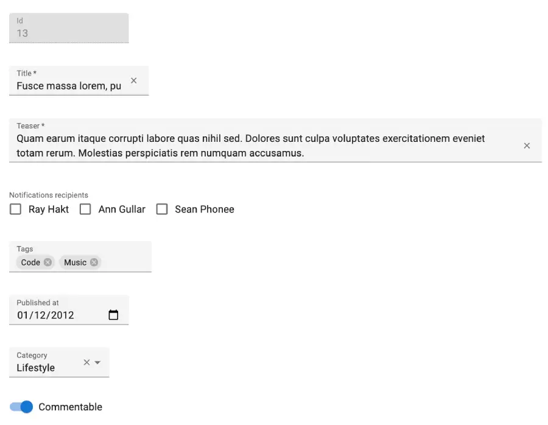
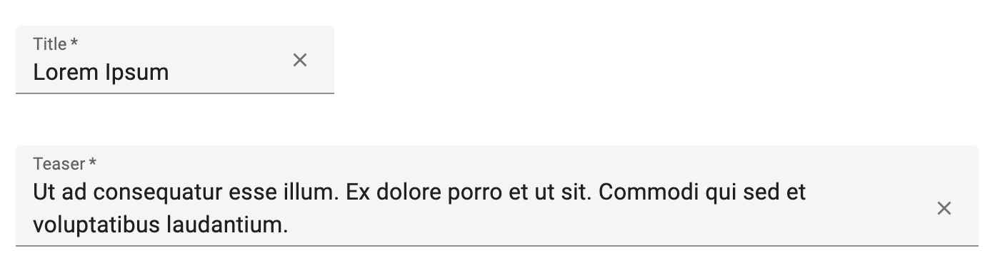

# Input Components

`Input`コンポーネントは、入力フィールドやドロップダウンリスト、ラジオボタンのリストなどを表示します。これらのコンポーネントは、レコードフィールドを更新するために使用され、`<Edit>`や`<Create>`コンポーネント、およびリストフィルターで一般的に使用されます。



入力コンポーネントは通常、Material UIのフォームコンポーネントのラッパーであり、現在のreact-hook-formのコンテキストにバインドされています。

## 使用方法

入力コンポーネントは必ずフォーム要素内（例：[`<Form>`](./Form.md), [`<SimpleForm>`](./SimpleForm.md), [`<TabbedForm>`](./TabbedForm.md)）で使用してください。これらのコンポーネントは[`react-hook-form`](https://react-hook-form.com/)のフォームとコンテキストを作成します。

入力コンポーネントには`source`プロップが必要です。

```tsx
import { Edit, SimpleForm, ReferenceInput, SelectInput, TextInput, required } from 'react-admin';

export const PostEdit = () => (
        <Edit>
            <SimpleForm>
                <TextInput disabled source="id" />
                <ReferenceInput label="User" source="userId" reference="users" validate={[required()]}>
                    <SelectInput optionText="name" />
                </ReferenceInput>
                <TextInput source="title" label="Post title" validate={[required()]} />
                <TextInput multiline source="body" defaultValue="Lorem Ipsum" />
            </SimpleForm>
        </Edit>
    );
```

## 共通の入力プロップ

すべての入力コンポーネントは以下のプロップを受け取ります：

|Prop|必須か|型|デフォルト|説明|
|---|---|---|---|---|
|`source`|必須|`string`|\-|入力値に使用するエンティティプロパティの名前|
|`className`|任意|`string`|\-|フィールド要素自体の外観と感触をカスタマイズするためのクラス名（通常はJSSによって生成される）|
|`defaultValue`|任意|`any`|\-|入力のデフォルト値|
|`disabled`|任意|`boolean`|\-|trueの場合、入力は無効になります|
|`format`|任意|`Function`|`value => value == null ? '' : value`|フォーム状態から値を取り、それを入力値として返すコールバック|
|`fullWidth`|任意|`boolean`|`false`|trueの場合、入力はフォームの幅に合わせて広がります|
|`helperText`|任意|`string`|\-|入力の下に表示されるテキスト（フィルター内では使用できません）|
|`label`|任意|`string`|\-|入力ラベル。i18nアプリでは、ラベルは`translate`関数に渡されます。省略された場合、`source`プロパティが人間向けに変換されてラベルとして使用されます。`label={false}`と設定するとラベルが非表示になります。|
|`parse`|任意|`Function`|`value => value === '' ? null : value`|入力値を取り、フォーム状態に格納したい値を返すコールバック|
|`sx`|任意|`SxProps`|\-|カスタムスタイルを定義するためのMaterial UIショートカット|
|`validate`|任意|`Function` \| `array`|\-|現在のプロパティの検証ルール。詳細は[Validation Documentation](./Validation.md#per-input-validation-built-in-field-validators)を参照してください。|

React-adminはフォーム入力を制御するために[react-hook-form](https://react-hook-form.com/)を使用します。各入力コンポーネントもすべてのreact-hook-formの[useController](https://react-hook-form.com/docs/usecontroller)フックオプションを受け取ります。

追加のプロップは、基礎となるコンポーネント（通常はMaterial UIコンポーネント）に渡されます。例えば、`<TextInput>`コンポーネントに`variant`プロップを設定すると、基礎となるMaterial UIの`<TextField>`がそれを受け取り、異なるバリアントでレンダリングされます。各入力コンポーネントの基礎となるMaterial UIコンポーネントとそのプロップについては、各入力コンポーネントのドキュメントを参照してください。

## どの入力コンポーネントを使うべきか？

React-adminは、特定のデータタイプ向けに設計された一連の入力コンポーネントを提供しています。以下は最も一般的な入力コンポーネントの一覧です：

|データタイプ|例|入力コンポーネント|
|---|---|---|
|String|`'Lorem Ipsum'`|[`<TextInput>`](./TextInput.md), [`<PredictiveTextInput>`](./PredictiveTextInput.md)|
|Rich text|`<p>Lorem Ipsum</p>`|[`<RichTextInput>`](./RichTextInput.md), [`<SmartRichTextInput>`](./SmartRichTextInput.md)|
|Markdown|`# Lorem Ipsum`|[`<MarkdownInput>`](./MarkdownInput.md)|
|Password|`'********'`|[`<PasswordInput>`](./PasswordInput.md)|
|Image URL|`'https://example.com/image.png'`|[`<ImageInput>`](./ImageInput.md)|
|File URL|`'https://example.com/file.pdf'`|[`<FileInput>`](./FileInput.md)|
|Number|`42`, `1.345`|[`<NumberInput>`](./NumberInput.md)|
|Boolean|`true`|[`<BooleanInput>`](./BooleanInput.md), [`<NullableBooleanInput>`](./NullableBooleanInput.md)|
|Date|`'2022-10-23'`|[`<DateInput>`](./DateInput.md)|
|Time|`'14:30:00'`|[`<TimeInput>`](./TimeInput.md)|
|Date & time|`'2022-10-24T19:40:28.003Z'`|[`<DateTimeInput>`](./DateTimeInput.md)|
|Object|`{ foo: 'bar' }`|All inputs (see [`source`](#source))|
|Enum|`'foo'`|[`<SelectInput>`](./SelectInput.md), [`<AutocompleteInput>`](./AutocompleteInput.md), [`<RadioButtonGroupInput>`](./RadioButtonGroupInput.md)|
|Tree node|`42`|[`<TreeInput>`](./TreeInput.md)|
|Foreign key|`42`|[`<ReferenceInput>`](./ReferenceInput.md)|
|Array of objects|`[{ item: 'jeans', qty: 3 }, { item: 'shirt', qty: 1 }]`|[`<ArrayInput>`](./ArrayInput.md)|
|Array of Enums|`['foo', 'bar']`|[`<SelectArrayInput>`](./SelectArrayInput.md), [`<AutocompleteArrayInput>`](./AutocompleteArrayInput.md), [`<CheckboxGroupInput>`](./CheckboxGroupInput.md), [`<DualListInput>`](./DualListInput.md)|
|Array of foreign keys|`[42, 43]`|[`<ReferenceArrayInput>`](./ReferenceArrayInput.md)|
|Translations|`{ en: 'Hello', fr: 'Bonjour' }`|[`<TranslatableInputs>`](./TranslatableInputs.md)|
|Related records|`[{ id: 42, title: 'Hello' }, { id: 43, title: 'World' }]`|[`<ReferenceManyInput>`](./ReferenceManyInput.md), [`<ReferenceManyToManyInput>`](./ReferenceManyToManyInput.md), [`<ReferenceNodeInput>`](./ReferenceNodeInput.md), [`<ReferenceOneInput>`](./ReferenceOneInput.md)|

## `className`

`className`プロップはルート要素に渡されます。

```tsx
<TextInput source="title" className="my-custom-class" />
```

**ヒント**：コンポーネントのスタイルを定義するには、`className`の代わりに[`sx`プロップ](#sx)を使用してください。

## `defaultValue`

レコードに`source`の値がない場合の入力値。



```tsx
<Form record={{ id: 123, title: 'Lorem ipsum' }}>
    <NumberInput source="age" defaultValue={18} /> {/* 初期値は18 */}
    <TextInput source="title" defaultValue="Hello, World!" /> {/* 初期値は "Lorem ipsum" */}
</Form>
```



フォーム全体で`defaultValues`を定義している場合、React-adminはこれらのデフォルト値を無視します：



```tsx
import { Create, SimpleForm, TextInput, NumberInput } from 'react-admin';
import { RichTextInput } from 'ra-input-rich-text';

export const PostCreate = () => (
    <Create>
        <SimpleForm defaultValues={{
            title: 'My first post',
            body: 'This is my first post',
            nb_views: 123,
        }}>
            <TextInput source="title" />
            <RichTextInput source="body" />
            {/* 初期値は123 */}
            <NumberInput source="nb_views" defaultValue={0} />
        </SimpleForm>
    </Create>
);
```



**ヒント**：`defaultValue`に関数を使用することはできません。レンダリング時に計算されるデフォルト値が必要な場合は、フォームレベルで`defaultValues`を設定してください。

```jsx
import { Create, SimpleForm, TextInput, NumberInput } from 'react-admin';
import { RichTextInput } from 'ra-input-rich-text';
import uuid from 'uuid';

const postDefaultValue = () => ({ id: uuid(), created_at: new Date(), nb_views: 0 });

export const PostCreate = () => (
    <Create>
        <SimpleForm defaultValues={postDefaultValue}>
            <TextInput source="title" />
            <RichTextInput source="body" />
            <NumberInput source="nb_views" />
        </SimpleForm>
    </Create>
);
```

## `disabled`

`true`の場合、入力が無効になり、ユーザーは値を変更できません。

```tsx
<TextInput source="title" disabled />
```

**ヒント**：React-adminで使用されているフォームフレームワークであるreact-hook-formは、`disabled`な入力は値を送信すべきではないと考えています。そのため、react-hook-formはすべての`disabled`入力の値を`undefined`に設定します。この結果、`disabled`な入力を含むフォームは常に`dirty`と見なされ（つまり、react-hook-formはフォーム値と初期レコード値が異なると見なします）、ユーザーが何も変更していなくてもフォームを離れるときに[未保存の変更について警告する機能](./EditTutorial.md#warning-about-unsaved-changes)がトリガーされます。この問題を回避するには、基礎となる入力コンポーネントに`disabled`プロップを設定します：



```jsx
<TextInput source="title" InputProps={{ disabled: true }} />
```



## `format`

`format`プロップは、フォーム状態から値を取り、入力値を返すコールバックを受け取ります（文字列である必要があります）。

```css
form state value --> format --> form input value (string)
```

```tsx
{/* 単価はセントで保存されます。つまり、123は1.23を意味します */}
<NumberInput 
    source="unit_price"
    format={v => String(v * 100)}
    parse={v => parseFloat(v) / 100}
/>
```

`format`はしばしば[`parse`](#parse)とペアで使用され、入力値をフォーム状態に格納する前に変換します。詳細は[Transforming Input Value](#transforming-input-value-tofrom-record)セクションを参照してください。

**ヒント**：デフォルトでは、react-adminの入力には以下の`format`関数があり、`null`または`undefined`の値を空文字列に変換します。これは、制御された/制御されていない入力コンポーネントに関する警告を回避するためです：

```ts
const defaultFormat = (value: any) => value == null ? '' : value;
```

## `fullWidth`

`true`の場合、入力はフォームの幅いっぱいに広がります。



```tsx
<TextInput source="title" />
<TextInput source="teaser" fullWidth multiline />
```

## `helperText`

ほとんどの入力は、入力の下に表示するテキストを表示するために`helperText`プロップを受け取ります。


```tsx
<NullableBooleanInput
    source="has_newsletter"
    helperText="ユーザーはニュースレターにオプトインしました"
/>
```

`helperText`を`false`に設定して、入力の下の空行を削除します。入力にエラーが含まれている場合、エラーメッセージが入力の下に表示されるため、フォームが視覚的に「ジャンプ」する可能性があることに注意してください。

**ヒント**：フィルター内で使用される入力には`helperText`を設定することはできません。

## `label`

入力ラベル。i18nアプリでは、ラベルは翻訳関数に渡されます。省略された場合、`source`プロパティが人間向けに変換され、ラベルとして使用されます。`label={false}`と設定するとラベルが非表示になります。

```tsx
<TextInput source="title" /> {/* 入力ラベルは "Title" */}
<TextInput source="title" label="Post title" /> {/* 入力ラベルは "Post title" */}
<TextInput source="title" label={false} /> {/* 入力ラベルはなし */}
```

**ヒント**：インターフェースが複数の言語をサポートする必要がある場合、`label`プロップを使用しないでください。代わりに、デフォルトラベル（`resources.${resourceName}.fields.${fieldName}`）に基づいてロケールごとに1つのラベルを提供してください。

```tsx
const frenchMessages = {
    resources: {
        posts: {
            fields: {
                title: 'Titre',
                // ...
            },
        },
    },
};

<TextInput source="title" /> {/* 入力ラベルは "Titre" */}
```

詳細は[翻訳ドキュメント](./TranslationTranslating.md#translating-resource-and-field-names)を参照してください。

## `parse`

`parse`プロップは、入力値（文字列）を取り、フォーム状態に格納する値を返すコールバックを受け取ります。

```css
form input value (string) ---> parse ---> form state value
```

```tsx
{/* 単価はセントで保存されます。つまり、123は1.23を意味します */}
<NumberInput 
    source="unit_price"
    format={v => String(v * 100)}
    parse={v => parseFloat(v) / 100}
/>
```

`parse`はしばしば[`format`](#format)とペアで使用され、フォーム値を入力に渡す前に変換します。詳細は[Transforming Input Value](#transforming-input-value-tofrom-record)セクションを参照してください。

**ヒント**：デフォルトでは、react-adminの入力には以下の`parse`関数があり、空文字列を`null`に変換します：

```js
const defaultParse = (value: string) => value === '' ? null : value;
```

## `source`

入力が編集するレコードフィールドを指定します。



```tsx
<Form record={{ id: 123, title: 'Hello, world!' }}>
    <TextInput source="title" /> {/* 初期値は "Hello, world!" */}
</Form>
```



複雑な構造を持つレコードを編集する場合、`source`パラメータとしてパスを使用できます。例えば、APIが以下の「book」レコードを返すとします：

```json
{
    "id": 1234,
    "title": "War and Peace",
    "author": {
        "firstName": "Leo",
        "lastName": "Tolstoi"
    }
}
```

次に、以下のようにして著者の名前を編集するためのテキスト入力を表示できます：

```tsx
<TextInput source="author.firstName" />
```

## `sx`

各入力は、基礎となるコンポーネントにカスタムスタイルを渡すための`sx`プロップをサポートしており、[Material UIシステム](https://mui.com/system/basics/#the-sx-prop)に依存しています。



```tsx
<TextInput
    source="title"
    variant="filled"
    sx={{
        marginRight: '1em',
        '& .MuiFilledInput-input': {
            paddingTop: '10px',
        },
    }}
/>
```



オーバーライドできる内部クラスについては、各入力コンポーネントのドキュメントを参照してください。

## `validate`

入力値を検証するための関数または関数の配列。

バリデータ関数は、値が有効な場合は`undefined`を返し、無効な場合はエラーを説明する文字列を返すべきです。

```tsx
const validateAge = (value: number) => {
    if (value < 18) {
        return '18歳以上でなければなりません';
    }
    return undefined;
}

<NumberInput source="age" validate={validate} />
```

**ヒント**：管理画面が[多言語サポート](./Translation.md)されている場合、バリデータ関数はメッセージ自体ではなくメッセージ識別子を返すべきです。React-adminはこれらの識別子を自動的に翻訳関数に渡します：

```tsx
// validators/required.jsで
const required = () => (value: any) =>
    value
        ? undefined
        : 'myroot.validation.required';
```

React-adminには一連の組み込みバリデータが付属しています：

* `required(message)` フィールドが必須の場合
* `minValue(min, message)` 整数の最小値を指定する場合
* `maxValue(max, message)` 整数の最大値を指定する場合
* `minLength(min, message)` 文字列の最小長を指定する場合
* `maxLength(max, message)` 文字列の最大長を指定する場合
* `number(message)` 入力が有効な数値であることを確認する場合
* `email(message)` 入力が有効なメールアドレスであることを確認する場合
* `regex(pattern, message)` 入力が正規表現と一致することを確認する場合
* `choices(list, message)` 入力が指定されたリスト内にあることを確認する場合

これらはバリデータファクトリであるため、バリデータを取得するには関数を呼び出す必要があります。

```tsx
<NumberInput source="age" validate={required()} />
```

複数のバリデーションルールを同じ入力に適用するために、バリデータの配列を使用できます。

```tsx
<NumberInput source="age" validate={[required(), validateAge]} />
```

**注意**：入力レベルのバリデーションと[フォームレベルのバリデーション](./Form.md#validate)を同時に使用することはできません。これは`react-hook-form`の制限です。

詳細は[Validation章](./Validation.md)を参照してください。

## 入力値のレコードへの変換およびその逆

入力コンポーネントが返すデータ形式は、APIが期待するものではないかもしれません。保存および読み込み時に入力値を変換するために、`parse`および`format`関数を使用できます。

2つの関数のニーモニック：

* `parse()`: 入力 -> レコード
* `format()`: レコード -> 入力

簡単な例を見てみましょう。ユーザーが0-100の値をパーセンテージフィールドに入力したいが、API（したがってレコード）は0-1.0を期待する場合、シンプルな`parse()`および`format()`関数を使用して変換を実現できます：

```tsx
<NumberInput
    source="percent"
    format={v => v * 100}
    parse={v => parseFloat(v) / 100}
    label="Formatted number"
/>
```

別の典型的な使用例は日付の処理です。`<DateInput>`は文字列を保存および返しますが、レコードにJavaScriptのDateオブジェクトを保存したい場合、以下のようにすることができます：

```tsx
const dateFormatRegex = /^\d{4}-\d{2}-\d{2}$/;
const dateParseRegex = /(\d{4})-(\d{2})-(\d{2})/;

const convertDateToString = (value: string | Date) => {
    // valueは`Date`オブジェクト
    if (!(value instanceof Date) || isNaN(value.getDate())) return '';
    const pad = '00';
    const yyyy = value.getFullYear().toString();
    const MM = (value.getMonth() + 1).toString();
    const dd = value.getDate().toString();
    return `${yyyy}-${(pad + MM).slice(-2)}-${(pad + dd).slice(-2)}`;
};

const dateFormatter = (value: string | Date) => {
    // null, undefined, および空文字列の値はdateFormatterを通過させない
    if (value == null || value === '') return '';
    if (value instanceof Date) return convertDateToString(value);
    // 有効な日付は変換しない
    if (dateFormatRegex.test(value)) return value;

    return convertDateToString(new Date(value));
};

const dateParser = value => {
    //valueは"YYYY-MM-DD"形式の文字列
    const match = dateParseRegex.exec(value);
    if (match === null || match.length === 0) return;
	const d = new Date(parseInt(match[1]), parseInt(match[2], 10) - 1, parseInt(match[3]));
    if (isNaN(d.getDate())) return;
    return d;
};


<DateInput source="isodate" format={dateFormatter} parse={dateParser} defaultValue={new Date()} />
```

**ヒント**：この機能の一般的な使用方法は、空の値を処理することです。実際、HTMLフォーム入力は常に文字列を返しますが、数値やブール値の場合でも多くのバックエンドは`null`の値を期待します。これが、デフォルトでreact-adminのすべての入力がHTML入力値が空文字列の場合に`null`を格納する理由です。

**ヒント**：カスタム入力コンポーネントを含むすべての入力コンポーネントに対してこれをグローバルに行う必要がある場合、 [`<Form>`コンポーネントの`sanitizeEmptyValues`プロップ](./Form.md#sanitizeemptyvalues)を確認してください。

## 必須として入力をマークする

デフォルトでは、react-adminは入力コンポーネントが [`required`バリデータ](./Validation.md#per-input-validation-built-in-field-validators)を使用する場合、入力ラベルにアスタリスクを追加します。


```tsx
import { TextInput, required } from 'react-admin';

<TextInput source="title" validate={required()} />
<TextInput source="teaser" multiline fullWidth validate={required()} />
```

## 2つの入力をリンクする

編集フォームには、例えば国と都市（後者の選択肢が前者の値に依存する）のようにリンクされた入力が含まれることがよくあります。

React-adminはフォーム処理のために[react-hook-form](https://react-hook-form.com/)に依存しています。現在のフォーム値はreact-hook-formの[useWatch](https://react-hook-form.com/docs/usewatch)フックを使用して取得できます。

```tsx
import * as React from "react";
import { Edit, SimpleForm, SelectInput } from "react-admin";
import { useWatch } from "react-hook-form";

const countries = ["USA", "UK", "France"];
const cities: Record<string, string[]> = {
    USA: ["New York", "Los Angeles", "Chicago", "Houston", "Phoenix"],
    UK: ["London", "Birmingham", "Glasgow", "Liverpool", "Bristol"],
    France: ["Paris", "Marseille", "Lyon", "Toulouse", "Nice"],
};
const toChoices = (items: string[]) => items.map((item) => ({ id: item, name: item }));

const CityInput = () => {
    const country = useWatch<{ country: string }>({ name: "country" });

    return (
        <SelectInput
            choices={country ? toChoices(cities[country]) : []}
            source="cities"
        />
    );
};

const OrderEdit = () => (
    <Edit>
        <SimpleForm>
            <SelectInput source="country" choices={toChoices(countries)} />
            <CityInput />
        </SimpleForm>
    </Edit>
);

export default OrderEdit;
```

または、React-adminの`<FormDataConsumer>`コンポーネントを使用することもできます。これにより、フォーム値が取得され、それが子関数に渡されます。`<FormDataConsumer>`はレンダープロップパターンを使用しているため、上記の`<CityInput>`コンポーネントのような中間コンポーネントを作成する必要がなくなります：

```tsx
import * as React from "react";
import { Edit, SimpleForm, SelectInput, FormDataConsumer } from "react-admin";

const countries = ["USA", "UK", "France"];
const cities: Record<string, string[]> = {
    USA: ["New York", "Los Angeles", "Chicago", "Houston", "Phoenix"],
    UK: ["London", "Birmingham", "Glasgow", "Liverpool", "Bristol"],
    France: ["Paris", "Marseille", "Lyon", "Toulouse", "Nice"],
};
const toChoices = (items: string[]) =>
    items.map((item) => ({ id: item, name: item }));

const OrderEdit = () => (
    <Edit>
        <SimpleForm>
            <SelectInput source="country" choices={toChoices(countries)} />
            <FormDataConsumer<{ country: string }>>
                {({ formData, ...rest }) => (
                    <SelectInput
                        source="cities"
                        choices={
                            formData.country ? toChoices(cities[formData.country]) : []
                        }
                        {...rest}
                    />
                )}
            </FormDataConsumer>
        </SimpleForm>
    </Edit>
);
```

**ヒント**：`<ArrayInput>`内で`FormDataConsumer`を使用する場合、`FormDataConsumer`は子関数に2つの追加プロパティを提供します：

* `scopedFormData`：現在レンダリングされている`ArrayInput`のアイテムの現在の値を含むオブジェクト
* `getSource`：`ArrayInput`用の有効なソースに変換する関数

`<ArrayInput>`内での`getSource`の使用例は以下のとおりです：

```tsx
import { FormDataConsumer } from 'react-admin';

const PostEdit = () => (
    <Edit>
        <SimpleForm>
            <ArrayInput source="authors">
                <SimpleFormIterator>
                    <TextInput source="name" />
                    <FormDataConsumer<{ name: string }>>
                        {({
                            formData, // フォーム全体のデータ
                            scopedFormData, // ArrayInputのこのアイテムのデータ
                            getSource, // ArrayInput内の有効なソースを取得するための関数
                            ...rest
                        }) =>
                            scopedFormData && getSource && scopedFormData.name ? (
                                <SelectInput
                                    source={getSource('role')} // "authors[0].role"に変換
                                    choices={[{ id: 1, name: 'Head Writer' }, { id: 2, name: 'Co-Writer' }]}
                                    {...rest}
                                />
                            ) : null
                        }
                    </FormDataConsumer>
                </SimpleFormIterator>
            </ArrayInput>
        </SimpleForm>
    </Edit>
);
```

**ヒント**：TypeScriptユーザーは、`scopedFormData`および`getSource`がオプションのパラメータとして型付けされていることに気付くでしょう。これは、`<FormDataConsumer>`コンポーネントが`<ArrayInput>`の外でも使用でき、その場合、これらのパラメータは`undefined`になるためです。`<ArrayInput>`内にいる場合、これらのパラメータは定義されていると安全に仮定できます。

## 他の入力に基づいて入力を非表示にする

他の入力の値に基づいて入力を表示または非表示にする場合があります。例えば、`hasEmail`ブール入力が`true`に設定されている場合にのみ`email`入力を表示するなど。

このような場合、上記のアプローチを使用して、`<FormDataConsumer>`コンポーネントを使用できます。

```tsx
import { FormDataConsumer } from 'react-admin';

 const PostEdit = () => (
     <Edit>
         <SimpleForm shouldUnregister>
             <BooleanInput source="hasEmail" />
             <FormDataConsumer<{ hasEmail: boolean }>>
                 {({ formData, ...rest }) => formData.hasEmail &&
                      <TextInput source="email" {...rest} />
                 }
             </FormDataConsumer>
         </SimpleForm>
     </Edit>
 );
```

**注意**：デフォルトでは、`react-hook-form`はアンマウントされた入力コンポーネントの値を送信します。上記の例では、`<SimpleForm>`コンポーネントの`shouldUnregister`プロップがそれを防ぎます。これにより、エンドユーザーが入力を非表示にした場合、その値は送信データに含まれません。

## 入力バリアントのオーバーライド

Material UIはテキストフィールドのために[3つのバリアント](https://mui.com/material-ui/react-text-field/#basic-textfield)を提供しています：`outlined`、`filled`、および`standard`。デフォルトのreact-adminテーマは`filled`バリアントを使用します。

ほとんどの入力コンポーネントは追加のプロップをルートコンポーネント（多くの場合Material UIフィールドコンポーネント）に渡すため、単一の入力のバリアントをオーバーライドするために`variant`プロップを渡すことができます：

```tsx
<TextInput source="name" variant="outlined" />
```

アプリケーションのすべての入力で別のバリアントを使用したい場合、[カスタムテーマ](./AppTheme.md#overriding-default-props)を使用して`<Admin theme>`プロップをオーバーライドします：

```tsx
import { defaultTheme } from 'react-admin';

const theme = {
    ...defaultTheme,
    components: {
        ...defaultTheme.components,
        MuiTextField: {
            defaultProps: {
                variant: 'outlined',
            },
        },
        MuiFormControl: {
            defaultProps: {
                variant: 'outlined',
            },
        },
    }
};

const App = () => (
    <Admin theme={theme}>
        // ...
    </Admin>
);
```

**ヒント**：TypeScriptユーザーは、前述の例で文字列値を`as const`として設定することで、TypeScriptの警告を回避できます：

```tsx
import { defaultTheme } from 'react-admin';

const theme = {
    ...defaultTheme,
    components: {
        ...defaultTheme.components,
        MuiTextField: {
            defaultProps: {
                variant: 'outlined' as const,
            },
        },
        MuiFormControl: {
            defaultProps: {
                variant: 'outlined' as const,
            },
        },
    }
};

// ...
```

## 独自の入力コンポーネントを作成する

より具体的な入力タイプが必要な場合は、Reactで直接作成できます。値の更新サイクルを処理するためにreact-hook-formの[useController](https://react-hook-form.com/docs/usecontroller)フックに依存する必要があります。

### `useController`の使用

例えば、現在のレコードの緯度と経度を編集するコンポーネントを作成してみましょう：

```tsx
// LatLongInput.jsで
import { useController } from 'react-hook-form';

const LatLngInput = () => {
    const input1 = useController({ name: 'lat', defaultValue: '' });
    const input2 = useController({ name: 'lng', defaultValue: '' });

    return (
        <span>
            <input {...input1.field} type="number" placeholder="latitude" />
            &nbsp;
            <input {...input2.field} type="number" placeholder="longitude" />
        </span>
    );
};
export default LatLngInput;

// ItemEdit.jsで
const ItemEdit = () => (
    <Edit>
        <SimpleForm>
            <LatLngInput />
        </SimpleForm>
    </Edit>
);
```

`LatLngInput`はプロップを受け取りません。なぜなら、`useController`コンポーネントはフォームコンテキストを介して現在のレコードにアクセスできるためです。`name`プロップは編集するレコードプロパティのセレクタとして機能します。このコンポーネントを実行すると、大まかに次のコードがレンダリングされます：

```html
<span>
    <input name="lat" type="number" placeholder="latitude" value={record.lat} />
    <input name="lng" type="number" placeholder="longitude" value={record.lng} />
</span>
```

**ヒント**：`useController`パラメータの1つとして`defaultValue: ''`を追加しました。これは、`record.lat`や`record.lng`の値が`undefined`や`null`である場合に制御された/制御されていないコンポーネントに関する警告を回避するための良いプラクティスです。

**ヒント**：React-hook-formの`useController`コンポーネントは`name`プロップでドット表記をサポートしており、ネストされた値にバインドすることができます：

```tsx
import { useController } from 'react-hook-form';

const LatLngInput = () => {
    const input1 = useController({ name: 'position.lat', defaultValue: '' });
    const input2 = useController({ name: 'position.lng', defaultValue: '' });
    
    return (
        <span>
            <input {...input1.field} type="number" placeholder="latitude" />
            &nbsp;
            <input {...input2.field} type="number" placeholder="longitude" />
        </span>
    );
};
export default LatLngInput;
```

### `<Labeled>`の使用

このコンポーネントにはラベルがありません。React-adminはそのための`<Labeled>`コンポーネントを提供しています：

```tsx
// LatLongInput.jsで
import { useController } from 'react-hook-form';
import { Labeled } from 'react-admin';

const LatLngInput = () => {
    const input1 = useController({ name: 'lat', defaultValue: '' });
    const input2 = useController({ name: 'lng', defaultValue: '' });
    
    return (
        <Labeled label="position">
            <span>
                <input {...input1.field} type="number" placeholder="latitude" />
                &nbsp;
                <input {...input2.field} type="number" placeholder="longitude" />
            </span>
        </Labeled>
    );
};
export default LatLngInput;
```

これで、コンポーネントはラベル付きでレンダリングされます：

```html
<label>Position</label>
<span>
    <input name="lat" type="number" placeholder="longitude" value={record.lat} />
    <input name="lng" type="number" placeholder="longitude" value={record.lng} />
</span>
```

### Material UIフィールドコンポーネントの使用

HTMLの`input`要素の代わりに、`TextField`のようなMaterial UIコンポーネントを使用できます。Material UIコンポーネントをフォーム値にバインドするために、`useController()`フックを使用します：

```tsx
// LatLongInput.jsで
import TextField from '@mui/material/TextField';
import { useController } from 'react-hook-form';

const BoundedTextField = ({ name, label }: { name: string; label: string }) => {
    const {
        field,
        fieldState: { isTouched, invalid, error },
        formState: { isSubmitted }
    } = useController({ name, defaultValue: '' });

    return (
        <TextField
            {...field}
            label={label}
            error={(isTouched || isSubmitted) && invalid}
            helperText={(isTouched || isSubmitted) && invalid ? error?.message : ''}
        />
    );
};
const LatLngInput = () => (
    <span>
        <BoundedTextField name="lat" label="latitude" />
        &nbsp;
        <BoundedTextField name="lng" label="longitude" />
    </span>
);
```

**ヒント**：Material UIの`<TextField>`コンポーネントにはすでにラベルが含まれているため、この場合は`<Labeled>`を使用する必要はありません。

**ヒント**：`useController`パラメータの1つとして`defaultValue: ''`を追加しました。これは、`record.lat`や`record.lng`の値が`undefined`や`null`である場合に制御された/制御されていないコンポーネントに関する警告を回避するための良いプラクティスです。

`useController()`は3つの値を返します：`field`、`fieldState`、および`formState`。これらのプロップについて詳しくは、[useController](https://react-hook-form.com/docs/usecontroller)フックのドキュメントを参照してください。

HTMLの`input`要素やMaterial UIコンポーネントの代わりに、react-admin入力コンポーネントを使用することもできます。例えば、`<NumberInput>`など。React-adminコンポーネントはすでに`useController()`を使用しており、すでにラベルを含んでいるため、`useController()`や`<Labeled>`は必要ありません：

```tsx
// LatLongInput.jsで
import { NumberInput } from 'react-admin';
const LatLngInput = () => (
    <span>
        <NumberInput source="lat" label="latitude" />
        &nbsp;
        <NumberInput source="lng" label="longitude" />
    </span>
);
export default LatLngInput;
```

### `useInput()`フック

React-adminはreact-hook-formに機能を追加します：

* `onChange`のようなカスタムイベントエミッタの処理、
* バリデータの配列のサポート、
* フィールドラベルにアスタリスクを追加するための必須フィールドの検出、
* レコード値をフォーム値に、またその逆に変換するための`parse`および`format`。

したがって、内部的には、react-adminコンポーネントはreact-hook-formの`useController()`フックをラップする別のフックを使用します。それは`useInput()`と呼ばれ、react-admin入力コンポーネントと同じAPIを持つフォーム入力を作成するために使用します：

```tsx
// LatLongInput.jsで
import { TextField, TextFieldProps } from "@mui/material";
import { useInput, required, InputProps } from "react-admin";

interface BoundedTextFieldProps
    extends Omit<
        TextFieldProps,
        "label" | "onChange" | "onBlur" | "type" | "defaultValue"
    >,
    InputProps {}

const BoundedTextField = (props: BoundedTextFieldProps) => {
    const { onChange, onBlur, label, ...rest } = props;
    const {
        field,
        fieldState: { isTouched, invalid, error },
        formState: { isSubmitted },
        isRequired,
    } = useInput({
        // イベントハンドラをフックに渡しますが、フィールドプロパティには渡しません。フィールドプロパティにはすでに含まれています。
        // useInputは提供されたonChangeとonBlurを呼び出し、react-hook-formに必要なデフォルトも呼び出します。
        onChange,
        onBlur,
        ...rest,
    });

    return (
        <TextField
            {...field}
            label={label}
            error={(isTouched || isSubmitted) && invalid}
            helperText={(isTouched || isSubmitted) && invalid ? error?.message : ""}
            required={isRequired}
            {...rest}
        />
    );
};
const LatLngInput = (props: BoundedTextFieldProps) => {
    const { source, ...rest } = props;

    return (
        <span>
            <BoundedTextField
                source="lat"
                label="Latitude"
                validate={required()}
                {...rest}
            />
            &nbsp;
            <BoundedTextField
                source="lng"
                label="Longitude"
                validate={required()}
                {...rest}
            />
        </span>
    );
};
```

今回は、Material UIの`Select`コンポーネントを使用した別の例です：

```tsx
// SexInput.jsで
import { Select, MenuItem } from "@mui/material";
import { InputProps, useInput } from "react-admin";

const SexInput = (props: InputProps) => {
    const {
        field,
        fieldState: { isTouched, invalid, error },
        formState: { isSubmitted },
    } = useInput(props);

    return (
        <Select label="Sex" {...field}>
            <MenuItem value="M">Male</MenuItem>
            <MenuItem value="F">Female</MenuItem>
        </Select>
    );
};
export default SexInput;
```

**ヒント**：`useInput`は、`useController`に渡すことができるすべての引数を受け入れます。さらに、`useInput`を使用するコンポーネントは、値をフォームから入力に、またその逆に変換するための`format`および`parse`プロップを受け入れます：

```tsx
const parse = value => {/* ... */};
const format = value => {/* ... */};

const PersonEdit = () => (
    <Edit>
        <SimpleForm>
            <SexInput
                source="sex"
                format={formValue => formValue === 0 ? 'M' : 'F'}
                parse={inputValue => inputValue === 'M' ? 0 : 1}
            />
        </SimpleForm>
    </Edit>
);
```

**リマインダー**：[react-hook-formの`formState`はProxyでラップされています](https://react-hook-form.com/docs/useformstate/#rules)ので、レンダリング前に`formState`をデコンストラクトまたは読み取ってサブスクリプションを有効にすることを確認してください。

```ts
const { isDirty } = useFormState(); // ✅
const formState = useFormState(); // ❌ formStateをデコンストラクトする必要があります      
```

## i18n

入力の`helperText`および`useInput()`からのエラーメッセージを適切にフォーマットするために、カスタム入力はreact-adminコンポーネントの`<InputHelperText>`を使用する必要があります。これにより、テキストが文字列かReactコンポーネントか、単純なメッセージかエラーかに関係なく、一貫して入力の下に表示されるようになります。重要なのは、`useInput()`からのreact-adminメッセージが`<InputHelperText>`内で`useTranslate()`を通過するため、このコンポーネントはローカライゼーションにとって重要です。

```jsx
import TextField from '@mui/material/TextField';
import { useInput, InputHelperText } from 'react-admin';

const BoundedTextField = (props: BoundedTextFieldProps) => {
    const { onChange, onBlur, label, helperText, ...rest } = props;
    const {
        field,
        fieldState: { isTouched, invalid, error },
        formState: { isSubmitted },
        isRequired,
    } = useInput({
        onChange,
        onBlur,
        ...rest,
    });

    const renderHelperText =
        helperText !== false || ((isTouched || isSubmitted) && invalid);

    return (
        <TextField
            {...field}
            label={label}
            error={(isTouched || isSubmitted) && invalid}
            helperText={
                renderHelperText ? (
                    <InputHelperText
                        touched={isTouched || isSubmitted}
                        error={error?.message}
                        helperText={helperText}
                    />
                ) : null
            }
            required={isRequired}
            {...rest}
        />
    );
};
```

## サードパーティコンポーネント

サードパーティリポジトリでreact-admin用のコンポーネントを見つけることができます。

* [alexgschwend/react-admin-color-picker](https://github.com/alexgschwend/react-admin-color-picker)：色入力を提供する[React Color](https://casesandberg.github.io/react-color/)を使用した色入力。

* [react-admin-mui-dateinputs](https://www.npmjs.com/package/react-admin-mui-dateinputs)：[MUI X Date Pickers](https://mui.com/x/react-date-pickers/date-picker/)に基づいたDate/Time入力のコレクション。

* [MrHertal/react-admin-json-view](https://github.com/MrHertal/react-admin-json-view)：react-admin用のJSONフィールドおよび入力。

* [@bb-tech/ra-components](https://github.com/bigbasket/ra-components)：有効なJSONのみを入力として許可する`JsonInput`、`Datagrid`の`List`コンポーネントで表示する際にフィールドをトリムする`TrimField`、およびJSONを適切に表示する`JsonField`。

* [@react-page/react-admin](https://react-page.github.io/docs/#/integration-react-admin)：ReactPageはリッチコンテンツエディタであり、すぐに使用できるReact-admin入力コンポーネントが付属しています。[デモを確認する](https://react-page.github.io/examples/reactadmin)

* **DEPRECATED V3**[LoicMahieu/aor-tinymce-input](https://github.com/LoicMahieu/aor-tinymce-input)：HTML編集に便利なTinyMCEコンポーネント。

## ラベルの非表示

入力コンポーネントで`label={false}`を設定すると、そのラベルを非表示にできます。

```tsx
<TextInput source="title" /> {/* 入力ラベルは "Title" */}
<TextInput source="title" label="Post title" /> {/* 入力ラベルは "Post title" */}
<TextInput source="title" label={false} /> {/* 入力ラベルはなし */}
```


