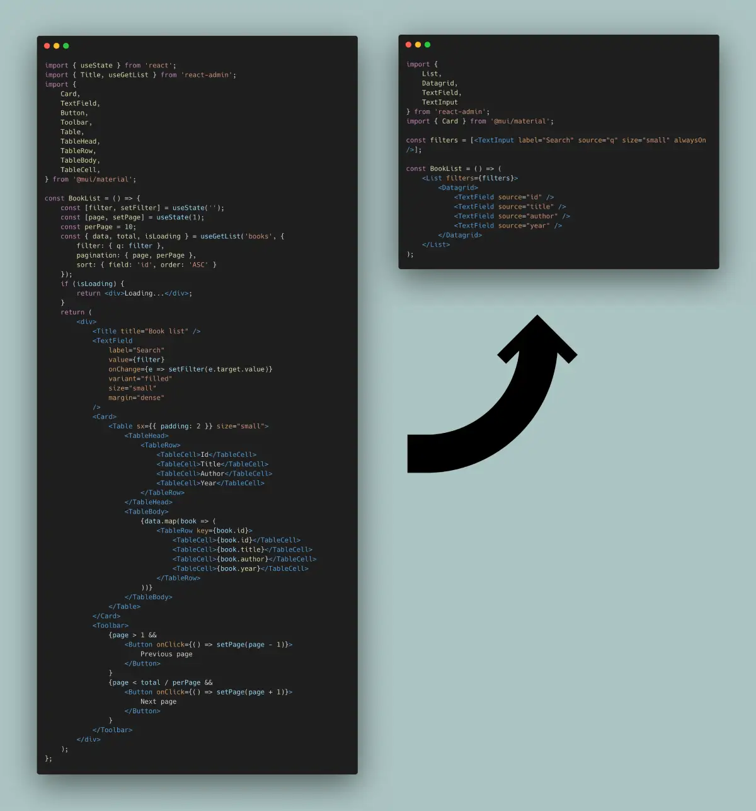

# リストページ

リストビューはレコードの一覧を表示し、ユーザーがフィルター、ソート、およびページネーションを使用して特定のレコードを検索できるようにします。


このチュートリアルでは、リストビューの基本原則を説明し、react-adminがどのようにして定型コードの量を減らし、ビジネスロジックに集中できるようにするかを示します。

## ピュアReactからReact-Adminへ

リストビューはレコードのリストを取得し、フィルター、ソート、ページネーション用のUIコントロールと共にそれをレンダリングします。

[](./img/list-from-react-to-react-admin.webp)

編集および作成に専念するためのreact-adminの様々なフックやコンポーネントの使い方を理解するために、まず手動でそのような編集ビューを構築してみましょう。

### 手動で構築したリストビュー

おそらく何度も開発してきたことがあると思いますし、実際に本のリストビューを作成するためにreact-adminを使用する必要はありません。


```tsx
    import { useState } from 'react';
    import { Title, useGetList } from 'react-admin';
    import {
        Card,
        TextField,
        Button,
        Toolbar,
        Table,
        TableHead,
        TableRow,
        TableBody,
        TableCell,
    } from '@mui/material';

    const BookList = () => {
        const [filter, setFilter] = useState('');
        const [page, setPage] = useState(1);
        const perPage = 10;
        const { data, total, isLoading } = useGetList<Book>('books', {
            filter: { q: filter },
            pagination: { page, perPage },
            sort: { field: 'id', order: 'ASC' }
        });
        if (isLoading) {
            return <div>Loading...</div>;
        }
        return (
            <div>
                <Title title="Book list" />
                <TextField
                    label="Search"
                    value={filter}
                    onChange={e => setFilter(e.target.value)}
                    variant="filled"
                    size="small"
                    margin="dense"
                />
                <Card>
                    <Table sx={{ padding: 2 }} size="small">
                        <TableHead>
                            <TableRow>
                                <TableCell>Id</TableCell>
                                <TableCell>Title</TableCell>
                                <TableCell>Author</TableCell>
                                <TableCell>Year</TableCell>
                            </TableRow>
                        </TableHead>
                        <TableBody>
                            {data?.map(book => (
                                <TableRow key={book.id}>
                                    <TableCell>{book.id}</TableCell>
                                    <TableCell>{book.title}</TableCell>
                                    <TableCell>{book.author}</TableCell>
                                    <TableCell>{book.year}</TableCell>
                                </TableRow>
                            ))}
                        </TableBody>
                    </Table>
                </Card>
                <Toolbar>
                    {page > 1 && <Button onClick={() => setPage(page - 1)}>Previous page</Button>}
                    {page < (total || 0) / perPage && <Button onClick={() => setPage(page + 1)}>Next page</Button>}
                </Toolbar>
            </div>
        );
    };
```



この`BookList`コンポーネントを`<Resource name="books" />`の`list`プロップとして渡すことができ、react-adminはそれを`/books/`パスにレンダリングします。

この例では、認証およびリクエスト状態のロジックを既に含んでいる`useGetList`フックを使用していますが、`fetch`を使用してリストビューを作成することも可能です。

このリストは多少粗削りです（例えば、検索入力に文字を1文字入力するごとにdataProviderへのコールが発生します）が、この章の目的には十分です。

### `<Datagrid>`がテーブル内のフィールドを表示

テーブルレイアウトは通常、テーブルヘッド、行、列などを定義するために多くのコードが必要です。react-adminの`<Datagrid>`コンポーネントは、フィールドコンポーネントと共に、その定型コードを削減するのに役立ちます。



```diff
import { useState } from 'react';
-import { Title, useGetList } from 'react-admin';
+import { Title, useGetList, Datagrid, TextField } from 'react-admin';
import {
    Card,
    TextField as MuiTextField,
    Button,
    Toolbar,
-   Table,
-   TableHead,
-   TableRow,
-   TableBody,
-   TableCell,
} from '@mui/material';

const BookList = () => {
    const [filter, setFilter] = useState('');
    const [page, setPage] = useState(1);
    const perPage = 10;
+   const sort = { field: 'id', order: 'ASC' };
    const { data, total, isLoading } = useGetList('books', {
        filter: { q: filter },
        pagination: { page, perPage },
+       sort
    });
    if (isLoading) {
        return <div>Loading...</div>;
    }
    return (
        <div>
            <Title title="Book list" />
            <MuiTextField
                label="Search"
                value={filter}
                onChange={e => setFilter(e.target.value)}
                variant="filled"
                size="small"
                margin="dense"
            />
            <Card>
-               <Table sx={{ padding: 2 }} size="small">
-                   <TableHead>
-                       <TableRow>
-                           <TableCell>Id</TableCell>
-                           <TableCell>Title</TableCell>
-                           <TableCell>Author</TableCell>
-                           <TableCell>Year</TableCell>
-                       </TableRow>
-                   </TableHead>
-                   <TableBody>
-                       {data.map(book => (
-                           <TableRow key={book.id}>
-                               <TableCell>{book.id}</TableCell>
-                               <TableCell>{book.title}</TableCell>
-                               <TableCell>{book.author}</TableCell>
-                               <TableCell>{book.year}</TableCell>
-                           </TableRow>
-                       ))}
-                   </TableBody>
-               </Table>
+               <Datagrid data={data} sort={sort}>
+                   <TextField source="id" />
+                   <TextField source="title" />
+                   <TextField source="author" />
+                   <TextField source="year" />
+               </Datagrid>
            </Card>
            <Toolbar>
                {page > 1 && <Button onClick={() => setPage(page - 1)}>Previous page</Button>}
                {page < total / perPage && <Button onClick={() => setPage(page + 1)}>Next page</Button>}
            </Toolbar>
        </div>
    );
};
```



`<Datagrid>`は以前のテーブル以上の機能を提供します。現在のソートに応じたテーブルヘッダーをレンダリングし、列ヘッダーをクリックすることでソート順序を変更することができます。また、各行に対して`RecordContext`を作成し、react-adminのフィールドおよびボタンを行データを明示的に渡すことなく使用することができます。

### `ListContext`が子孫コンポーネントにリストデータを公開

`<Datagrid>`はレンダリングするために`data`プロップを必要としますが、`ListContext`からそれを取得することもできます。`<ListContextProvider>`を使用してこのようなコンテキストを作成することにより、フィルタリング（`<FilterForm>`）やページネーション（`<Pagination>`）に特化した他のreact-adminコンポーネントを使用することができ、さらに定型コードを削減できます。



```diff
import { useState } from 'react';
import { 
    Title,
    useGetList,
    Datagrid,
    TextField,
+   ListContextProvider,
+   FilterForm,
+   Pagination,
+   TextInput
} from 'react-admin';
-import { Card, TextField as MuiTextField, Button, Toolbar } from '@mui/material';
+import { Card } from '@mui/material';

const BookList = () => {
    const [filter, setFilter] = useState('');
    const [page, setPage] = useState(1);
    const perPage = 10;
    const sort = { field: 'id', order: 'ASC' };
    const { data, total, isLoading } = useGetList('books', {
        filter: { q: filter },
        pagination: { page, perPage },
        sort,
    });
    if (isLoading) {
        return <div>Loading...</div>;
    }
+   const filters = [<TextInput label="Search" source="q" size="small" alwaysOn />];
+   const filterValues = { q: filter };
+   const setFilters = filters => setFilter(filters.q);
    return (
+       /* The ListContext actually does a lot more so we ignored the TS error to keep this example simple */
+       /* @ts-ignore */
+       <ListContextProvider value={{ data: data || [], total: total || 0, page, perPage, setPage, filterValues, setFilters, sort }}>
        <div>
            <Title title="Book list" />
-           <MuiTextField
-               label="Search"
-               value={filter}
-               onChange={e => setFilter(e.target.value)}
-               variant="filled"
-               size="small"
-               margin="dense"
-           />
+           <FilterForm filters={filters} />
            <Card>
-               <Datagrid data={data} sort={sort}>
+               <Datagrid>
                    <TextField source="id" />
                    <TextField source="title" />
                    <TextField source="author" />
                    <TextField source="year" />
                </Datagrid>
            </Card>
-           <Toolbar>
-               {page > 1 && <Button onClick={() => setPage(page - 1)}>Previous page</Button>}
-               {page < total / perPage && <Button onClick={() => setPage(page + 1)}>Next page</Button>}
-           </Toolbar>
+           <Pagination />
        </div>
+       </ListContextProvider>
    );
};
```



### `useListController`がコントローラーロジックを処理

APIからレコードを取得し、フィルターおよびページネーションの状態を管理し、それらを変更するためのコールバックを作成する初期ロジックも共通であり、react-adminは [`useListController` フック](./useListController.md)を提供しています。このフックは、`<ListContextProvider>`が期待する形式に完全に適合するオブジェクトを返します。



```diff
-import { useState } from 'react';
import { 
    Title,
-   useGetList,
+   useListController,
    Datagrid,
    TextField,
    ListContextProvider,
    FilterForm,
    Pagination,
    TextInput
} from 'react-admin';
import { Card } from '@mui/material';

const BookList = () => {
-   const [filter, setFilter] = useState('');
-   const [page, setPage] = useState(1);
-   const perPage = 10;
-   const sort = { field: 'id', order: 'ASC' };
-   const { data, total, isLoading } = useGetList('books', {
-       filter: { q: filter },
-       pagination: { page, perPage },
-       sort,
-   });
-   if (isLoading) {
-       return <div>Loading...</div>;
-   }
+   const listContext = useListController();
+   if (listContext.isLoading) {
+       return <div>Loading...</div>;
+   }
    const filters = [<TextInput label="Search" source="q" size="small" alwaysOn />];
-   const filterValues = { q: filter };
-   const setFilters = filters => setFilter(filters.q);
    return (
-       <ListContextProvider value={{ data, total, page, perPage, setPage, filterValues, setFilters, sort }}>
+       <ListContextProvider value={listContext}>
            <div>
                <Title title="Book list" />
                <FilterForm filters={filters} />
                <Card>
                    <Datagrid>
                        <TextField source="id" />
                        <TextField source="title" />
                        <TextField source="author" />
                        <TextField source="year" />
                    </Datagrid>
                </Card>
                <Pagination />
            </div>
        </ListContextProvider>
    );
};
```



`useListController`は'books'リソース名を必要としません - `<Resource>`コンポーネントによって設定された`ResourceContext`に依存してそれを推測します。

react-adminのリストコントローラーは、上記のコードを置き換える以上のことを多く行います：

* ソートおよびページネーション状態のデフォルトを使用します
* リスト状態（ソート、ページネーション、フィルター）をURLに保存し、ページをブックマーク可能にします
* ユーザーがリストに戻ったときに同じフィルターを見つけられるようにその状態を記憶します
* バルクアクション用にレコードを選択することを可能にします
* ユーザーがフィルターフォームにテキストを入力する際にAPIへのコールをデバウンスします
* 新しいページが取得される間、現在のデータを画面に保持します
* ページが空の場合、現在のページを変更します
* タイトルを翻訳します

### `<ListBase>`：コントローラーのコンポーネント版

リストコントローラーを呼び出してその結果をコンテキストに入れることも一般的であるため、react-adminは [`<ListBase>` コンポーネント](./ListBase.md)を提供しています。これにより、次のようにさらに簡略化することができます。

```diff
import { 
    Title,
-   useListController,
    Datagrid,
    TextField,
-   ListContextProvider,
+   ListBase,
    FilterForm,
    Pagination,
    TextInput
} from 'react-admin';
import { Card } from '@mui/material';

+const filters = [<TextInput label="Search" source="q" size="small" alwaysOn />];

const BookList = () => {
-   const listContext = useListController();
-   if (listContext.isLoading) {
-       return <div>Loading...</div>;
-   }
-   const filters = [<TextInput label="Search" source="q" size="small" alwaysOn />];
    return (
-       <ListContextProvider value={listContext}>
+       <ListBase>
            <div>
                <Title title="Book list" />
                <FilterForm filters={filters} />
                <Card>
                    <Datagrid>
                        <TextField source="id" />
                        <TextField source="title" />
                        <TextField source="author" />
                        <TextField source="year" />
                    </Datagrid>
                </Card>
                <Pagination />
            </div>
-       </ListContextProvider>
+       </ListBase>
    );
};
```

ローディング状態を手動で処理する必要がなくなりました。実際、`<Datagrid>`コンポーネントはデータの取得中にスケルトンをレンダリングすることができます。

### `useListContext`でリストコンテキストにアクセス

`<ListBase>`コンポーネントを使用することで一つの欠点があります。それは、コンポーネント内でリストコンテキスト（`data`、`total`など）にアクセスできなくなることです。その代わりに、`ListContext`から [`useListContext` フック](./useListContext.md)を使用してアクセスする必要があります。

以下の例は、カスタムページネーションコンポーネントでの`useListContext`の使用を示しています。

```tsx
import { useListContext } from 'react-admin';
import { Toolbar, Button } from '@mui/material';

const Pagination = () => {
    const { page, setPage, total } = useListContext();
    return (
        <Toolbar>
            {page > 1 && <Button onClick={() => setPage(page - 1)}>Previous page</Button>}
            {page < total / 10 && <Button onClick={() => setPage(page + 1)}>Next page</Button>}
        </Toolbar>
    )
}
```

### `<List>`はタイトル、フィルター、ページネーションをレンダリング

`<ListBase>`はヘッドレスコンポーネントであり、その子要素のみをレンダリングします。しかし、ほとんどのリストビューにはラップする`<div>`、タイトル、フィルター、ページネーション、Material UIの`<Card>`などが必要です。そこでreact-adminは [`<List>` コンポーネント](./List.md)を提供しており、`<ListBase>`コンポーネントと"クラシック"なレイアウトを含め、さらに定型コードを削減します。

```diff
import { 
-   Title,
-   ListBase,
+   List,
    Datagrid,
    TextField,
-   FilterForm,
-   Pagination,
    TextInput
} from 'react-admin';
-import { Card } from '@mui/material';

const filters = [<TextInput label="Search" source="q" size="small" alwaysOn />];

const BookList = () => (
-   <ListBase>
-       <div>
-           <Title title="Book list" />
-           <FilterForm filters={filters} />
-           <Card>
+    <List filters={filters}>
                <Datagrid>
                    <TextField source="id" />
                    <TextField source="title" />
                    <TextField source="author" />
                    <TextField source="year" />
                </Datagrid>
-           </Card>
-           <Pagination />
-       </div>
-   </ListBase>
+   </List>
);
```

## 典型的なReact-Adminリストビュー

このページの最初のスニペットを思い出してください。react-admin版ははるかに短く、表現力豊かです。

```tsx
import { 
    List,
    Datagrid,
    TextField,
    TextInput
} from 'react-admin';

const filters = [<TextInput label="Search" source="q" size="small" alwaysOn />];

const BookList = () => (
    <List filters={filters}>
        <Datagrid>
            <TextField source="id" />
            <TextField source="title" />
            <TextField source="author" />
            <TextField source="year" />
        </Datagrid>
    </List>
);
```

共通のCRUDロジックをカプセル化することで、react-adminは必要なコードの量を減らし、ビジネスロジックに集中できるようにします。リストコントローラーおよびコンテキストで見たように、魔法はありません：これは標準的なReactフックおよびコンポーネントで、B2Bアプリおよび期限のあるWeb開発者向けに設計されています。

## `<ListGuesser>`：ゼロコンフィギュレーションリスト

時には`<Datagrid>`やいくつかの`<Field>`コンポーネントを入力することすら多すぎることがあります。例えば、多くのリソースの管理画面をプロトタイプする場合や、実際のデータ構造を気にせずにAPIを通じてデータを検索する場合です。

このような場合に備えて、react-adminは`<ListGuesser>`コンポーネントを提供しており、データからdatagridの列を推測します。これは少し`<List>`コンポーネントのようですが、設定を一切必要としません。

```tsx
import { Admin, Resource, ListGuesser } from 'react-admin';
import { dataProvider } from './dataProvider';

const App = () => (
    <Admin dataProvider={dataProvider}>
        <Resource name="posts" list={ListGuesser} />
    </Admin>
);
```

`<ListGuesser>`はリストビューをブートストラップするための良い方法でもあり、生成されたリストのコードをコンソールに出力します。そのコードをカスタムリストコンポーネントにコピー＆ペーストし、リストビューのカスタマイズをすぐに開始できます。

## リストイテレータ

`<List>`の子要素として使用できるコンポーネントは「リストイテレータ」と呼ばれます。これらはレコードのリストをレンダリングします。`<Datagrid>`もその一つですが、react-adminは他にも多くのリストイテレータを提供しています。

* [`<Datagrid>`](./Datagrid.md)
* [`<DatagridAG>`](./DatagridAG.md)
* [`<SimpleList>`](./SimpleList.md)
* [`<SingleFieldList>`](./SingleFieldList.md)
* [`<EditableDatagrid>`]()
* [`<TreeWithDetails>`](./TreeWithDetails.md)
* [`<Calendar>`](./Calendar.md)

それでも十分でない場合は、[カスタムイテレータの作成](#building-a-custom-iterator)も難しくありません。

## レスポンシブリスト

モバイルでは、`<Datagrid>`はうまく機能しません - 画面が狭すぎます。代わりに、`<SimpleList>`コンポーネントを使用するべきです - これはもう一つの組み込みリストイテレータです。

<video controls autoplay playsinline muted loop style="height:300px"> <source src="./img/simple-list.webm" type="video/webm"/> <source src="./img/simple-list.mp4" type="video/mp4"/> Your browser does not support the video tag. </video>

デスクトップでは`<Datagrid>`を、モバイルでは`<SimpleList>`を使用するには、`useMediaQuery`フックを使用します。

```tsx
// in src/posts.tsx
import * as React from 'react';
import { useMediaQuery, Theme } from '@mui/material';
import { List, SimpleList, Datagrid, TextField, ReferenceField } from 'react-admin';

type Post = {
    id: number;
    userId: number;
    title: string;
    views: number;
    published_at: string;
}


export const PostList = () => {
    const isSmall = useMediaQuery<Theme>(theme => theme.breakpoints.down('sm'));
    return (
        <List>
            {isSmall ? (
                <SimpleList<Post>
                    primaryText={record => record.title}
                    secondaryText={record => `${record.views} views`}
                    tertiaryText={record => new Date(record.published_at).toLocaleDateString()}
                />
            ) : (
                <Datagrid rowClick="edit">
                    <TextField source="id" />
                    <ReferenceField label="User" source="userId" reference="users">
                        <TextField source="name" />
                    </ReferenceField>
                    <TextField source="title" />
                    <TextField source="body" />
                </Datagrid>
            )}
        </List>
    );
};
```

詳細は [`useMediaQuery`の専用ドキュメント](./useMediaQuery.md)を参照してください。

## カスタムイテレータの作成

場合によっては、`<Datagrid>`や`<SimpleList>`コンポーネントが特定のタスクに最適な方法でレコードを表示できないことがあります。このような場合、レイアウトコンポーネントを直接`<List>`コンポーネントの子要素として渡します。

`<List>`はデータの取得とそれを`ListContext`に配置する役割を担っているため、レンダープロップでリストデータを取得するために [`<WithListContext>` コンポーネント](./WithListContext.md)を活用することができます。



```tsx
import { List, WithListContext } from 'react-admin';
import { Stack, Typography } from '@mui/material';

type Book = {
	id: number;
	title: string;
	author: string;
	year: number;
};

const BookList = () => (
    <List emptyWhileLoading>
        <WithListContext<Book> render={({ data }) => (
            <Stack spacing={2} sx={{ padding: 2 }}>
                {data.map(book => (
                    <Typography key={book.id}>
                        <i>{book.title}</i>, by {book.author} ({book.year})
                    </Typography>
                ))}
            </Stack>
        )} />
    </List>
);
```



フックを使用する場合は、代わりに [`useListContext` フック](./useListContext.md)を使用できます。



```tsx
import { List, useListContext } from 'react-admin';
import { Stack, Typography } from '@mui/material';

type Book = {
	id: number;
	title: string;
	author: string;
	year: number;
};

const BookListView = () => {
    const { data } = useListContext<Book>();
    return (
        <Stack spacing={2} sx={{ padding: 2 }}>
            {data.map(book => (
                <Typography key={book.id}>
                    <i>{book.title}</i>, by {book.author} ({book.year})
                </Typography>
            ))}
        </Stack>
    );
};

const BookList = () => (
    <List emptyWhileLoading>
        <BookListView />
    </List>
);
```



**Tip**: `emptyWhileLoading`がオンになっている場合、`<List>`コンポーネントはデータが利用可能になるまで子コンポーネントをレンダリングしません。このフラグがない場合、`<SimpleBookList>`コンポーネントはロードフェーズ中にレンダリングされ、`data.map()`で壊れてしまいます。

カスタムリストレイアウト内でローディング状態を処理することもできますが、通常は`emptyWhileLoading`がより便利です。

## リストのフィルタリング

リストページの最も重要な機能の一つは、特定のレコードを検索する能力です。このドキュメントでは、リストを検索するためのコントロールを「フィルター」と呼びます。

react-adminはフィルターのために2つのUIを提供し、それらが不十分な場合には独自のUIを作成することができます。

最初のフィルターUIは「フィルター/フォームコンボ」と呼ばれます。

<video controls autoplay playsinline muted loop> <source src="./img/list\_filter.webm" type="video/webm"/> <source src="./img/list\_filter.mp4" type="video/mp4"/> Your browser does not support the video tag. </video>

二つ目のフィルターUIは「フィルターリストサイドバー」と呼ばれます。

<video controls autoplay playsinline muted loop> <source src="./img/filter-sidebar.webm" type="video/webm"/> <source src="./img/filter-sidebar.mp4" type="video/mp4"/> Your browser does not support the video tag. </video>

フィルタリングに関する詳細は[専用フィルターチュートリアル章](./FilteringTutorial.md)を参照してください。

## リストのソート

リストビューは`sort`および`order`クエリパラメータを使用して、`dataProvider.getList()`に渡されるソートフィールドおよび順序を決定します。

典型的なリストURLは次のとおりです。

> [https://myadmin.dev/#/posts?displayedFilters=%7B%22commentable%22%3Atrue%7D&filter=%7B%22commentable%22%3Atrue%2C%22q%22%3A%22lorem%20%22%7D&order=DESC&page=1&perPage=10&sort=published\_at](https://myadmin.dev/#/posts?displayedFilters=%7B%22commentable%22%3Atrue%7D&filter=%7B%22commentable%22%3Atrue%2C%22q%22%3A%22lorem%20%22%7D&order=DESC&page=1&perPage=10&sort=published_at)

これをデコードすると、意図されたソートが明らかになります。

```makefile
sort=published_at
order=DESC
```

`<Datagrid>`をリストビュー内で使用している場合、列ヘッダーはボタンになっており、ユーザーがリストのソートフィールドおよび順序を変更することができます。この機能は設定を必要とせず、そのまま機能します。特定の列のソートに使用するフィールドを無効にしたり変更したりする方法については、 [`<Datagrid>` のドキュメント](./Datagrid.md#customizing-column-sort)を参照してください。

<video controls autoplay playsinline muted loop> <source src="./img/sort-column-header.webm" type="video/webm"/> <source src="./img/sort-column-header.mp4" type="video/mp4"/> Your browser does not support the video tag. </video>

他のリストレイアウトを使用している場合は、 [`<SortButton>` コンポーネント](./SortButton.md)を参照してください。これは、ユーザーがリストのソートフィールドおよび順序を変更できるスタンドアロンのボタンです。

<video controls autoplay playsinline muted loop> <source src="./img/sort-button.webm" type="video/webm"/> <source src="./img/sort-button.mp4" type="video/mp4"/> Your browser does not support the video tag. </video>
## プリソートされたリストへのリンク

ソート値はURLから取得されるため、`sort`および`order`クエリパラメータを設定することでプリソートされたリストへのリンクを提供できます。

例えば、公開日で並べ替えられた投稿のリストがあり、ビュー数の降順でリストを並べ替えるボタンを提供したい場合は次のようになります。



```tsx
import Button from '@mui/material/Button';
import { Link } from 'react-router-dom';
import { stringify } from 'query-string';

const SortByViews = () => (
    <Button
        color="primary"
        component={Link}
        to={{
            pathname: '/posts',
            search: stringify({
                page: 1,
                perPage: 25,
                sort: 'nb_views',
                order: 'DESC',
                filter: {},
            }),
        }}
    >
        Sort by views 
    </Button>
);
```



**Tip**: すべてのクエリ文字列パラメータを渡す必要があります - `sort`および`order`だけではありません。これはreact-adminの現在の制限です。

## カスタムソートコントロールの作成

`<Datagrid>`や`<SortButton>`がUIのニーズに合わない場合は、カスタムソートコントロールを作成する必要があります。カスタムフィルターと同様に、`ListContext`から必要なデータとコールバックを取得します。`sort`および`setSort`の使用例として、`<SortButton>`のソースを使用します。

```tsx
import * as React from 'react';
import { Button, Menu, MenuItem } from '@mui/material';
import SortIcon from '@mui/icons-material/Sort';
import ArrowDropDownIcon from '@mui/icons-material/ArrowDropDown';
import { useListSortContext, useTranslate } from 'react-admin';

const SortButton = ({ fields }) => {
    // sortは現在のソートを含むオブジェクト{ field, order }
    // setSortはソートフィールドと順序を変更するコールバック({ field, order }) => void
    const { sort, setSort } = useListSortContext();
    // 翻訳に依存して「Sort by sales descending」などのラベルを表示
    const translate = useTranslate();
    // ドロップダウンのオープン/クローズ状態
    const [anchorEl, setAnchorEl] = React.useState<HTMLButtonElement | null>(null);

    // マウスハンドラ
	const handleClick: React.MouseEventHandler<HTMLButtonElement> = (event) => {
        setAnchorEl(event.currentTarget);
    };
    const handleClose = () => {
        setAnchorEl(null);
    };
    const handleChangeSort: React.MouseEventHandler<HTMLLIElement> = (event) => {
        const field = event.currentTarget.dataset.sort;
        if (field) {
            setSort({
                field,
                order: field === sort.field ? inverseOrder(sort.order) : 'ASC'
            });
        }
        setAnchorEl(null);
    };

    // 英語翻訳は「Sort by %{field} %{order}」
    const buttonLabel = translate('ra.sort.sort_by', {
        field: translate(`resources.products.fields.${sort.field}`),
        order: translate(`ra.sort.${sort.order}`),
    });

    return (<>
        <Button
            aria-controls="simple-menu"
            aria-haspopup="true"
            color="primary"
            onClick={handleClick}
            startIcon={<SortIcon />}
            endIcon={<ArrowDropDownIcon />}
            size="small"
        >
            {buttonLabel}
        </Button>
        <Menu
            id="simple-menu"
            anchorEl={anchorEl}
            keepMounted
            open={Boolean(anchorEl)}
            onClose={handleClose}
        >
            {fields.map(field => (
                <MenuItem
                    onClick={handleChangeSort}
                    // ソートフィールドを要素データセットに格納し、各アイテムのために新しいクリックハンドラを作成することを避ける（パフォーマンス向上のため）
                    data-sort={field}
                    key={field}
                >
                    {translate(`resources.products.fields.${field}`)}{' '}
                    {translate(
                        `ra.sort.${
                            sort.field === field
                                ? inverseOrder(sort.order)
                                : 'ASC'
                        }`
                    )}
                </MenuItem>
            ))}
        </Menu>
    </>);
};

const inverseOrder = (sort: string) => (sort === 'ASC' ? 'DESC' : 'ASC');

export default SortButton;
```

## カスタムページネーションの作成

[`<Pagination>`](./Pagination.md)コンポーネントは、 [`useListContext` フック](./useListContext.md)から次の定数を取得します：

* `page`: 現在のページ番号（整数）。最初のページは`1`。
* `perPage`: 1ページあたりのレコード数。
* `setPage`: 現在のページ番号を設定する関数`Function(page: number) => void`。
* `total`: レコードの総数（データプロバイダが[部分的なページネーション](./DataProviderWriting.md#partial-pagination)を使用している場合、未定義の場合があります）。
* `hasPreviousPage`: ページ番号が1より大きい場合はtrue。
* `hasNextPage`: ページ番号が総ページ数より小さい場合はtrue。
* `actions`: ページネーションボタンを表示するコンポーネント（デフォルト：`<PaginationActions>`）
* `limit`: 表示するデータがない場合に表示される要素（デフォルト：`<PaginationLimit>`）

デフォルトのページネーションを「<前 - 次>」ページネーションに置き換えたい場合は、次のようなページネーションコンポーネントを作成します。

```tsx
import { List, useListContext } from 'react-admin';
import { Button, Toolbar } from '@mui/material';
import ChevronLeft from '@mui/icons-material/ChevronLeft';
import ChevronRight from '@mui/icons-material/ChevronRight';

const PostPagination = () => {
    const { page, hasPreviousPage, hasNextPage, setPage } = useListContext();
    if (!hasPreviousPage && !hasNextPage) return null;
    return (
        <Toolbar>
            {hasPreviousPage &&
                <Button 
                    key="previous"
                    onClick={() => setPage(page - 1)}
                    startIcon={<ChevronLeft />}
                >
                    Previous
                </Button>
            }
            {hasNextPage &&
                <Button 
                    key="next"
                    onClick={() => setPage(page + 1)}
                    startIcon={<ChevronRight />}
                >
                    Next                    
                </Button>
            }
        </Toolbar>
    );
}

export const PostList = () => (
    <List pagination={<PostPagination />}>
        ...
    </List>
);
```

ただし、ページネーションボタンの色プロパティを変更したいだけの場合は、既存のコンポーネントを拡張することができます。

```tsx
import { List, Pagination, PaginationActions } from 'react-admin';

export const MyPaginationActions = () => (
    <PaginationActions
        // これらのプロップはMaterial UIの<ページネーション>コンポーネントに渡されます
        color="primary"
        showFirstButton
        showLastButton
    />
);

export const MyPagination = () => <Pagination ActionsComponent={MyPaginationActions} />;

export const UserList = () => (
    <List pagination={<MyPagination />} >
        //...
    </List>
);
```

## サードパーティコンポーネント

react-admin用のリストコンポーネントは、サードパーティのリポジトリでも見つけることができます。

* [ra-customizable-datagrid](https://github.com/fizix-io/ra-customizable-datagrid): 列を動的に表示/非表示にするプラグイン。
* [ra-datagrid](https://github.com/marmelab/ra-datagrid): Material UIの`<Datagrid>`との統合。

