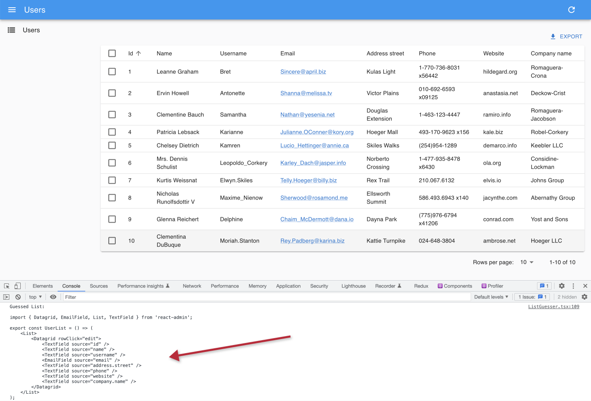

# React-Adminチュートリアル

この30分のチュートリアルでは、既存のREST APIを基に新しい管理アプリを作成する方法を紹介します。

以下はその結果の概要です：

<video controls autoplay playsinline muted loop poster="./img/tutorial_overview.png">
  <source src="./img/tutorial_overview.mp4" type="video/mp4"/>
  Your browser does not support the video tag.
</video>


## 設定

React-adminはReactを使用します。新しい管理画面を立ち上げるために[create-react-admin](./CreateReactAdmin.md)を使います：

```sh
npm init react-admin test-admin
# or
yarn create react-admin test-admin
```

データプロバイダーとして**JSON Server**を選択し、認証プロバイダーとしては**None**を選んでください。今のところリソースを追加する必要はありませんので、そのまま**Enter**キーを押してください。最後に、`npm`か`yarn`を選択し、**Enter**キーを押します。すべてがインストールされたら、次のコマンドを入力してください：

```sh
cd test-admin
npm run dev
# or
yarn dev
```

ポート5173で空のReact管理アプリケーションが稼働しているはずです：

[](./img/tutorial_empty.png)

**ヒント**：このチュートリアルでは[Vite](https://vitejs.dev/)と[TypeScript](https://www.typescriptlang.org/)を使用していますが、JavaScriptを好む場合はreact-adminをJavaScriptで使用することもできます。また、[Next.js](./NextJs.md)、[Remix](./Remix.md)、[create-react-app](./CreateReactApp.md)、あるいは他のReactフレームワークを使って管理アプリを作成することも可能です。React-adminはフレームワークに依存しません。

生成されたコードを見てみましょう。メインのエントリーポイントは`index.tsx`で、DOM内の`App`コンポーネントをレンダリングします：

```tsx
// in src/index.tsx
import React from 'react';
import ReactDOM from 'react-dom/client';
import { App } from './App';

ReactDOM.createRoot(document.getElementById('root')!).render(
    <React.StrictMode>
        <App />
    </React.StrictMode>
);
```

`<App>`コンポーネントは`<Admin>`コンポーネントをレンダリングします。これはreact-adminアプリケーションのルートコンポーネントです。

```tsx
// in src/App.tsx
import { Admin, Resource, ListGuesser, EditGuesser, ShowGuesser } from 'react-admin';
import { dataProvider } from './dataProvider';

export const App = () => (
    <Admin dataProvider={dataProvider}>

    </Admin>
);
```

この空のコンポーネントは、`dataProvider` プロパティのみを定義しています。しかし、データプロバイダとは何でしょうか？

## APIをデータソースとして使用する

React-admin アプリはブラウザで動作するシングルページアプリ（SPA）で、APIからデータを取得します。コンピュータ間のデータ交換には標準がないため、react-adminはあなたのAPIと通信するためのアダプタが必要です。このアダプタは *データプロバイダ* と呼ばれます。

このチュートリアルでは、テストやプロトタイピング用に設計された偽のREST APIである [JSONPlaceholder](https://jsonplaceholder.typicode.com/) をアプリケーションのデータソースとして使用します。以下がその様子です：

```
curl https://jsonplaceholder.typicode.com/users/2
```

```json
{
  "id": 2,
  "name": "Ervin Howell",
  "username": "Antonette",
  "email": "Shanna@melissa.tv",
  "address": {
    "street": "Victor Plains",
    "suite": "Suite 879",
    "city": "Wisokyburgh",
    "zipcode": "90566-7771",
    "geo": {
      "lat": "-43.9509",
      "lng": "-34.4618"
    }
  },
  "phone": "010-692-6593 x09125",
  "website": "anastasia.net",
  "company": {
    "name": "Deckow-Crist",
    "catchPhrase": "Proactive didactic contingency",
    "bs": "synergize scalable supply-chains"
  }
}
```

JSONPlaceholderは、ユーザー、投稿、およびコメントのためのエンドポイントを提供します。構築する管理者は、これらのリソースを作成、取得、更新、削除（CRUD）することができるようにする必要があります。

あなたが作成したばかりの `test-admin` プロジェクトには、JSONPlaceholder用に事前に設定されたデータプロバイダが既に含まれています。

```tsx
// in src/dataProvider.ts
import jsonServerProvider from 'ra-data-json-server';

export const dataProvider = jsonServerProvider(
    import.meta.env.VITE_JSON_SERVER_URL
);
```

このプロジェクトは、サードパーティのパッケージ `ra-data-json-server` を使用しています。これは、JSONPlaceholder APIの方言をreact-adminのCRUD APIにマッピングします。様々なAPIやデータベース用の[数十のデータプロバイダパッケージ](./DataProviderList.md)があります。必要に応じて独自のデータプロバイダを作成することもできます。しかし、今のところは、アプリがJSONPlaceholderに接続できることを確認しましょう。

**ヒント**: `import.meta.env.VITE_JSON_SERVER_URL` 式は [Vite環境変数](https://vitejs.dev/guide/env-and-mode.html) です。これはプロジェクトのルートにある `.env` ファイルで `https://jsonplaceholder.typicode.com` に設定されています。

## APIエンドポイントをリソースにマッピングする

まずは、ユーザーのリストを追加するところから始めます。

`<Admin>` コンポーネントは、一つ以上の `<Resource>` 子コンポーネントを期待します。各リソースは、API内のエンドポイントに名前をマッピングします。`App.tsx` ファイルを編集して、`users` という名前のリソースを追加します：

```diff
// in src/App.tsx
import { Admin, Resource, ListGuesser, EditGuesser, ShowGuesser } from 'react-admin';
import { dataProvider } from './dataProvider';

export const App = () => (
  <Admin dataProvider={dataProvider}>
+   <Resource name="users" list={ListGuesser} />
  </Admin>
);
```

`<Resource name="users" />` という行は、react-adminに [https://jsonplaceholder.typicode.com/users](https://jsonplaceholder.typicode.com/users) URL から "users" レコードをフェッチするよう指示します。`<Resource>` は、各CRUD操作（`list`、`create`、`edit`、`show`）に使用するReactコンポーネントも定義します。

`list={ListGuesser}` は、react-adminにユーザーのリストを表示するために `<ListGuesser>` コンポーネントを使用するよう指示します。このコンポーネントは、APIからフェッチされたデータに基づいてリストの設定（列名やタイプ）を *推測* します。

アプリはこれでユーザーのリストを表示できるようになります：

[](./img/tutorial_users_list.png)

このリストはすでに機能的です：列ヘッダをクリックして並べ替えたり、下部のページネーションコントロールを使用してページを変更したりできます。ブラウザの開発者ツールのネットワークタブを見ると、リスト上の各アクションが `https://jsonplaceholder.typicode.com/users` への新しい呼び出しを引き起こし、クエリ文字列が変更されていることが分かります。これがデータプロバイダが行うことです：ユーザーのアクションをバックエンドAPIが理解するHTTPリクエストに変換します。

## ページコンポーネントの作成

`<ListGuesser>` コンポーネントは本番環境で使用することを意図していません - これは管理画面をすばやくブートストラップする方法に過ぎません。つまり、`users` リソースの `ListGuesser` コンポーネントをカスタムのReactコンポーネントに置き換える必要があります。幸いにも、`ListGuesser` は推測したリストのコードをコンソールにダンプします：

[](./img/tutorial_guessed_list.png)

このコードをコピーし、`users.tsx` という新しいファイルに新しい `UserList` コンポーネントを作成しましょう：


```tsx
// in src/users.tsx
import { List, Datagrid, TextField, EmailField } from "react-admin";

export const UserList = () => (
    <List>
        <Datagrid rowClick="edit">
            <TextField source="id" />
            <TextField source="name" />
            <TextField source="username" />
            <EmailField source="email" />
            <TextField source="address.street" />
            <TextField source="phone" />
            <TextField source="website" />
            <TextField source="company.name" />
        </Datagrid>
    </List>
);
```

次に、`App.tsx` ファイルを編集し、`ListGuesser` の代わりにこの新しいコンポーネントを使用します：


```diff
// in src/App.tsx
-import { Admin, Resource, ListGuesser, EditGuesser, ShowGuesser } from 'react-admin';
+import { Admin, Resource } from "react-admin";
import { dataProvider } from './dataProvider';
+import { UserList } from "./users";

export const App = () => (
  <Admin dataProvider={dataProvider}>
-   <Resource name="users" list={ListGuesser} />
+   <Resource name="users" list={UserList} />
  </Admin>
);
```

[](./img/tutorial_users_list.png)

ブラウザ上では目に見える変化はありませんが、アプリは今やカスタマイズ可能なコンポーネントを使用しています。

## コンポーネントの構成

`<UserList>` コンポーネントのコードを分析するために、少し時間を取りましょう：

```tsx
export const UserList = () => (
    <List>
        <Datagrid rowClick="edit">
            <TextField source="id" />
            <TextField source="name" />
            <TextField source="username" />
            <EmailField source="email" />
            <TextField source="address.street" />
            <TextField source="phone" />
            <TextField source="website" />
            <TextField source="company.name" />
        </Datagrid>
    </List>
);
```

ルートコンポーネントである `<List>` は、URLからクエリパラメータを読み取り、これらのパラメータに基づいてAPIを呼び出し、結果をReactコンテキストに配置します。また、子コンポーネントがリストのフィルタ、ページネーション、およびソートを変更するための一連のコールバックも構築します。`<List>` は多くのことを行いますが、その構文は非常にシンプルです：


```tsx
<List>
   {/* children */}
</List>
```

これは、react-adminの目標をよく示しています：開発者が簡単な方法で洗練されたアプリを構築するのを助けること。

しかし、ほとんどのフレームワークでは、「シンプル」は「限定的」を意味し、基本的な機能を超えるのは難しいものです。React-adminは *コンポジション* を使用することでこれを解決します。`<List>` はデータフェッチの部分のみを行います。実際のリストのレンダリングは子コンポーネントに委ねます - この場合は `<Datagrid>` です。別の言い方をすると、上記のコードは `<List>` と `<Datagrid>` の機能を組み合わせています。

これは、`<List>` を別のコンポーネント（例えば `<SimpleList>`）と組み合わせることができることを意味します：

```tsx
// in src/users.tsx
import { List, SimpleList } from "react-admin";

export const UserList = () => (
    <List>
        <SimpleList
          primaryText={(record) => record.name}
          secondaryText={(record) => record.username}
          tertiaryText={(record) => record.email}
        />
    </List>
);
```

`<SimpleList>` は [Material UIの `<List>` と `<ListItem>` コンポーネント](https://mui.com/material-ui/react-list/)を使用し、`primaryText`、`secondaryText`、`tertiaryText` プロパティとして関数を期待します。

ページを更新すると、リストが異なる方法で表示されるようになります：

[](./img/tutorial_simple_list.webp)

React-adminは、コンポジションを使用して望むUIを構築するために選択できる多くのコンポーネントを提供しています。そして、それが十分でない場合、独自のコンポーネントを構築してまさに望むUIを得ることができます。

## カスタムリストコンポーネントの作成

React-adminのレイアウトはすでにレスポンシブです。ブラウザのサイズを変更して、サイドバーが小さな画面でドロワーに切り替わる様子を確認してください。さらに、`<SimpleList>` コンポーネントはモバイルデバイスに非常に適しています。

<video controls autoplay playsinline muted loop>
  <source src="./img/tutorial_mobile_user_list.webm" type="video/webm"/>
  <source src="./img/tutorial_mobile_user_list.mp4" type="video/mp4"/>
  Your browser does not support the video tag.
</video>


しかし、デスクトップでは、`<SimpleList>` は情報密度が低い割に多くのスペースを取ります。そこで、`<UserList>` コンポーネントを変更して、デスクトップでは `<Datagrid>` コンポーネントを使用し、モバイルでは `<SimpleList>` コンポーネントを使用するようにしましょう。

これを行うために、Material UIの[the `useMediaQuery` フック](https://mui.com/material-ui/react-use-media-query/)を使用します：

```tsx
// in src/users.tsx
import { useMediaQuery, Theme } from "@mui/material";
import { List, SimpleList, Datagrid, TextField, EmailField } from "react-admin";

export const UserList = () => {
    const isSmall = useMediaQuery<Theme>((theme) => theme.breakpoints.down("sm"));
    return (
        <List>
            {isSmall ? (
                <SimpleList
                    primaryText={(record) => record.name}
                    secondaryText={(record) => record.username}
                    tertiaryText={(record) => record.email}
                />
            ) : (
                <Datagrid rowClick="edit">
                    <TextField source="id" />
                    <TextField source="name" />
                    <TextField source="username" />
                    <EmailField source="email" />
                    <TextField source="address.street" />
                    <TextField source="phone" />
                    <TextField source="website" />
                    <TextField source="company.name" />
                </Datagrid>
            )}
        </List>
    );
};
```

これは、期待通りに正確に動作します。

<video controls autoplay playsinline muted loop>
  <source src="./img/tutorial_user_list_responsive.webm" type="video/webm"/>
  <source src="./img/tutorial_user_list_responsive.mp4" type="video/mp4"/>
  Your browser does not support the video tag.
</video>


これは、`<List>` の子が何であっても問題ないことを示しています - 独自のロジックを持つカスタムReactコンポーネントでさえもです。また、react-adminがレスポンシブアプリケーションに適していることも示していますが、ページ内で `useMediaQuery()` を使用するのはあなたの仕事です。

## 列の選択

`<Datagrid>` に戻りましょう。これは、`<List>` によってフェッチされたデータを読み取り、各レコードに対して1行のテーブルをレンダリングします。`<Datagrid>` は、その子コンポーネント（ここでは、一連の `<TextField>` と `<EmailField>`）を使用して、レンダリングする列を決定します。各フィールドコンポーネントは、`source` プロパティによって指定されたAPIレスポンス内の異なるフィールドにマッピングされます。

`<ListGuesser>` は、レスポンスのすべてのフィールドに対して1列を作成しました。これは使いやすいグリッドには少し多すぎるので、Datagridからいくつかの `<TextField>` コンポーネントを削除して効果を確認しましょう：

```diff
// in src/users.tsx
  <Datagrid rowClick="edit">
    <TextField source="id" />
    <TextField source="name" />
-   <TextField source="username" />
    <EmailField source="email" />
-   <TextField source="address.street" />
    <TextField source="phone" />
    <TextField source="website" />
    <TextField source="company.name" />
  </Datagrid>
```

[](./img/tutorial_users_list_selected_columns.png)

React-adminでは、ほとんどの設定はコンポーネントを介して行われます。`<Datagrid>` は `columns` プロパティを取ることもでき、設定オブジェクトを期待することもできます。しかし、代わりに `children` プロパティを使用することで、はるかに強力なカスタマイズが可能になります。たとえば、列のタイプを変更したり、特定の列に独自のコンポーネントを使用したりすることです。

## フィールドタイプの使用

あなたはちょうど `<TextField>` と `<EmailField>` コンポーネントに出会いました。React-adminは、さまざまなデータタイプにマッピングする[多くのフィールドコンポーネント](./Fields.md)を提供しています：数字、日付、画像、HTML、配列、リレーションシップなど。

例えば、`website` フィールドはURLのように見えます。テキストとして表示する代わりに、クリック可能なリンクを使用して表示するのはどうでしょうか？それがまさに `<UrlField>` が行うことです：

```diff
// in src/users.tsx
-import { List, SimpleList, Datagrid, TextField, EmailField } from "react-admin";
+import { List, SimpleList, Datagrid, TextField, EmailField, UrlField } from "react-admin";
// ...
  <Datagrid rowClick="edit">
    <TextField source="id" />
    <TextField source="name" />
    <EmailField source="email" />
    <TextField source="phone" />
-   <TextField source="website" />
+   <UrlField source="website" />
    <TextField source="company.name" />
  </Datagrid>
```

[](./img/tutorial_url_field.png)

これは、react-adminを使用した開発の初期段階を反映しています：guesserコンポーネントを使用して基本的なページをブートストラップし、生成されたコードを微調整してビジネスロジックにより適合させます。

## カスタムフィールドの作成

React-adminでは、フィールドは単なるReactコンポーネントです。レンダリングされると、カスタムフックを使用してAPIからフェッチされた `record`（例：`{ "id": 2, "name": "Ervin Howell", "website": "anastasia.net", ... }`）を取得し、`source` フィールド（例：`website`）を使用して表示するべき値（例："anastasia.net"）を取得します。

これは、カスタムフィールドを作成するために同じことができることを意味します。例えば、こちらは `<UrlField>` の簡略化されたバージョンです：

```tsx
// in src/MyUrlField.tsx
import { useRecordContext } from "react-admin";

const MyUrlField = ({ source }: { source: string }) => {
    const record = useRecordContext();
    if (!record) return null;
    return <a href={record[source]}>{record[source]}</a>;
};

export default MyUrlField;
```

各行について、`<Datagrid>` は `RecordContext` を作成し、現在のレコードをそれに保存します。`useRecordContext` は、そのレコードを読み取ることを可能にします。これは、特定のUIを強制せずに独自のコンポーネントを構築するために、react-adminが公開する50以上のヘッドレスフックの一つです。

`<MyUrlField>` コンポーネントを `<UserList>` で、react-adminの `<UrlField>` コンポーネントの代わりに使用することができ、全く同じように機能します。

```diff
// in src/users.tsx
-import { List, SimpleList, Datagrid, TextField, EmailField, UrlField } from "react-admin";
+import { List, SimpleList, Datagrid, TextField, EmailField } from "react-admin";
+import MyUrlField from './MyUrlField';
// ...
  <Datagrid rowClick="edit">
    <TextField source="id" />
    <TextField source="name" />
    <EmailField source="email" />
    <TextField source="phone" />
-   <UrlField source="website" />
+   <MyUrlField source="website" />
    <TextField source="company.name" />
  </Datagrid>
```

これは、react-adminがあなたをブロックすることは決してないことを意味します：もしreact-adminのコンポーネントが完璧にあなたのニーズに合わない場合、それを自分のバージョンに交換することができます。

## スタイルのカスタマイズ

`<MyUrlField>` コンポーネントは、スタイルをカスタマイズする方法を説明するのに最適な機会です。

React-adminは [Material UI](https://mui.com/material-ui/getting-started/) に依存しています。これは、Googleの [Material Design Guidelines](https://material.io/) をモデルにした一連のReactコンポーネントです。すべてのMaterial UIコンポーネント（およびほとんどのreact-adminコンポーネント）は、カスタムインラインスタイルを許可する `sx` というプロパティをサポートしています。リンクの下線を消してアイコンを追加するために `sx` プロパティを利用しましょう：


```tsx
// in src/MyUrlField.tsx
import { useRecordContext } from "react-admin";
import { Link } from "@mui/material";
import LaunchIcon from "@mui/icons-material/Launch";

const MyUrlField = ({ source }: { source: string }) => {
    const record = useRecordContext();
    return record ? (
        <Link href={record[source]} sx={{ textDecoration: "none" }}>
            {record[source]}
            <LaunchIcon sx={{ fontSize: 15, ml: 1 }} />
        </Link>
    ) : null;
};

export default MyUrlField;
```


[](./img/tutorial_custom_styles.png)

`sx` プロパティはReactの `style` プロパティのようなものですが、テーマ、メディアクエリ、省略形プロパティなどをサポートしています。これはCSS-in-JSソリューションなので、CSSプロパティ名のJSバリアント（例えば `textDecoration` は `text-decoration` の代わり）を使用する必要があります。

**ヒント**: このチュートリアルでカバーしているものよりも、Material UIスタイルにはもっと多くのことがあります。テーマ、ベンダープレフィックス、レスポンシブユーティリティなどについて詳しく知るために、[Material UIのドキュメント](https://mui.com/system/basics/)を読んでください。

**ヒント**: Material UIは、[スタイル付きコンポーネント](https://mui.com/system/styled/)を含む他のCSS-in-JSソリューションもサポートしています。

## 関連性の処理

JSONPlaceholderでは、各 `post` レコードには `userId` フィールドが含まれており、これは `user` を指しています：

```json
{
    "id": 1,
    "title": "sunt aut facere repellat provident occaecati excepturi optio reprehenderit",
    "body": "quia et suscipit\nsuscipit recusandae consequuntur expedita et cum\nreprehenderit molestiae ut ut quas totam\nnostrum rerum est autem sunt rem eveniet architecto",
    "userId": 1
}
```

React-adminは、これらの外部キーを利用して参照をフェッチする方法を知っています。`/posts` APIエンドポイントのための新しい `<Resource>` を作成することで、`ListGuesser` がそれらをどのように管理するかを見てみましょう：


```diff
// in src/App.tsx
-import { Admin, Resource } from "react-admin";
+import { Admin, Resource, ListGuesser } from "react-admin";
import { dataProvider } from './dataProvider';
import { UserList } from "./users";

export const App = () => (
  <Admin dataProvider={dataProvider}>
+   <Resource name="posts" list={ListGuesser} />
    <Resource name="users" list={UserList} />
  </Admin>
);
```

[](./img/tutorial_guessed_post_list.png)

`ListGuesser` は、`userId` フィールドに `<ReferenceField>` を使用することを提案しています。guesserによってダンプされたコードに基づいて `PostList` コンポーネントを作成し、この新しいフィールドで遊んでみましょう：

```tsx
// in src/posts.tsx
import { List, Datagrid, TextField, ReferenceField } from "react-admin";

export const PostList = () => (
    <List>
        <Datagrid rowClick="edit">
            <ReferenceField source="userId" reference="users" />
            <TextField source="id" />
            <TextField source="title" />
            <TextField source="body" />
        </Datagrid>
    </List>
);
```

```diff
// in src/App.tsx
-import { Admin, Resource, ListGuesser } from "react-admin";
+import { Admin, Resource } from "react-admin";
import { dataProvider } from './dataProvider';
+import { PostList } from "./posts";
import { UserList } from "./users";

export const App = () => (
    <Admin dataProvider={dataProvider}>
-       <Resource name="posts" list={ListGuesser} />
+       <Resource name="posts" list={PostList} />
        <Resource name="users" list={UserList} />
    </Admin>
);
```

投稿リストを表示する際、アプリは投稿の作者の `id` を表示します。これはあまり意味がありません - 代わりにユーザーの `name` を使用すべきです。そのためには、"users" リソースの `recordRepresentation` プロパティを設定してください。


```diff
// in src/App.tsx
const App = () => (
    <Admin dataProvider={dataProvider}>
        <Resource name="posts" list={PostList} />
-       <Resource name="users" list={UserList} />
+       <Resource name="users" list={UserList} recordRepresentation="name" />
    </Admin>
);
```

投稿リストには、現在各行にユーザー名が表示されています。

[](./img/tutorial_list_user_name.png)

`<ReferenceField>` コンポーネントは参照データを取得し、その結果で `RecordContext` を作成し、レコードの表現（またはその子要素）をレンダリングします。

**ヒント**: ブラウザのネットワークタブを再度見てみましょう：react-adminはユーザーに関するリクエストを重複排除し、データグリッド全体で `/users` エンドポイントに対して *1回の* HTTPリクエストのみを行うように集約します。これはUIを迅速かつ反応良く保つための多くの最適化の一つです。

投稿リストを完成させるために、最初の列として投稿の `id` フィールドを配置し、`body` フィールドを削除します。UXの観点から、大量のテキストを含むフィールドはデータグリッドには表示せず、詳細ビューにのみ表示するべきです。また、編集アクションを際立たせるために、`rowClick` アクションを明示的なアクションボタンに置き換えましょう：

```diff
// in src/posts.tsx
-import { List, Datagrid, TextField, ReferenceField } from "react-admin";
+import { List, Datagrid, TextField, ReferenceField, EditButton } from "react-admin";

export const PostList = () => (
  <List>
-   <Datagrid rowClick="edit">
+   <Datagrid>
+     <TextField source="id" />
      <ReferenceField source="userId" reference="users" />
-     <TextField source="id" />
      <TextField source="title" />
-     <TextField source="body" />
+     <EditButton />
    </Datagrid>
  </List>
);
```

[](./img/tutorial_post_list_less_columns.png)

## 詳細ビューの追加

現在、管理画面にはリストページのみが存在します。さらに、ユーザーリストはすべてのカラムを表示していません。したがって、全てのユーザーフィールドを見るために詳細ビューを追加する必要があります。`<Resource>` コンポーネントは、詳細ビューを定義するための `show` コンポーネントのプロップを受け入れます。それを支援するために `<ShowGuesser>` を使用しましょう：

```diff
// in src/App.tsx
-import { Admin, Resource } from "react-admin";
+import { Admin, Resource, ShowGuesser } from "react-admin";
import { dataProvider } from './dataProvider';
import { PostList } from "./posts";
import { UserList } from "./users";

export const App = () => (
    <Admin dataProvider={dataProvider}>
        <Resource name="posts" list={PostList} />
-       <Resource name="users" list={UserList} recordRepresentation="name" />
+       <Resource name="users" list={UserList} show={ShowGuesser} recordRepresentation="name" />
    </Admin>
);
```

データグリッドの行をクリックすると詳細ビューにリンクするように、ユーザーリストビューを変更する必要があります：

```diff
// in src/users.tsx
export const UserList = () => {
    // ...
-        <Datagrid rowClick="edit">
+        <Datagrid rowClick="show">
    // ...
};
```

これで、リストのユーザーをクリックすると、その詳細を見ることができます：


<video controls autoplay playsinline muted loop>
  <source src="./img/tutorial_show_user.mp4" type="video/mp4"/>
  Your browser does not support the video tag.
</video>

他の推測されたコンポーネントと同様に、`<ShowGuesser>` によって出力されたコードをコピーし、必要に応じてカスタマイズすることができます。これは本チュートリアルの範囲外ですので、そのままにしておきます。

しかし、`users` リソースに `show` ビューが追加されたので、投稿リストビューからもリンクを設定できます。必要なのは、`<ReferenceField>` コンポーネントを編集し、`link="show"` を以下のように追加することです：

```diff
// in src/posts.tsx
export const PostList = () => (
    <List>
        <Datagrid rowClick="edit">
-           <ReferenceField source="userId" reference="users" />
+           <ReferenceField source="userId" reference="users" link="show" />
            <TextField source="id" />
            <TextField source="title" />
            <TextField source="body" />
        </Datagrid>
    </List>
);
```

[](./img/tutorial_list_user_name_link.png)

参照コンポーネントは、ユーザーが自然な方法で一つのリソースから別のリソースにナビゲートするのを可能にします。これはreact-adminの重要な機能の一つです。

## 編集機能の追加

管理インターフェースは、リモートデータの表示だけでなく、レコードの編集も可能にすべきです。そのために、React-adminは `<Edit>` コンポーネントを提供しています。それを支援するために `<EditGuesser>` を使用しましょう。

```diff
// in src/App.tsx
-import { Admin, Resource, ShowGuesser } from "react-admin";
+import { Admin, Resource, ShowGuesser, EditGuesser } from "react-admin";
import { dataProvider } from './dataProvider';
import { PostList } from "./posts";
import { UserList } from "./users";

export const App = () => (
    <Admin dataProvider={dataProvider}>
-       <Resource name="posts" list={PostList} />
+       <Resource name="posts" list={PostList} edit={EditGuesser} />
        <Resource name="users" list={UserList} show={ShowGuesser} recordRepresentation="name" />
    </Admin>
);
```

<video controls autoplay playsinline muted loop>
  <source src="./img/tutorial_edit_guesser.webm" type="video/webm"/>
  <source src="./img/tutorial_edit_guesser.mp4" type="video/mp4"/>
  Your browser does not support the video tag.
</video>


ユーザーは「編集」ボタンをクリックするだけで編集ページを表示できます。このフォームはすでに機能しており、送信時にREST APIに対して `PUT` リクエストを発行します。また、「users」リソースの `recordRepresentation` のおかげで、投稿の著者としてユーザー名が表示されます。

コンソールによって出力された `<PostEdit>` コードを `posts.tsx` ファイルにコピーし、ビューをカスタマイズできます：

```tsx
// in src/posts.tsx
import {
    List,
    Datagrid,
    TextField,
    ReferenceField,
    EditButton,
    Edit,
    SimpleForm,
    ReferenceInput,
    TextInput,
} from "react-admin";

export const PostList = () => {
    /* ... */
};

export const PostEdit = () => (
    <Edit>
        <SimpleForm>
            <ReferenceInput source="userId" reference="users" />
            <TextInput source="id" />
            <TextInput source="title" />
            <TextInput source="body" />
        </SimpleForm>
    </Edit>
);
```

そのコンポーネントを推測ツールの代わりに "posts" リソースの `edit` プロパティとして使用します：


```diff
// in src/App.tsx
-import { Admin, Resource, ShowGuesser, EditGuesser } from "react-admin";
+import { Admin, Resource, ShowGuesser } from "react-admin";
import { dataProvider } from './dataProvider';
-import { PostList } from "./posts";
+import { PostList, PostEdit } from "./posts";
import { UserList } from "./users";

export const App = () => (
  <Admin dataProvider={dataProvider}>
-   <Resource name="posts" list={PostList} edit={EditGuesser} />
+   <Resource name="posts" list={PostList} edit={PostEdit} />
    <Resource name="users" list={UserList} show={ShowGuesser} recordRepresentation="name" />
  </Admin>
);
```

これで、`<PostEdit>` コンポーネントを調整して、プライマリキー（`id`）の編集を無効にし、最初に配置し、`body` フィールドにテキストエリアを使用するように設定できます。以下のようにします：



```diff
// in src/posts.tsx
export const PostEdit = () => (
  <Edit>
    <SimpleForm>
+     <TextInput source="id" InputProps={{ disabled: true }} />
      <ReferenceInput source="userId" reference="users" link="show" />
-     <TextInput source="id" />
      <TextInput source="title" />
-     <TextInput source="body" />
+     <TextInput source="body" multiline rows={5} />
    </SimpleForm>
  </Edit>
);
```


もし `<List>` コンポーネントを理解していれば、`<Edit>` コンポーネントも驚きはありません。このコンポーネントはレコードの取得とページタイトルの表示を担当します。そして、レコードを `<SimpleForm>` コンポーネントに渡します。`<SimpleForm>` はフォームのレイアウト、デフォルト値、バリデーションを担当します。`<Datagrid>` と同様に、`<SimpleForm>` はその子要素を使用して表示するフォーム入力を決定します。*入力コンポーネント* を子要素として期待しています。`<TextInput>` や `<ReferenceInput>` はそのような入力です。

`<ReferenceInput>` は `<ReferenceField>`（先ほど `<PostList>` ページで使用した）と同じプロパティを取ります。`<ReferenceInput>` はこれらのプロパティを使用して、現在のレコード（この場合、現在の `post` に関連する可能性のある `users`）に関連する可能な参照のためにAPIをフェッチします。次に、可能な選択肢のコンテキストを作成し、選択肢を表示し、ユーザーが一つを選択できるようにする `<AutocompleteInput>` をレンダリングします。

## 投稿作成機能の追加

ユーザーが投稿を作成できるようにしましょう。`<PostEdit>` コンポーネントを `<PostCreate>` にコピーし、`<Edit>` を `<Create>` に置き換えます：

```diff
// in src/posts.tsx
import {
    List,
    Datagrid,
    TextField,
    ReferenceField,
    EditButton,
    Edit,
+   Create,
    SimpleForm,
    ReferenceInput,
    TextInput,
} from "react-admin";

export const PostList = () => (
  { /* ... */ }
);

export const PostEdit = () => (
  { /* ... */ }
);

+export const PostCreate = () => (
+  <Create>
+    <SimpleForm>
+      <ReferenceInput source="userId" reference="users" />
+      <TextInput source="title" />
+      <TextInput source="body" multiline rows={5} />
+    </SimpleForm>
+  </Create>
+);
```

**ヒント**: `<PostEdit>` と `<PostCreate>` コンポーネントは、`<PostEdit>` の追加の `id` 入力を除いて、ほぼ同じ子フォームを使用しています。ほとんどの場合、レコードの作成と編集用のフォームは少し異なります。なぜなら、ほとんどのAPIではプライマリキーがサーバー側で作成されるからです。しかし、フォームが同じであれば、`<PostEdit>` と `<PostCreate>` で共通のフォームコンポーネントを共有できます。

新しい `<PostCreate>` コンポーネントを投稿リソースで使用するには、`<Resource name="posts">` コンポーネントの `create` 属性として追加します：

```diff
// in src/App.tsx
import { Admin, Resource, ShowGuesser } from "react-admin";
import { dataProvider } from './dataProvider';
-import { PostList, PostEdit } from "./posts";
+import { PostList, PostEdit, PostCreate } from "./posts";
import { UserList } from "./users";

export const App = () => (
  <Admin dataProvider={dataProvider}>
-   <Resource name="posts" list={PostList} edit={PostEdit} />
+   <Resource name="posts" list={PostList} edit={PostEdit} create={PostCreate} />
    <Resource name="users" list={UserList} show={ShowGuesser} recordRepresentation="name" />
  </Admin>
);
```

<video controls autoplay playsinline muted loop>
  <source src="./img/tutorial_post_create.webm" type="video/webm"/>
  <source src="./img/tutorial_post_create.mp4" type="video/mp4"/>
  Your browser does not support the video tag.
</video>


React-adminは自動的に「作成」ボタンを投稿リストの上部に追加し、`create` コンポーネントへのアクセスを提供します。そして、作成フォームは機能しており、送信時にREST APIに対して `POST` リクエストを発行します。

## 楽観的レンダリングと取り消し

残念ながら、JSONPlaceholderは読み取り専用のAPIです。`POST` や `PUT` リクエストを受け入れるように見えますが、作成や編集は考慮されません。そのため、この特定のケースでは、作成後にエラーが表示され、保存した後に編集内容が表示されないことがあります。これはJSONPlaceholderの特性によるものです。

しかし、上記のスクリーンキャストで、新しく作成された投稿が作成直後にリストに表示されるのはどうしてでしょうか？

それは、react-adminが*楽観的な更新*を使用しているからです。ユーザーがレコードを編集して「保存」ボタンをクリックすると、UIは確認を表示し、*サーバーに更新クエリを送信する前に* 更新されたデータを表示します。主な利点は、UIの変更が即座に行われることです - サーバーの応答を待つ必要がありません。これはユーザーにとって大きな快適さです。

しかし、さらなる利点があります：「取り消し」機能も可能になります。管理画面ではその時点で取り消し機能が既に機能しています。レコードを編集し、それがスライドアウトする前に黒い確認ボックス内の「取り消し」リンクをクリックしてみてください。アプリはAPIに `UPDATE` クエリを送信せず、変更されていないデータを表示することがわかります。

<video controls autoplay playsinline muted loop>
  <source src="./img/tutorial_post_edit_undo.webm" type="video/webm"/>
  <source src="./img/tutorial_post_edit_undo.mp4" type="video/mp4"/>
  Your browser does not support the video tag.
</video>


楽観的レンダリングにより更新がすぐに表示されるものの、React-adminは短い遅延（約5秒）の後にサーバーへの更新を送信します。この遅延中にユーザーはアクションを取り消すことができ、React-adminは更新を送信しません。

楽観的な更新と取り消し機能はAPI側で特別なコードを必要としません - React-adminはこれらを完全にクライアント側で処理します。つまり、独自のAPIでこれらの機能を無料で得ることができます！

**注記**: アイテムの編集機能を追加するとき、それを削除する機能も追加されます。編集ビューの「削除」ボタンはそのままで完全に機能し、これも「取り消し」可能です。

## ページタイトルのカスタマイズ

投稿編集ページには少し問題があります：メインタイトル（トップバーに表示されるテキスト）として投稿IDを使用しています。`<Resource name="posts">` コンポーネントでカスタムの `recordRepresentation` を設定することもできますが、文字列をレンダリングすることに限られます。

カスタムタイトルコンポーネントでビュータイトルをカスタマイズしましょう：

```diff
// in src/posts.tsx
+import { useRecordContext} from "react-admin";

// ...

+const PostTitle = () => {
+  const record = useRecordContext();
+  return <span>Post {record ? `"${record.title}"` : ''}</span>;
+};

export const PostEdit = () => (
-   <Edit>
+   <Edit title={<PostTitle />}>
        // ...
    </Edit>
);
```

[](./img/tutorial_post_title.png)

このコンポーネントは、先に説明したカスタム `<UrlField>` コンポーネントと同じ `useRecordContext` フックを使用しています。

ユーザーがURLから直接投稿の編集ページにアクセスできるため、`<Edit>` コンポーネントがそれをフェッチしている間、`<PostTitle>` コンポーネントは *レコードなしで* レンダリングされる場合があります。そのため、`useRecordContext` から返される `record` が定義されているかどうかを常に確認し、上記の `PostTitle` のように使用する必要があります。

## リストに検索とフィルターを追加

少し投稿リストに戻りましょう。リストはソートとページネーションを提供していますが、内容を検索する機能が欠けています。

React-adminは、入力コンポーネントを使用してリストビューで多条件検索エンジンを作成できます。そのような入力コンポーネントの配列をリストの `filters` プロパティに渡してフィルタリングを有効にします：

```tsx
// in src/posts.tsx
const postFilters = [
    <TextInput source="q" label="Search" alwaysOn />,
    <ReferenceInput source="userId" label="User" reference="users" />,
];

export const PostList = () => (
    <List filters={postFilters}>
        // ...
    </List>
);
```

最初のフィルター 'q' は、JSONPlaceholderによって提供される全文検索機能を活用しています。これは `alwaysOn` なので、常に画面に表示されます。ユーザーは、リストの上部にある「フィルター追加」ボタンを使って、2番目のフィルター `userId` を追加できます。これは `<ReferenceInput>` なので、可能なユーザーで既に入力されています。

<video controls autoplay playsinline muted loop>
  <source src="./img/filters.webm" type="video/webm"/>
  <source src="./img/filters.mp4" type="video/mp4"/>
  Your browser does not support the video tag.
</video>

フィルターは「入力しながら検索」のタイプで、ユーザーがフィルターフォームに新しい値を入力すると、リストが（APIリクエストを介して）すぐに更新されます。

**ヒント**: `label` プロパティは任意の入力に使用して、そのラベルをカスタマイズできます。

## メニューアイコンのカスタマイズ

サイドバーメニューは投稿とユーザーの両方で同じアイコンを表示しています。メニューアイコンをカスタマイズするには、各 `<Resource>` に `icon` 属性を渡すだけです：

```tsx
// in src/App.tsx
import PostIcon from "@mui/icons-material/Book";
import UserIcon from "@mui/icons-material/Group";

export const App = () => (
    <Admin dataProvider={dataProvider}>
        <Resource 
            name="posts"
            list={PostList}
            edit={PostEdit}
            create={PostCreate}
            icon={PostIcon}
        />
        <Resource
            name="users"
            list={UserList}
            show={ShowGuesser}
            recordRepresentation="name"
            icon={UserIcon}
        />
    </Admin>
);
```

<video controls autoplay playsinline muted loop>
  <source src="./img/custom-menu.webm" type="video/webm"/>
  <source src="./img/custom-menu.mp4" type="video/mp4"/>
  Your browser does not support the video tag.
</video>


## カスタムホームページの使用

デフォルトでは、react-adminは最初の `Resource` 要素のリストページをホームページとして表示します。代わりにカスタムコンポーネントを表示したい場合は、`<Admin>` コンポーネントの `dashboard` プロパティにそれを渡します。

```tsx
// in src/Dashboard.tsx
import { Card, CardContent, CardHeader } from "@mui/material";

export const Dashboard = () => (
    <Card>
        <CardHeader title="Welcome to the administration" />
        <CardContent>Lorem ipsum sic dolor amet...</CardContent>
    </Card>
);
```

```tsx
// in src/App.tsx
import { Dashboard } from './Dashboard';

export const App = () => (
    <Admin dataProvider={dataProvider} dashboard={Dashboard} >
          // ...
    </Admin>
);
```

[](./img/dashboard.png)

## ログインページの追加

ほとんどの管理アプリでは認証が必要です。React-adminはページを表示する前にユーザーの資格情報を確認し、REST APIが403エラーコードを返した場合はログインフォームにリダイレクトできます。

これらの資格情報が*何であるか*、そしてそれらを*どのように取得するか*は、開発者であるあなたが答えなければならない質問です。React-adminは認証戦略（ベーシック認証、OAuth、カスタムルートなど）についての仮定はしませんが、`authProvider` オブジェクトを使用して、適切な場所に認証ロジックを追加する機能を提供します。

このチュートリアルでは、公開された認証APIがないため、すべてのログインリクエストを受け入れ、`username` を `localStorage` に保存する偽の認証プロバイダーを使用できます。ページ変更のたびに `localStorage` に `username` アイテムが含まれている必要があります。

`authProvider` は、それぞれ `Promise` を返す5つのメソッドを公開する必要があります：

```tsx
// in src/authProvider.ts
import { AuthProvider } from "react-admin";

export const authProvider: AuthProvider = {
    // called when the user attempts to log in
    login: ({ username }) => {
        localStorage.setItem("username", username);
        // accept all username/password combinations
        return Promise.resolve();
    },
    // called when the user clicks on the logout button
    logout: () => {
        localStorage.removeItem("username");
        return Promise.resolve();
    },
    // called when the API returns an error
    checkError: ({ status }: { status: number }) => {
        if (status === 401 || status === 403) {
            localStorage.removeItem("username");
            return Promise.reject();
        }
        return Promise.resolve();
    },
    // called when the user navigates to a new location, to check for authentication
    checkAuth: () => {
        return localStorage.getItem("username")
            ? Promise.resolve()
            : Promise.reject();
    },
    // called when the user navigates to a new location, to check for permissions / roles
    getPermissions: () => Promise.resolve(),
};
```

**ヒント**: `authProvider` の呼び出しが非同期であるため、この中で簡単に認証サーバーをフェッチすることができます。

この認証ストラテジーを有効にするには、`<Admin>` コンポーネントに `authProvider` を渡してください:

```tsx
// in src/App.tsx
import { Dashboard } from './Dashboard';
import { authProvider } from './authProvider';

export const App = () => (
    <Admin authProvider={authProvider} dataProvider={dataProvider} dashboard={Dashboard} >
        // ...
    </Admin>
);
```

アプリが再読み込みされると、全員を受け入れるログインフォームの背後に配置されます:


<video controls autoplay playsinline muted loop>
  <source src="./img/login.webm" type="video/webm"/>
  <source src="./img/login.mp4" type="video/mp4"/>
  Your browser does not support the video tag.
</video>

## 実際のAPIへの接続

このチュートリアルの重要なポイントは、実際のプロジェクトでは、APIのダイアレクト（REST? GraphQL? その他?）がJSONPlaceholderのダイアレクトと一致しないことです。React-adminを動作させるためには、最初にデータプロバイダーを書くことが必要になるでしょう。APIによっては、これに数時間の追加作業が必要になることもあります。

React-adminは、データクエリをデータプロバイダーオブジェクトに委譲し、これがAPIに適合するアダプターとして機能します。これにより、react-adminは任意のAPIダイアレクトをマッピングし、複数のドメインのエンドポイントを使用することができます。

例えば、`my.api.url` REST APIを使用する必要があるとしましょう。このAPIは次のパラメーターを期待しています：

| アクション         | 期待されるAPIリクエスト                                                               |
| ----------------- | ------------------------------------------------------------------------------------ |
| リストの取得       | `GET http://my.api.url/posts?sort=["title","ASC"]&range=[0, 24]&filter={"title":"bar"}` |
| 単一レコードの取得 | `GET http://my.api.url/posts/123`                                                      |
| 複数レコードの取得 | `GET http://my.api.url/posts?filter={"id":[123,456,789]}`                              |
| 関連レコードの取得 | `GET http://my.api.url/posts?filter={"author_id":345}`                                 |
| レコードの作成     | `POST http://my.api.url/posts`                                                         |
| レコードの更新     | `PUT http://my.api.url/posts/123`                                                      |
| 複数レコードの更新 | `PUT http://my.api.url/posts?filter={"id":[123,124,125]}`                              |
| レコードの削除     | `DELETE http://my.api.url/posts/123`                                                   |
| 複数レコードの削除 | `DELETE http://my.api.url/posts?filter={"id":[123,124,125]}`                           |

React-adminは、このリストの各アクションに対してデータプロバイダーを呼び出し、戻り値としてPromiseを期待します。これらのメソッドは`getList`、`getOne`、`getMany`、`getManyReference`、`create`、`update`、`updateMany`、`delete`、`deleteMany`と呼ばれます。データプロバイダーの役割は、HTTPリクエストを発行し、応答をreact-adminが期待する形式に変換することです。

`my.api.url` API用のデータプロバイダーのコードは次のとおりです：

```tsx
// in src/dataProvider.ts
import { DataProvider, fetchUtils } from "react-admin";
import { stringify } from "query-string";

const apiUrl = 'https://my.api.com/';
const httpClient = fetchUtils.fetchJson;

export const dataProvider: DataProvider = {
    getList: (resource, params) => {
        const { page, perPage } = params.pagination;
        const { field, order } = params.sort;
        const query = {
            sort: JSON.stringify([field, order]),
            range: JSON.stringify([(page - 1) * perPage, page * perPage - 1]),
            filter: JSON.stringify(params.filter),
        };
        const url = `${apiUrl}/${resource}?${stringify(query)}`;

        return httpClient(url).then(({ headers, json }) => ({
            data: json,
            total: parseInt((headers.get('content-range') || "0").split('/').pop() || '0', 10),
        }));
    },

    getOne: (resource, params) =>
        httpClient(`${apiUrl}/${resource}/${params.id}`).then(({ json }) => ({
            data: json,
        })),

    getMany: (resource, params) => {
        const query = {
            filter: JSON.stringify({ id: params.ids }),
        };
        const url = `${apiUrl}/${resource}?${stringify(query)}`;
        return httpClient(url).then(({ json }) => ({ data: json }));
    },

    getManyReference: (resource, params) => {
        const { page, perPage } = params.pagination;
        const { field, order } = params.sort;
        const query = {
            sort: JSON.stringify([field, order]),
            range: JSON.stringify([(page - 1) * perPage, page * perPage - 1]),
            filter: JSON.stringify({
                ...params.filter,
                [params.target]: params.id,
            }),
        };
        const url = `${apiUrl}/${resource}?${stringify(query)}`;

        return httpClient(url).then(({ headers, json }) => ({
            data: json,
            total: parseInt((headers.get('content-range') || "0").split('/').pop() || '0', 10),
        }));
    },

    update: (resource, params) =>
        httpClient(`${apiUrl}/${resource}/${params.id}`, {
            method: 'PUT',
            body: JSON.stringify(params.data),
        }).then(({ json }) => ({ data: json })),

    updateMany: (resource, params) => {
        const query = {
            filter: JSON.stringify({ id: params.ids}),
        };
        return httpClient(`${apiUrl}/${resource}?${stringify(query)}`, {
            method: 'PUT',
            body: JSON.stringify(params.data),
        }).then(({ json }) => ({ data: json }));
    },

    create: (resource, params) =>
        httpClient(`${apiUrl}/${resource}`, {
            method: 'POST',
            body: JSON.stringify(params.data),
        }).then(({ json }) => ({
            data: { ...params.data, id: json.id } as any,
        })),

    delete: (resource, params) =>
        httpClient(`${apiUrl}/${resource}/${params.id}`, {
            method: 'DELETE',
        }).then(({ json }) => ({ data: json })),

    deleteMany: (resource, params) => {
        const query = {
            filter: JSON.stringify({ id: params.ids}),
        };
        return httpClient(`${apiUrl}/${resource}?${stringify(query)}`, {
            method: 'DELETE',
        }).then(({ json }) => ({ data: json }));
    }
};
```

**ヒント**: `fetchUtils.fetchJson()`は、`fetch().then(r => r.json())`のショートカットであり、4xxまたは5xxのレスポンスがある場合に`HTTPError`をスローするためのHTTPレスポンスコードのコントロールが追加されています。必要に応じて、直接`fetch()`を使用しても構いません。

前の`jsonServerProvider`の代わりにこのプロバイダーを使用するのは、関数を切り替えるだけの問題です：

```tsx
// in src/app.tsx
import { dataProvider } from './dataProvider';

const App = () => (
  <Admin dataProvider={dataProvider}>
    // ...
  </Admin>
);
```

## 結論

React-adminはカスタマイズを念頭に置いて構築されています。例えば、カスタムリストレイアウトを表示するため、または特定のリソースに対して異なる編集フォームを表示するために、任意のreact-adminコンポーネントを自分のコンポーネントに置き換えることができます。

このチュートリアルを完了した今、react-adminの全機能をリストアップした[機能章](./Features.md)で学びの旅を続けてください。

その後、react-adminを学ぶ最良の方法は、その主要な部分の各導入章を読むことです：

- [データプロバイダーとAPIコール](./DataProviders.md)
- [認証プロバイダーとセキュリティ](./Authentication.md)
- [リストページ](./ListTutorial.md)
- [作成・編集ページ](./EditTutorial.md)
- [詳細ページ](./ShowTutorial.md)
- [フィールド](./Fields.md)
- [インプット](./Inputs.md)
- [プリファレンス](./Store.md)
- [リアルタイム](./Realtime.md)

**ヒント**: React-adminは大規模なフレームワークなので、そのドキュメントもかなり大きいです。しかし怖がらないでください！React-adminはあらゆる規模のプロジェクトに適しています。React-adminの発見を続けるためには、サイドバーから高度な機能を隠す**[初心者モードを有効にする](#beginner-mode)**ことをお勧めします。ただし、さらに進む準備ができたら無効にすることを忘れないでください。

そして、理論的な知識と実践的な経験のギャップを埋めるために、react-adminの[デモ](./Demos.md)を活用してください。これらは、実際のアプリケーションでreact-adminを使用する方法の素晴らしい例です。また、単純なCRUDアプリを超えるためのベストプラクティスも示されています。

<video controls autoplay playsinline muted loop width="100%">
  <source src="https://user-images.githubusercontent.com/99944/116970434-4a926480-acb8-11eb-8ce2-0602c680e45e.mp4" type="video/mp4" />
  Your browser does not support the video tag.
</video>
