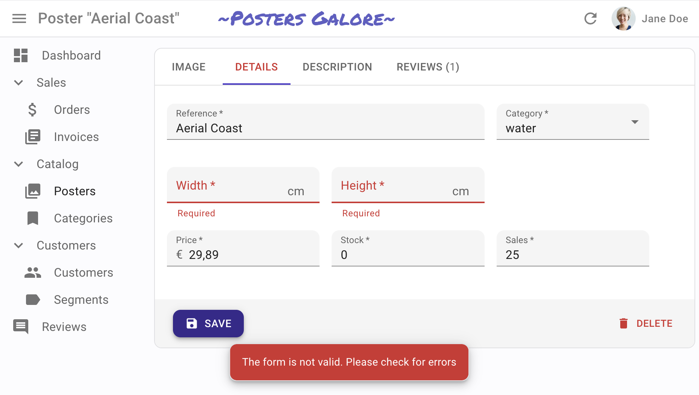

# フォームバリデーション



React-adminはフォーム内のユーザー入力のバリデーションに[react-hook-form](https://react-hook-form.com/)を利用しています。React-adminは以下のアプローチをサポートしています：

- `validate`プロパティをフォームレベルで使用（関数によるバリデーション）
- `validate`プロパティを入力レベルで使用
- `resolver`プロパティをフォームレベルで使用（スキーマによるバリデーション）
- サーバからの戻り値を使用（サーバサイドバリデーション）

フォームレベルのバリデーションと入力レベルのバリデーションを同時に使用することはできません。これは`react-hook-form`の制限です。

## バリデーションモード

デフォルトでは、バリデーションモードは`onSubmit`で、再バリデーションモードは`onChange`です。

[`<Form>`](./Form.md)は実際にはすべての追加プロパティをreact-hook-formの[`useForm`フック](https://react-hook-form.com/docs/useform/)に渡すため、`mode`および`reValidateMode`プロパティを設定することで簡単に変更できます。

```jsx
    export const UserCreate = () => (
        <Create>
            <SimpleForm mode="onBlur" reValidateMode="onBlur">
                <TextInput label="First Name" source="firstName" validate={required()} />
            </SimpleForm>
        </Create>
    );
```

## グローバルバリデーション

フォームの`validate`プロパティの値は、レコードを入力として取り、フィールドごとにエラーメッセージをインデックス付けして返す関数でなければなりません。例えば：

```jsx
const validateUserCreation = (values) => {
    const errors = {};
    if (!values.firstName) {
        errors.firstName = 'The firstName is required';
    }
    if (!values.age) {
        errors.age = 'ra.validation.required';
    } else if (values.age < 18) {
        errors.age = {
            message: 'ra.validation.minValue',
            args: { min: 18 }
        };
    }
    if (!values.children || !values.children.length) {
        errors.children = 'ra.validation.required';
    } else {
        errors.children = values.children.map(child => {
            const childErrors = {};
            if (!child || !child.firstName) {
                childErrors.firstName = 'The firstName is required';
            }
            if (!child || !child.age) {
                childErrors.age = 'ra.validation.required';
            }
            return childErrors;
        });
    }
    return errors;
};

export const UserCreate = () => (
    <Create>
        <SimpleForm validate={validateUserCreation}>
            <TextInput label="First Name" source="firstName" validate={required()} />
            <TextInput label="Age" source="age" validate={required()} />
            <ArrayInput label="Children" source="children" fullWidth validate={required()}>
                <SimpleFormIterator>
                    <TextInput label="First Name" source="firstName" validate={required()} />
                    <TextInput label="Age" source="age" validate={required()} />
                </SimpleFormIterator>
            </ArrayInput>
        </SimpleForm>
    </Create>
);
```

**ヒント**: `<SimpleForm>`および`<TabbedForm>`に渡すプロパティは、`react-hook-form`の[useFormフック](https://react-hook-form.com/docs/useform)に渡されます。

**ヒント**: `validate`関数は、非同期バリデーションのためにプロミスを返すことができます。以下の[サーバサイドバリデーションのセクション](#server-side-validation)を参照してください。

## 入力ごとのバリデーション：組み込みフィールドバリデーター

代わりに、`<Input>`コンポーネントに`validate`プロパティを直接指定することができます。これは関数または関数の配列を受け取ります。React-adminにはすでにいくつかのバリデータ関数がバンドルされており、これらを入力レベルのバリデーターとして使用できます：

* 必須フィールドの場合は`required(message)`
* 整数の最小値を指定する場合は`minValue(min, message)`
* 整数の最大値を指定する場合は`maxValue(max, message)`
* 文字列の最小長を指定する場合は`minLength(min, message)`
* 文字列の最大長を指定する場合は`maxLength(max, message)`
* 有効な数値であることを確認する場合は`number(message)`
* 有効なメールアドレスであることを確認する場合は`email(message)`
* 入力が正規表現に一致することを確認する場合は`regex(pattern, message)`
* 入力が指定されたリスト内であることを確認する場合は`choices(list, message)`
* 入力が一意であることを確認する場合は`unique()`（[`useUnique`](./useUnique.md)を参照）

使用例：

```jsx
import {
    required,
    minLength,
    maxLength,
    minValue,
    maxValue,
    number,
    regex,
    email,
    choices
} from 'react-admin';

const validateFirstName = [required(), minLength(2), maxLength(15)];
const validateEmail = email();
const validateAge = [number(), minValue(18)];
const validateZipCode = regex(/^\d{5}$/, 'Must be a valid Zip Code');
const validateGender = choices(['m', 'f', 'nc'], 'Please choose one of the values');

export const UserCreate = () => (
    <Create>
        <SimpleForm>
            <TextInput label="First Name" source="firstName" validate={validateFirstName} />
            <TextInput label="Email" source="email" validate={validateEmail} />
            <TextInput label="Age" source="age" validate={validateAge}/>
            <TextInput label="Zip Code" source="zip" validate={validateZipCode}/>
            <SelectInput label="Gender" source="gender" choices={[
                { id: 'm', name: 'Male' },
                { id: 'f', name: 'Female' },
                { id: 'nc', name: 'Prefer not say' },
            ]} validate={validateGender}/>
        </SimpleForm>
    </Create>
);
```

**ヒント**: メッセージとして関数を渡すと、react-adminはこの関数を`{ args, value, values, translate, ...props }`として呼び出します。例えば：

```jsx
const message = ({ translate }) => translate('myroot.validation.email_invalid');
const validateEmail = email(message);
```

## 入力ごとのバリデーション：カスタム関数バリデーター

独自のバリデーター関数を定義することもできます。これらの関数はエラーがない場合は`undefined`を返し、エラーメッセージを返します。

```jsx
const required = (message = 'Required') =>
    value => value ? undefined : message;
const maxLength = (max, message = 'Too short') =>
    value => value && value.length > max ? message : undefined;
const number = (message = 'Must be a number') =>
    value => value && isNaN(Number(value)) ? message : undefined;
const minValue = (min, message = 'Too small') =>
    value => value && value < min ? message : undefined;

const ageValidation = (value, allValues) => {
    if (!value) {
        return 'The age is required';
    }
    if (value < 18) {
        return 'Must be over 18';
    }
    return undefined;
};

const validateFirstName = [required(), maxLength(15)];
const validateAge = [required(), number(), ageValidation];

export const UserCreate = () => (
    <Create>
        <SimpleForm>
            <TextInput label="First Name" source="firstName" validate={validateFirstName} />
            <TextInput label="Age" source="age" validate={validateAge}/>
        </SimpleForm>
    </Create>
);
```

React-adminはすべての入力レベル関数を単一の関数に結合し、前述のような形になります。

入力バリデーション関数は、現在のフィールド値と現在のレコードのすべてのフィールドの値を受け取ります。これにより、複雑なバリデーションシナリオ（例えば、2つのパスワードが同じかどうかのバリデーション）が可能になります。

**ヒント**: 管理者が多言語対応の場合、バリデーター関数はメッセージそのものではなく、メッセージ識別子を返すべきです。React-adminはこれらの識別子を翻訳関数に自動的に渡します：

```jsx
// in validators/required.js
const required = () => (value, allValues, props) =>
    value
        ? undefined
        : 'myroot.validation.required';

// in i18n/en.json
export default {
    myroot: {
        validation: {
            required: 'Required field',
        }
    }
}
```

翻訳が変数に依存する場合、バリデーターは翻訳識別子ではなくオブジェクトを返すことができます：

```jsx
// in validators/minLength.js
const minLength = (min) => (value, allValues, props) => 
    value.length >= min
        ? undefined
        : { message: 'myroot.validation.minLength', args: { min } };

// in i18n/en.js
export default {
    myroot: {
        validation: {
            minLength: 'Must be %{min} characters at least',
        }
    }
}
```

詳細は[翻訳ドキュメント](./TranslationTranslating.md#translating-form-validation-errors)を参照してください。

**ヒント**: バリデーター関数や関数の配列はコンポーネントの外側で変数として定義し、JSX内で直接定義しないようにしましょう。これにより、毎回新しい関数や配列が作成され、無限リレンダリングが発生する可能性があります。



```jsx
const validateStock = [required(), number(), minValue(0)];

export const ProductEdit = () => (
    <Edit>
        <SimpleForm defaultValues={{ stock: 0 }}>
            ...
            {/* こちらを使用 */}
            <NumberInput source="stock" validate={validateStock} />
            {/* こちらを使用しない */}
            <NumberInput source="stock" validate={[required(), number(), minValue(0)]} />
            ...
        </SimpleForm>
    </Edit>
);
```



**ヒント**: 入力コンポーネントのプロパティは、`react-hook-form`の[useController](https://react-hook-form.com/docs/usecontroller)フックに渡されます。

**ヒント**: カスタムバリデーター関数はプロミスを返すことができ、サーバサイドバリデーションに使用されます。詳細は次のセクションを参照してください。

## 非同期バリデーション

フォーム全体をバリデートするために、フォームの`validate`関数でプロミスを返すことができます。例えば：

```jsx
const validateUserCreation = async (values) => {
    const errors = {};
    if (!values.firstName) {
        errors.firstName = 'The firstName is required';
    }
    if (!values.age) {
        errors.age = 'The age is required';
    } else if (values.age < 18) {
        errors.age = 'Must be over 18';
    }

    const isEmailUnique = await checkEmailIsUnique(values.email);
    if (!isEmailUnique) {
        errors.email = 'Email already used';
        errors.email = 'myapp.validation.email_not_unique';
        errors.email = {
            message: 'myapp.validation.email_not_unique',
            args: { email: values.email }
        };
    }
    return errors;
};

export const UserCreate = () => (
    <Create>
        <SimpleForm validate={validateUserCreation}>
            <TextInput label="First Name" source="firstName" />
            <TextInput label="Email" source="email" />
            <TextInput label="Age" source="age" />
        </SimpleForm>
    </Create>
);
```

入力バリデーターもプロミスを返し、サーバにバリデーションを行わせることができます。例えば：

```jsx
const validateEmailUnicity = async (value) => {
    const isEmailUnique = await checkEmailIsUnique(value);
    if (!isEmailUnique) {
        return 'Email already used';
        return 'myroot.validation.email_already_used';
        return { message: 'myroot.validation.email_already_used', args: { email: value } };
    }

    return undefined;
};

const emailValidators = [required(), validateEmailUnicity];

export const UserCreate = () => (
    <Create>
        <SimpleForm>
            ...
            <TextInput label="Email" source="email" validate={emailValidators} />
            ...
        </SimpleForm>
    </Create>
);
```

## スキーマバリデーション

`react-hook-form`は[`resolver`プロパティ](https://react-hook-form.com/docs/useform#validationResolver)を通じて多くのライブラリと連携してスキーマバリデーションをサポートします。使用するには、[resolversのドキュメント](https://github.com/react-hook-form/resolvers)に従ってください。以下は`yup`を使用した例です：

```jsx
import { yupResolver } from '@hookform/resolvers/yup';
import * as yup from 'yup';
import { SimpleForm, TextInput, NumberInput } from 'react-admin';

const schema = yup
    .object()
    .shape({
        name: yup.string().required(),
        age: yup.number().required(),
    })
    .required();

const CustomerCreate = () => (
    <Create>
        <SimpleForm resolver={yupResolver(schema)}>
            <TextInput source="name" />
            <NumberInput source="age" />
        </SimpleForm>
    </Create>
);
```

## サーバサイドバリデーション

サーバサイドバリデーションは`pessimistic`モードのみで標準サポートされています。これは、dataProviderが以下の形のエラーをスローする必要があることを意味します：

```css
{
    body: {
        errors: {
            title: 'このタイトルの記事は既に存在します。タイトルは一意である必要があります。',
            date: '日付は必須です。',
            tags: { message: "タグ 'agriculture' は存在しません。" },
        }
    }
}
```

**ヒント**: 返されるバリデーションエラーの形はフォームの形と一致する必要があります：各キーは`source`プロパティと一致する必要があります。

**ヒント**: 返されるバリデーションエラーは、各キーに対して任意のバリデーションフォーマット（単純な文字列、翻訳文字列、または`message`属性を持つ翻訳オブジェクト）を持つことができます。

**ヒント**: React Adminの[`httpClient`](https://marmelab.com/react-admin/DataProviderWriting.html#example-rest-implementation)を利用するdata providerの場合、すべてのエラーレスポンスボディは`HttpError`としてラップされてスローされます。つまり、APIは`errors`キーを含むJSONボディを持つ無効なレスポンスを返すだけで済みます。

```js
import { fetchUtils } from "react-admin";

const httpClient = fetchUtils.fetchJson;

const apiUrl = 'https://my.api.com/';
/*
  バリデーションエラーがある場合のAPIからの例：

  {
    "errors": {
      "title": "このタイトルの記事は既に存在します。タイトルは一意である必要があります。",
      "date": "日付は必須です。",
      "tags": { "message": "タグ 'agriculture' は存在しません。" },
    }
  }
*/

const myDataProvider = {
    create: (resource, params) =>
        httpClient(`${apiUrl}/${resource}`, {
            method: 'POST',
            body: JSON.stringify(params.data),
        }).then(({ json }) => ({
            data: { ...params.data, id: json.id },
        })),
}
```

**ヒント:** React Adminの`httpClient`を使用していない場合でも、エラーを`HttpError`でラップして正しい形で返すことができます：

```js
import { HttpError } from 'react-admin';

const myDataProvider = {
    create: async (resource, { data }) => {
        const response = await fetch(`${process.env.API_URL}/${resource}`, {
            method: 'POST',
            body: JSON.stringify(data),
        });

        const body = response.json();
        /*
            bodyは次のようなものでなければなりません：
            {
                errors: {
                    title: "このタイトルの記事は既に存在します。タイトルは一意である必要があります。",
                    date: "日付は必須です。",
                    tags: { message: "タグ 'agriculture' は存在しません。" },
                }
            }
        */

        if (status < 200 || status >= 300) {
            throw new HttpError(
                (body && body.message) || status,
                status,
                body
            );
        }

        return body;
    }
}
```


